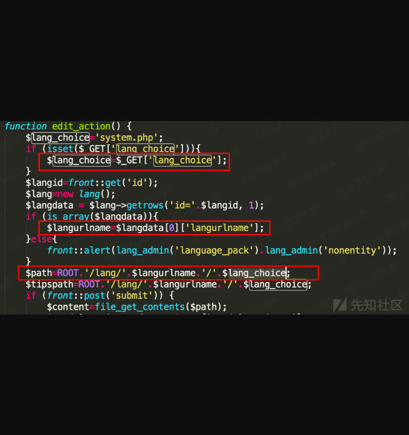
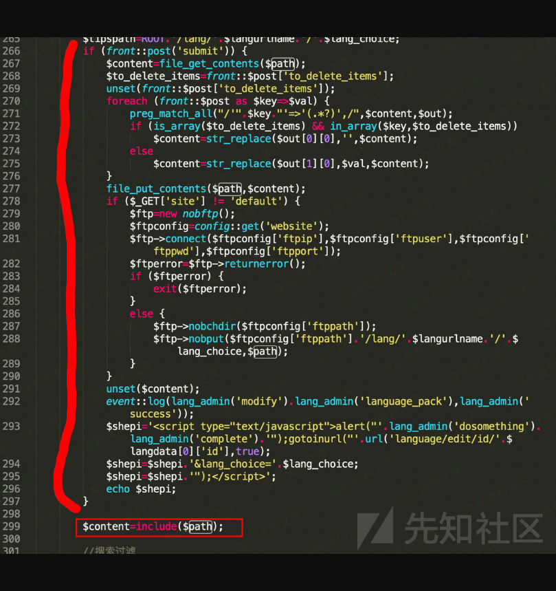
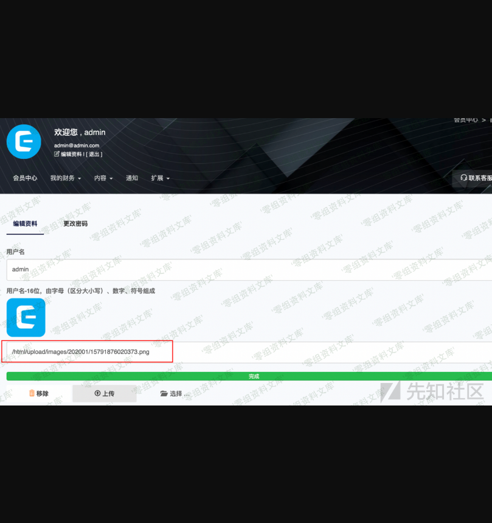
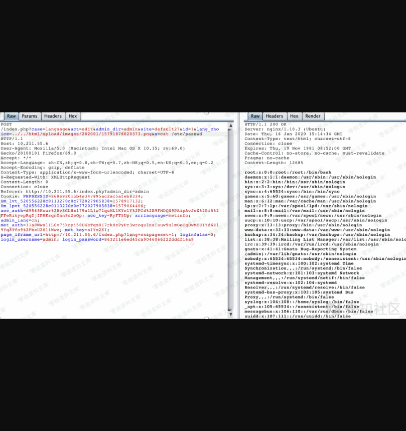

CmsEasy 7.3.8 本地文件包含漏洞
==============================

一、漏洞简介
------------

二、漏洞影响
------------

CmsEasy 7.3.8

三、复现过程
------------

CmsEasy
V7.3.8框架后端的语言编辑功能函数接口对include的文件路径没有做安全性校验，攻击者可以通过该接口包含上传的带有PHP代码内容的任意后缀（合法）文件，导致远程代码执行

漏洞代码位置是位于CmsEasy\_7.3.8\_UTF-8\_20191230/lib/admin/language\_admin.php文件中的edit\_action函数

\$lang\_choice是从用户的GET请求参数中直接获取的，\$langurlname是从数据库中获取的langurlname字段。后面将这两个参数直接拼接路劲赋值给\$path，这里的\$lang\_choice拼接在最后，可以任意赋值（为后面文件包含导致命令执行奠定基础）。

接着由于266行判断POST参数是否有submit，我们可以直接不传这个参数来绕开这一段的代码执行，到299行直接通过inlcude函数包含我们任意传递的值，导致文件包含

CmsEasy对于任何用户存在文件和图片上传功能，虽然我们不能直接上传php文件（默认禁止），但是可以上传内容为php代码的图片后缀文件，因此可以通过这一处文件包含达到最后高危的命令执行问题

参考链接
--------

> https://xz.aliyun.com/t/7273
