# EyouCMS 1.5.2 后台文件包含漏洞

## 利用思路
* 前台设置一个管理员的session
* 后台远程插件下载文件包含getshell。

### 前台设置管理员session
在`application/api/controller/Ajax.php:219`

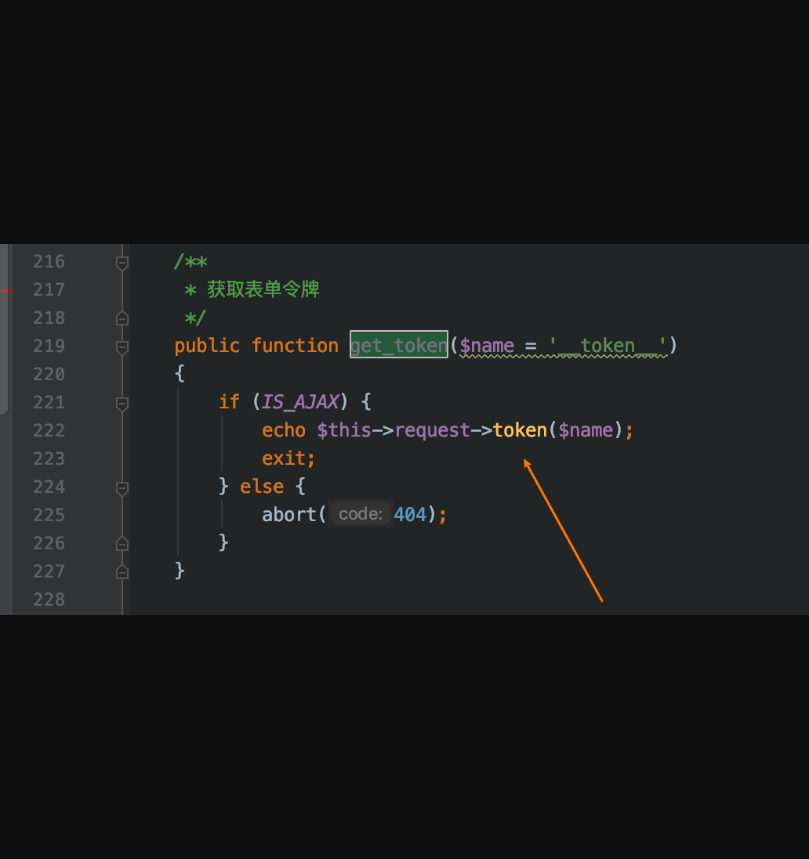

get_token函数是可以前台随意调用的，另外形参中的$name变量也是通过http传递进来的。跟进token函数，如下图所示。

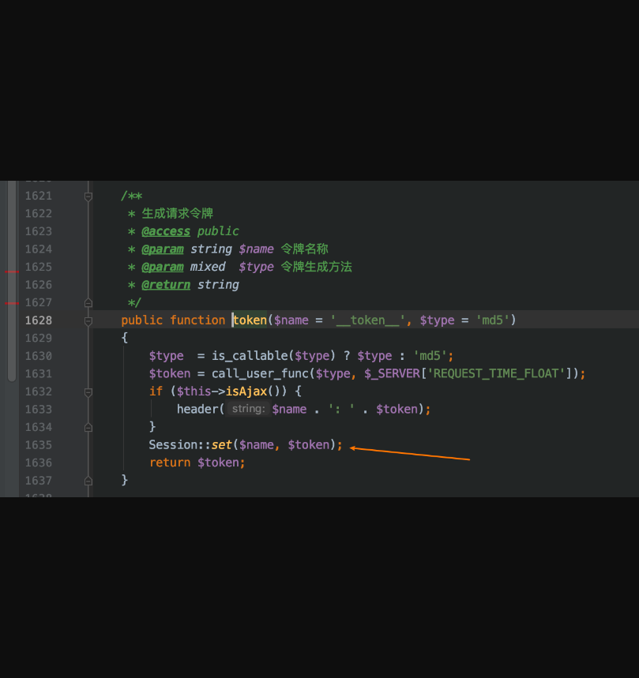

箭头处有一个设置session的操作，名字是可控的，而值是请求时间戳md5的值。不可控。

既然可以设置任意session名字了，那么我们是否可以给自己一个管理员的session呢？

然后我们梳理一下后台管理员的登录逻辑。

在`application/admin/controller/B ase.php:61`

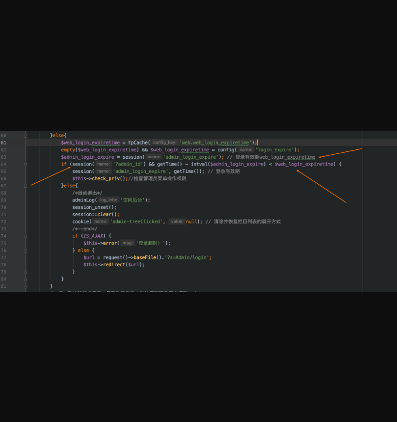

这里涉及到了两个session，一个admin_login_expire，一个admin_id。

`admin_id` （该session有就即可，不会验证其值）

`admin_login_expire` （该session会做减法的校验，需要满足一定条件）

而我们设置的session中是md5字符串，因此在设置admin_login_expire时，需要挑选一个前面是很长一段数字的md5，这样计算出来的结果就是负数，就满足该if条件了。

如图所示：

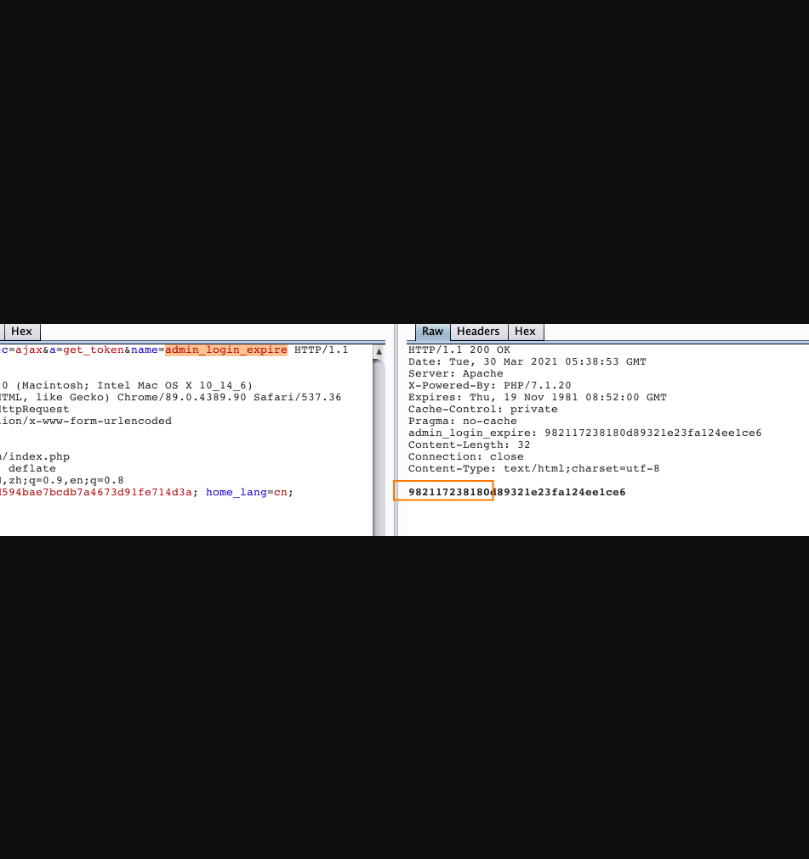

设置完这两个session后，我们继续看到if条件判断里还有一个check_priv函数，跟进查看：

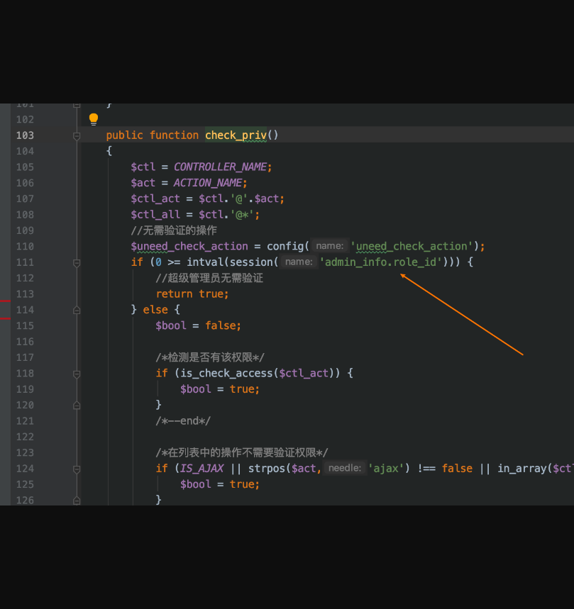

这里就很简单了，继续设置一个`admin_info.role_id`。满足比较小于0即可。

设置完三个session后，就可以进后台了，如图所示：

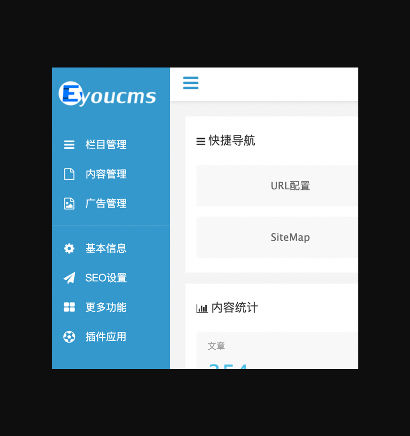

### 后台远程插件下载getshell
在`application/admin/controller/Weapp.php:1285`

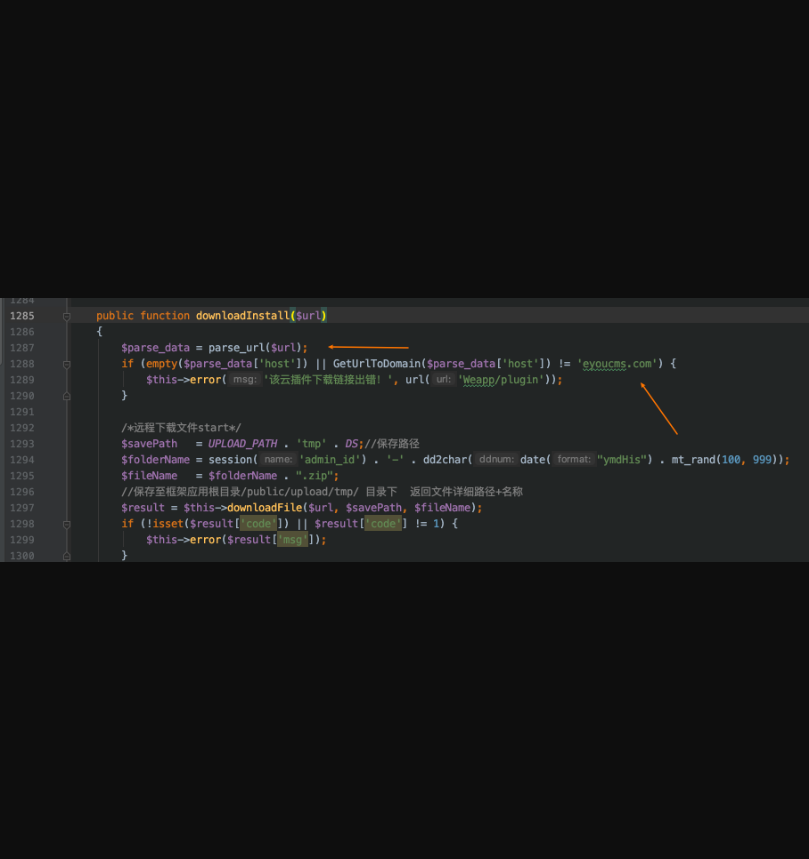

这里传进来一个$url，然后做一个url解析，需要满足host为`eyoucms.com`。

也就是程序限制只能从官网下载插件安装，但是这个校验太简单了，可以绕。

然后下文就是请求这个下载链接，做解压操作，并包含进来config.php。

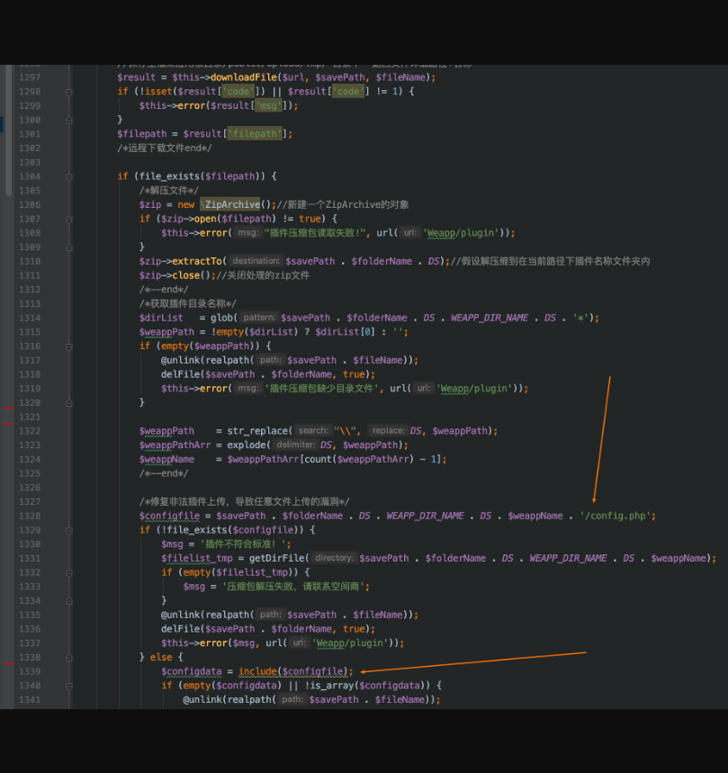

然后开始准备制作恶意压缩包，也就是如下图所示的目录结构：

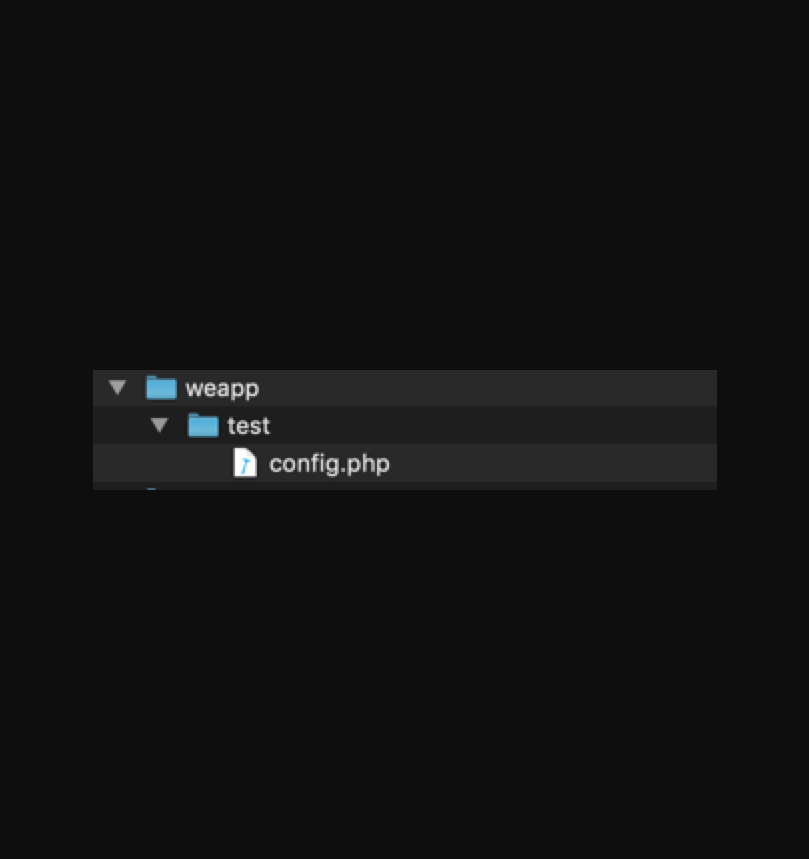

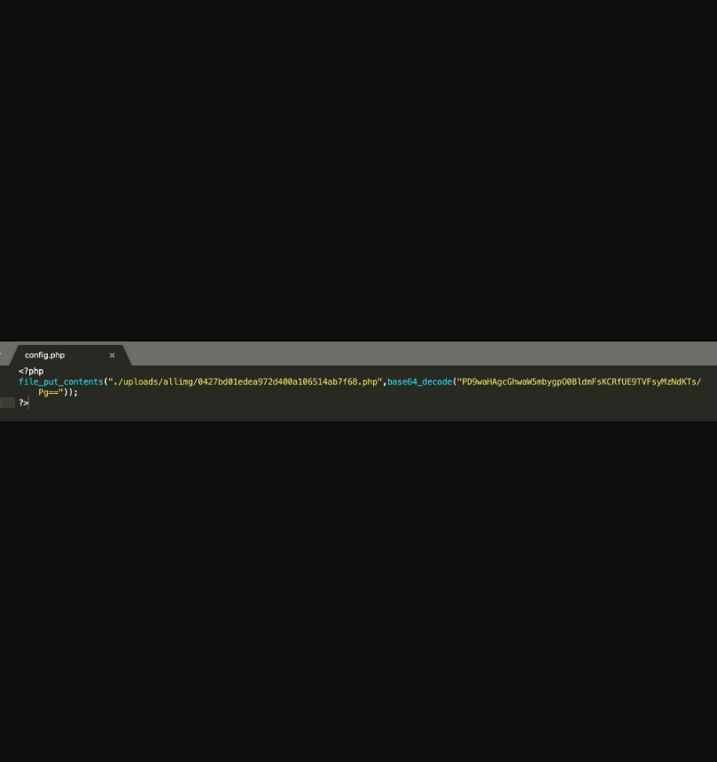

然后去官网转一转，看看有没有上传的地方，还真有！在提问功能处可以上传图片

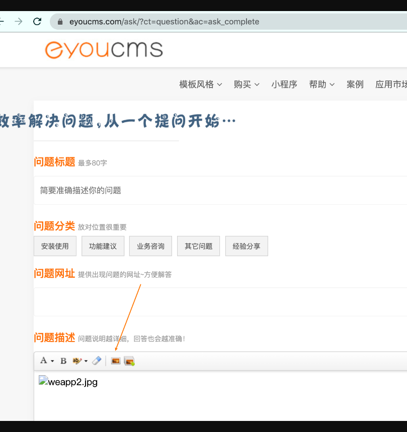

然后我们把恶意压缩包改成图片后缀传上去，得到一个上传后的图片路径，在构造报文触发文件包含。

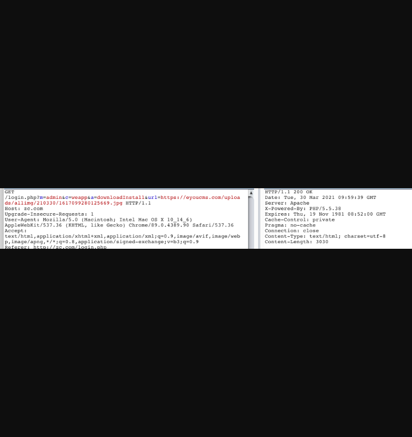

生成webshell。

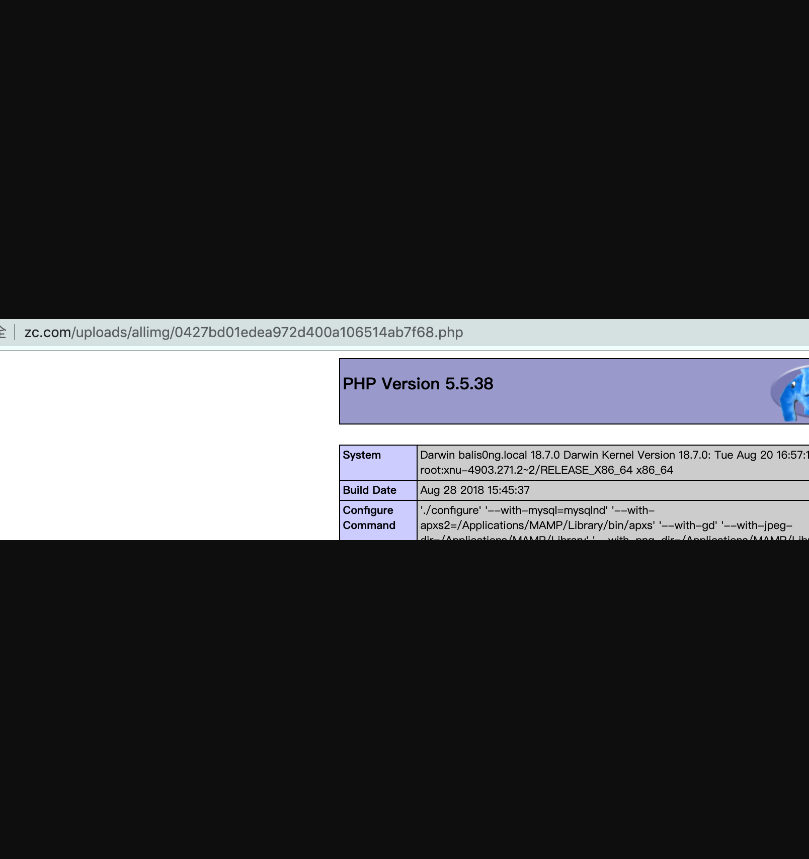