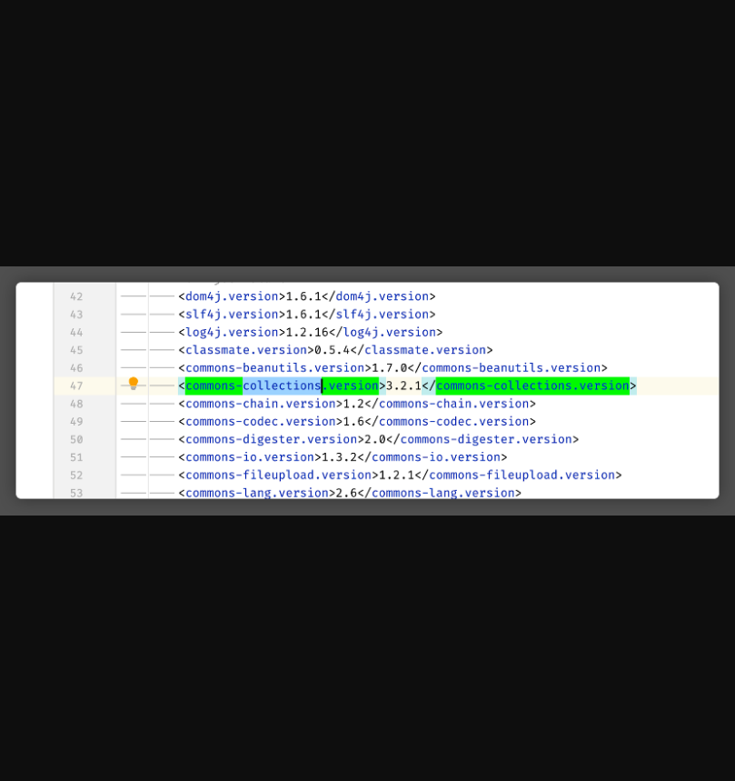
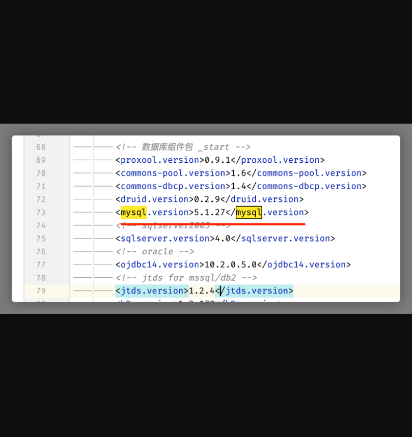
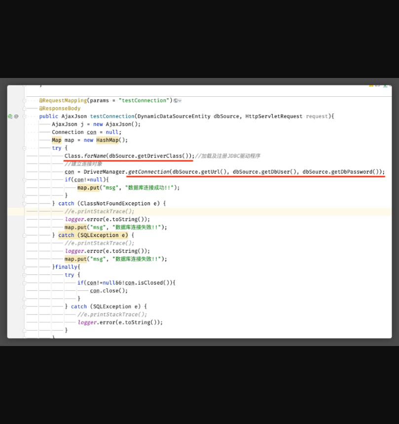
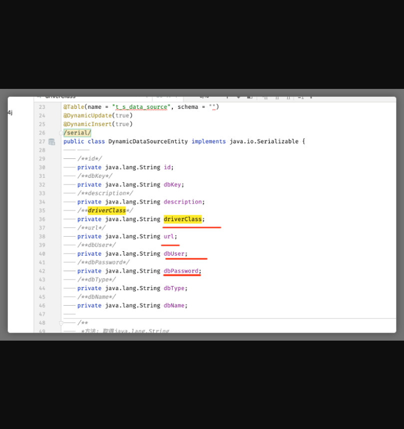
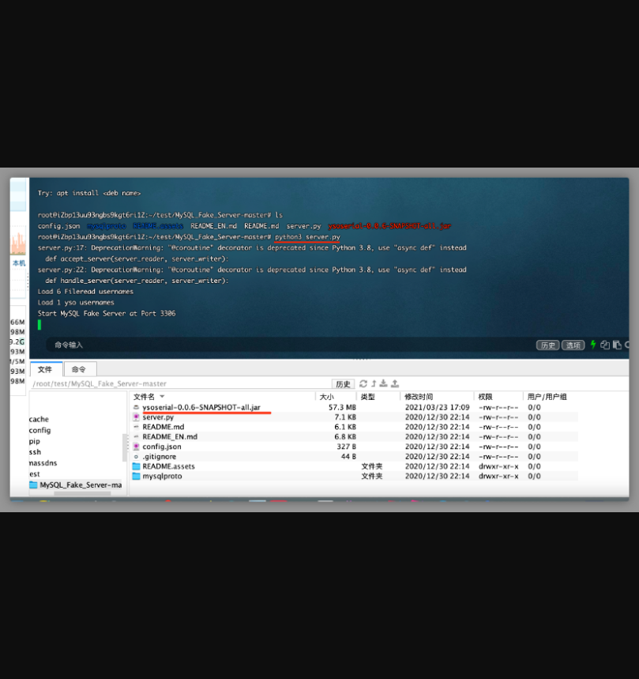
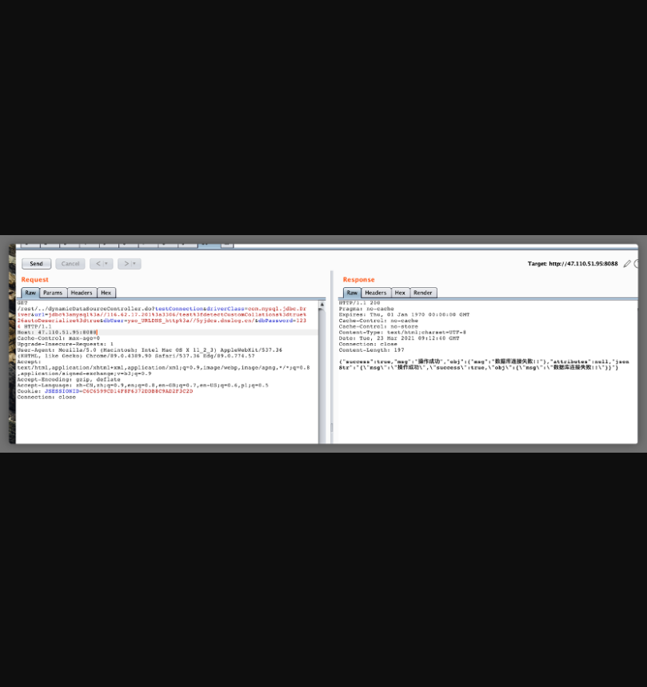
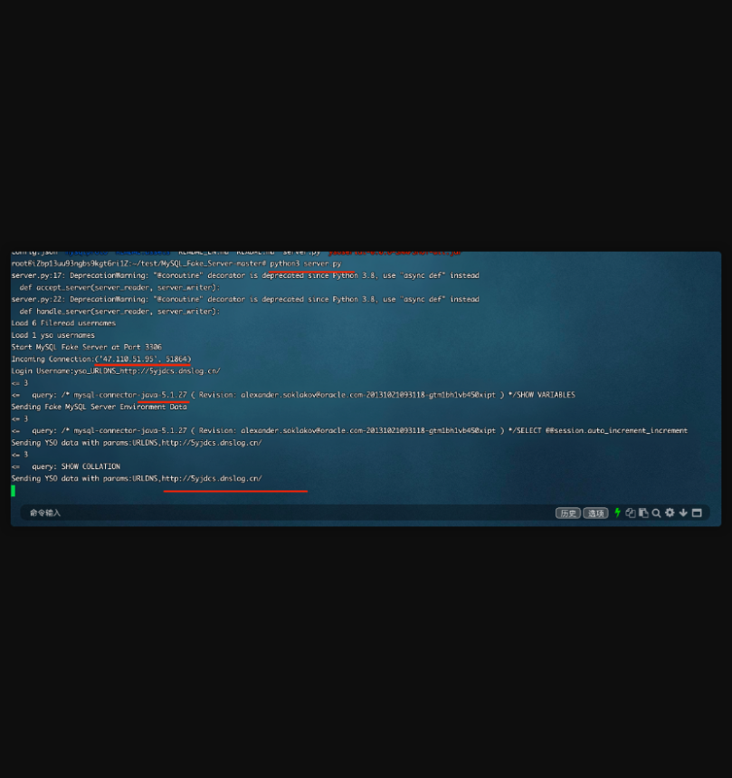
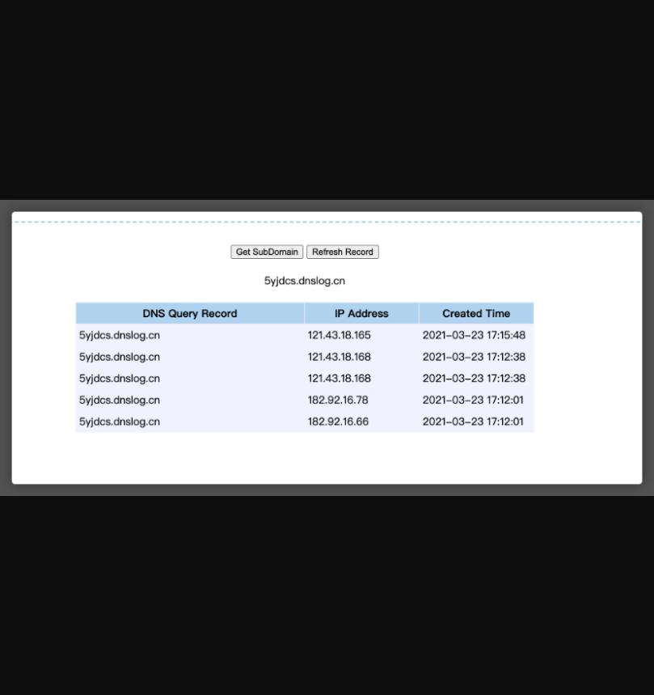

## **JEEWMS存在命令执行漏洞**

## 漏洞描述

**JEEWMS存在命令执行漏洞**

## 漏洞影响

> JEEWMS全版本

## FOFA

> body="plug-in/lhgDialog/lhgdialog.min.js?skin=metro" && body="仓"

## 漏洞复现

**漏洞详情：**

\1.   漏洞代码位置

```
pom.xml文件中使用commons-collections.version版本3.2.1，可进行反序列化命令执行
```



```
mysql版本<mysql.version>5.1.27</mysql.version>，可进行jdbc反序列化
```



 

\2.   漏洞代码分析

src/main/java/org/jeecgframework/web/system/controller/core/DynamicDataSourceController.java

此控制器可传入数据库jdbc url、用户名、密码，因此存在jdbc反序列化漏洞



DynamicDataSourceEntity内容：src/main/java/org/jeecgframework/web/system/pojo/base/DynamicDataSourceEntity.java

 



 

已知jdbc url可控，存在jdbc反序列化漏洞，无害验证如下

启动虚假mysql服务器



发送payload（此处使用了授权绕过漏洞 ,在上文)

在url中使用/rest/../绕过登录授权

 

发送反序列化payload





收到dnslog请求

