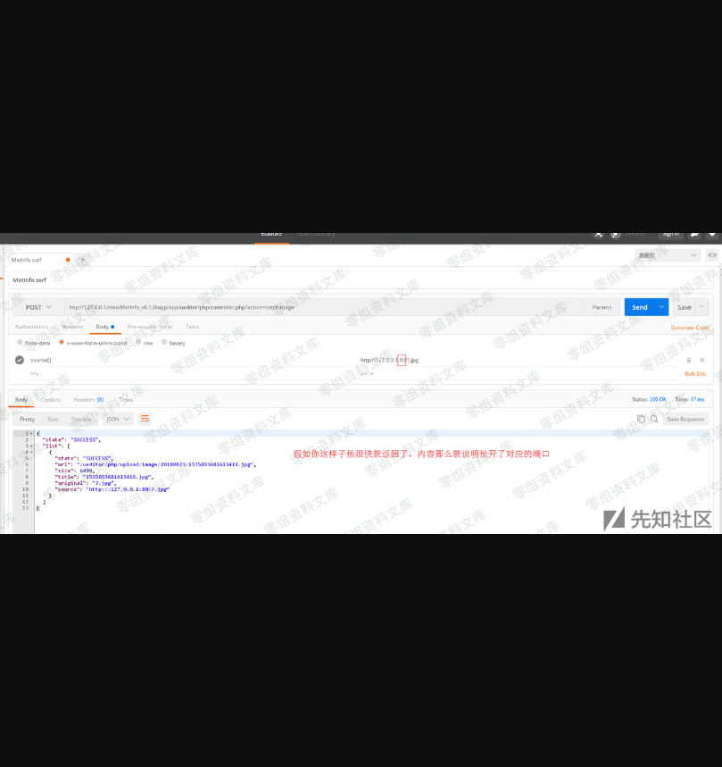
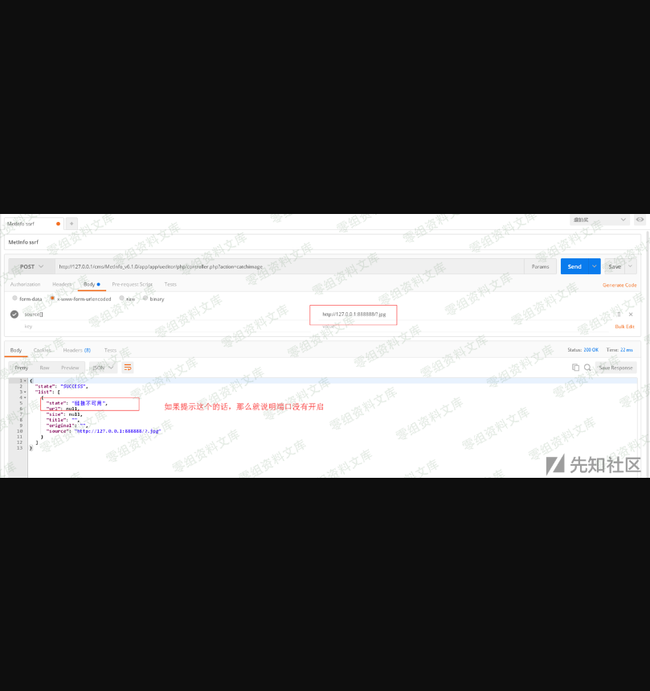
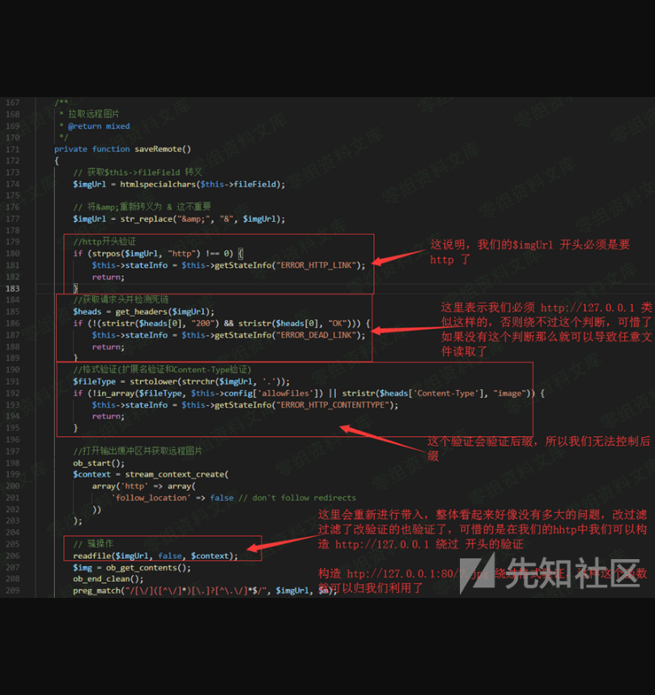
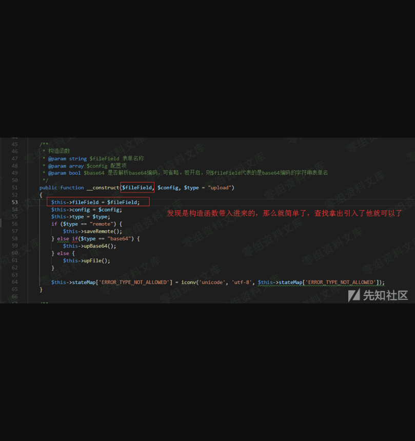
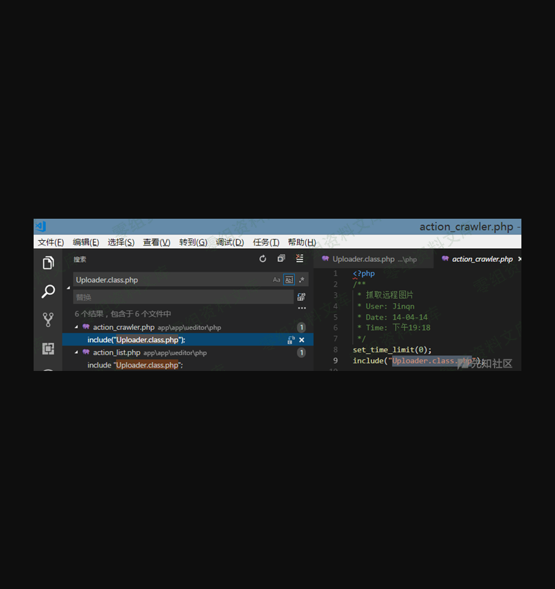

MetInfo系统中隐藏的一处旧插件导致的ssrf
=======================================

一、漏洞简介
------------

二、漏洞影响
------------

三、复现过程
------------

利用的话，ssrf嘛你可以扫描扫描端口咯。 我这里的话，简单说明利用一下

### 分析过程

文件：MetInfo\_v6.1.0\\app\\app\\ueditor\\php\\Uploader.class.php

get\_headers这里是验证资源是否存在的，不存在就不走下面了，所以这里可以用来判断端口，例如81端口不存在那么他这里就会直接报错了
\$this-\>stateInfo = \$this-\>getStateInfo(\"ERROR\_DEAD\_LINK\");

这个时候我还不清楚的\$this-\>fileField 的值是向哪里获取的=-=
又搜索了一下。

需要注意的是：\$type == \"remote\"
才能进入\$this-\>saveRemote();流程引起漏洞触发。

搜索一下

打开文件：MetInfo\_v6.1.0\\app\\app\\ueditor\\php\\action\_crawler.php
打开文件以后，虽然引入了Uploader.class.php
但是没有引入\$CONFIG所以直接调用代码会报错，那么就继续找引入

搜索一下

打开文件：MetInfo\_v6.1.0\\app\\app\\ueditor\\php\\controller.php

image
