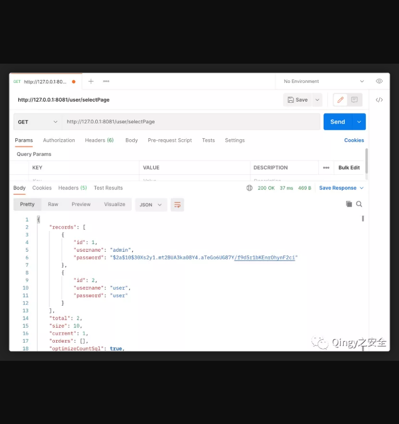
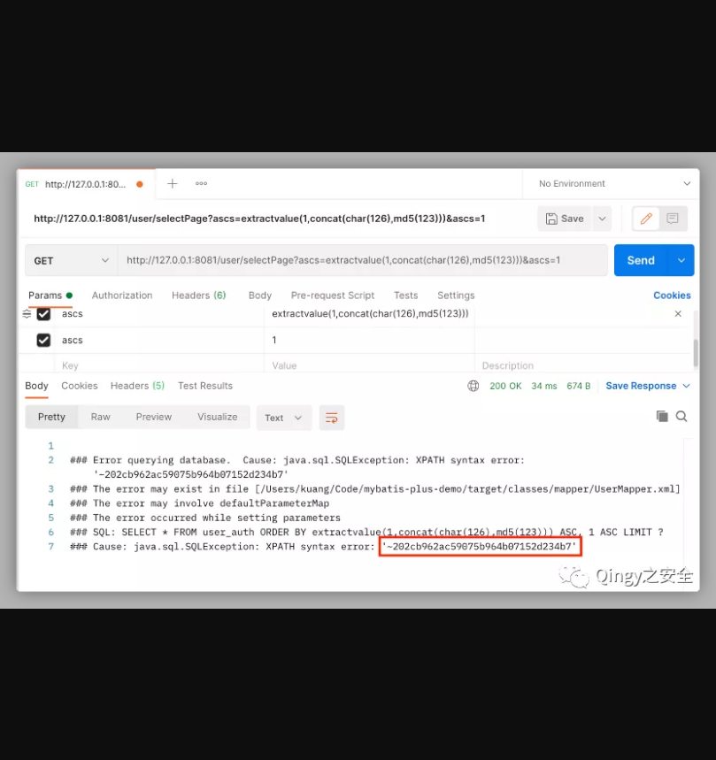
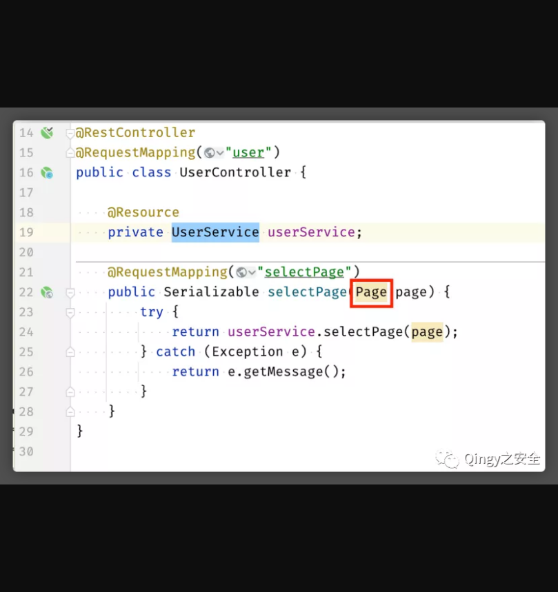
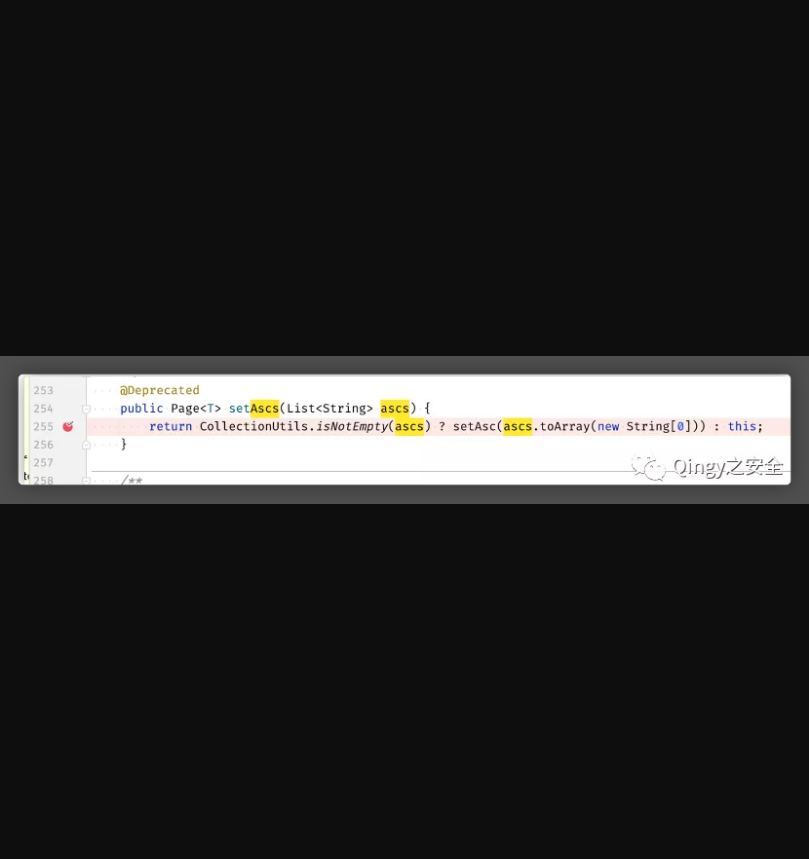
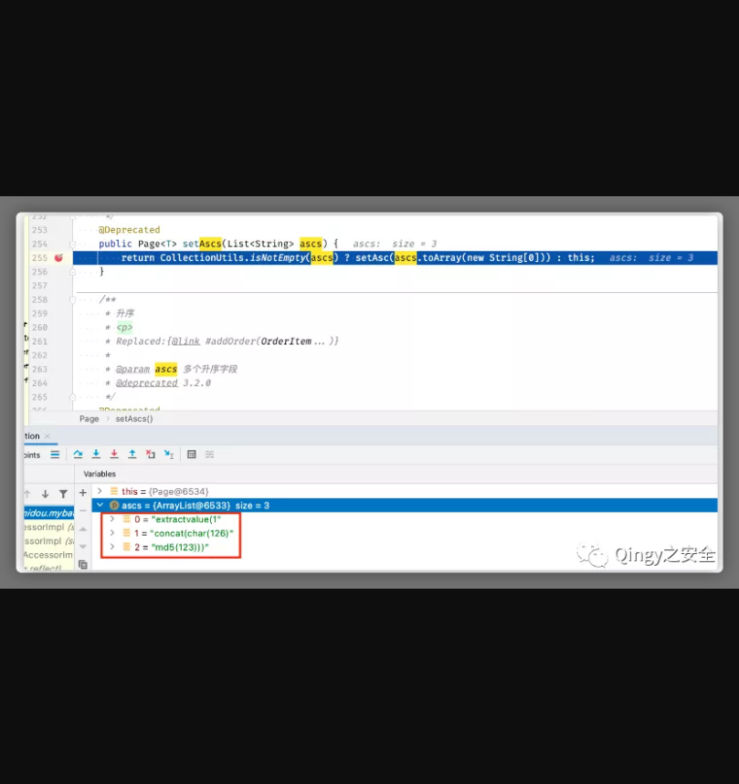
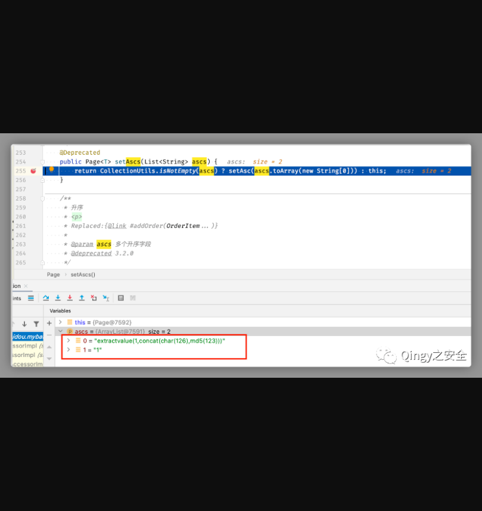
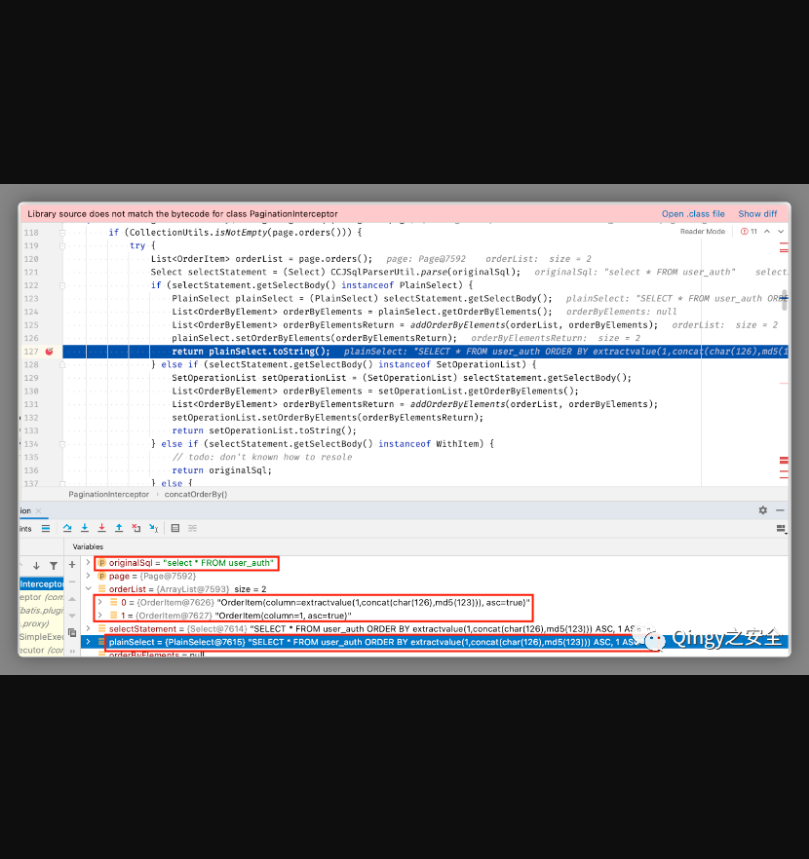
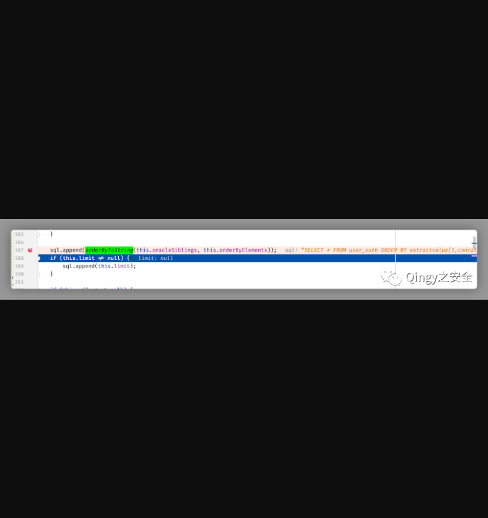
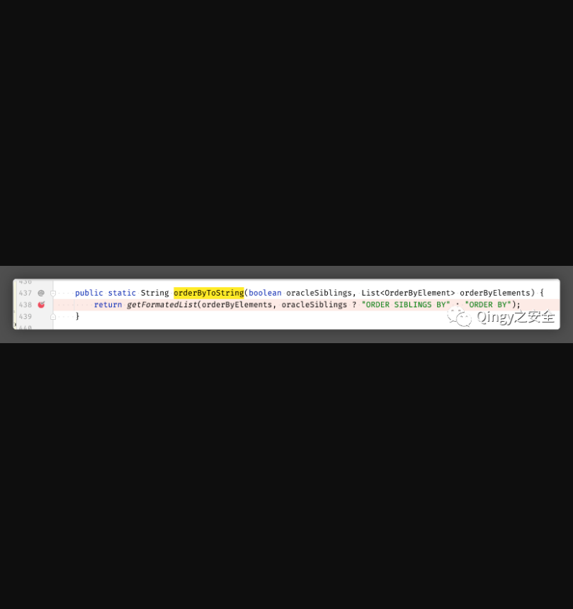

# Mybatis-plus存在SQL注入漏洞

## 漏洞描述

MyBatis：一种操作数据库的框架，提供一种Mapper类，支持让你用java代码进行增删改查的数据库操作，省去了每次都要手写sql语句的麻烦。但是！有一个前提，你得先在xml中写好sql语句，很麻烦，于是有了Mybatis-plus.

MyBatis-plus:国人团队苞米豆在Mybatis的基础上开发的框架，在Mybatis基础上扩展了许多功能，荣获了2018最受欢迎国产开源软件第5名

## 漏洞影响

> Mybatis-plus

## FOFA

> Mybatis

## 漏洞复现

使用Idea打开项目，修改配置文件数据库地址、账户密码、导入SQL文件，或在Mybatis-plus官网自行搭建，运行项目，访问selectPage接口



使用报错注入payload：

```
http://127.0.0.1:8081/user/selectPage?ascs=extractvalue(1,concat(char(126),md5(123)))&ascs=1
```




断点分析

进入Page实体中



255行断点，此处接收的是个List类型参数：



我们只发送一个ascs参数：

```
ascs=extractvalue(1,concat(char(126),md5(123)))
```

可以看到ascs被以逗号分割成了3份，会导致后续SQL拼接的语句语法错误（URL编码结果一样）：



因为我们这里传入两个ascs参数（至于为什么会这样，推测是SpringMVC的设计）：

```
ascs=extractvalue(1,concat(char(126),md5(123)))&ascs=1
```

再断点：



这里我们的payload就不会被分割了，两个参数成了List的两个元素。

查看Page分页拦截器

```
mybatis-plus-extension-3.4.2.jar!/com/baomidou/mybatisplus/extension/plugins/PaginationInterceptor.class
```

127行断点：



SQL代码就是在此处拼接完成的，具体拼接流程是这两行：

```
plainSelect.setOrderByElements(orderByElementsReturn); return plainSelect.toString();
```

orderByElementsReturn就是我们传入的payload数组，plainSelect是mybatis中的原始sql语句，此处先将orderByElementsReturn，set到plainSelect的属性中，之后重写了toString方法，跟入toString：

387行将payload加上ORDER BY字符串后append到原始sql中：



orderByToString方法：



至此Payload就被拼接到了Mybatis原始SQL语句中。