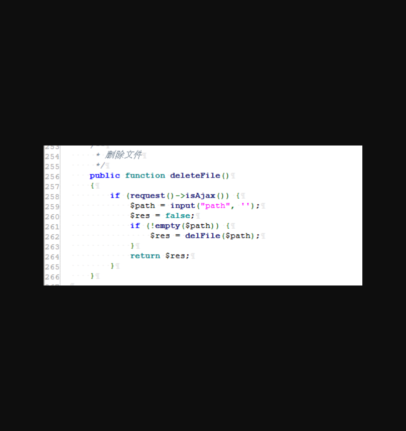
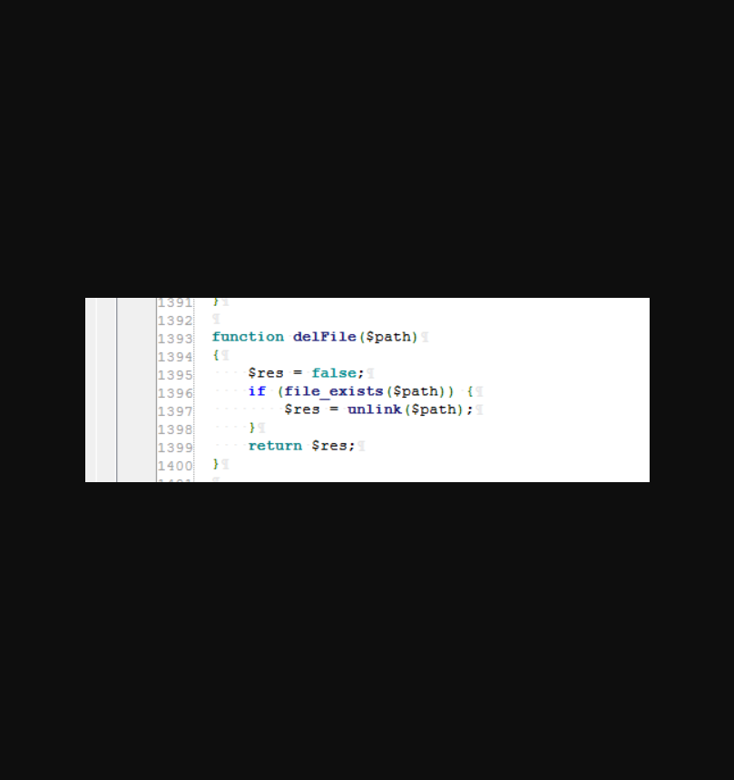
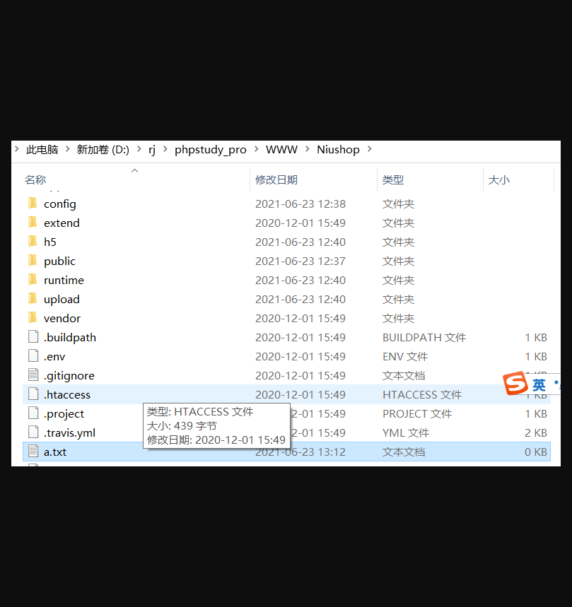
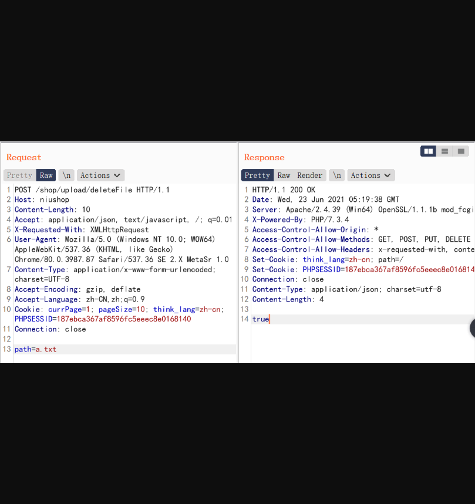

# Niushop单商户V4版任意文件删除

## 漏洞描述

Niushop是一套开源的商城系统，存在任意文件删除漏洞

## 漏洞影响

> Niushop

## FOFA

> title="Niushop"

## 漏洞分析

漏洞位于：

```
\app\shop\controller\Upload.php
```



```
\app\shop\controller\common.php
```



可以看到由于没有清除参数或过滤所以导致任意文件删除

## 漏洞复现

为了测试，在跟目录下创建a.txt


####POC：

返回true即删除成功。