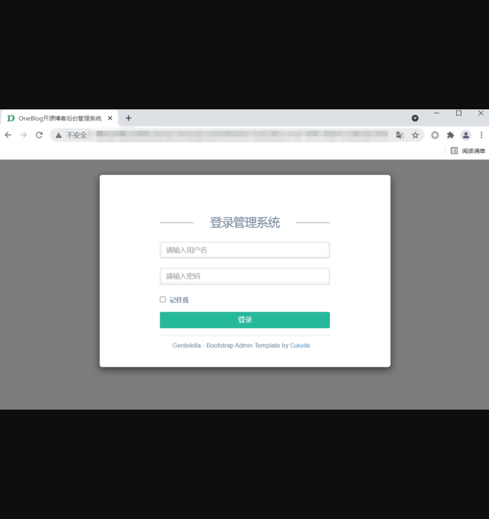
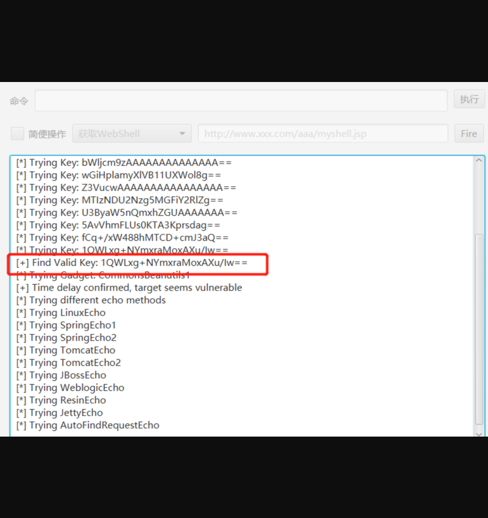
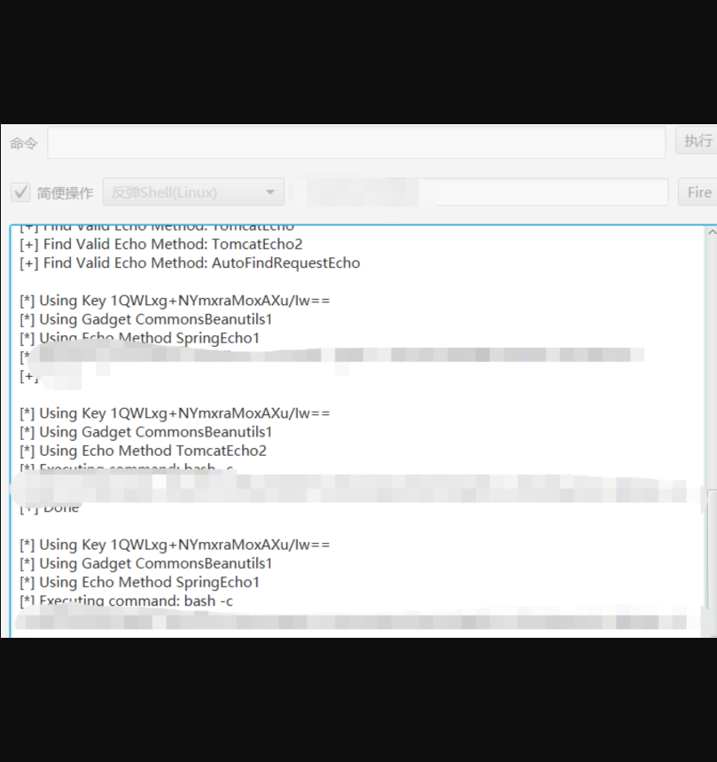
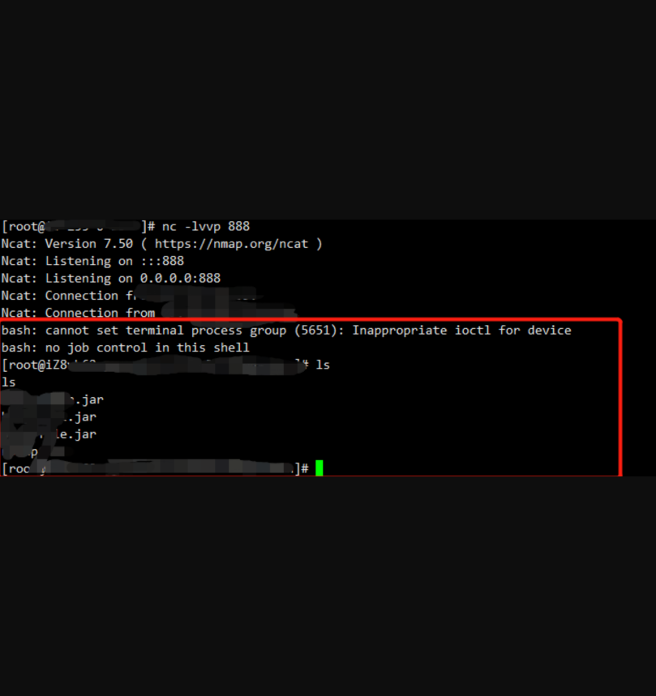

## OneBlog远程代码执行

## 漏洞描述

OneBlog 小于v2.2.1 由于使用含有漏洞版本的Apache Shiro和默认的密钥导致存在远程命令执行漏洞

## 漏洞影响

> OneBlog <= v2.2.1

## FOFA

> app="OneBlog开源博客后台管理系统"

## 漏洞复现

登录页面如下：

由于OneBlog小于2.2.1版本中使用了存在漏洞版本的Apache Shiro及默认密钥导致存在远程代码执行漏洞，使用shiro反序列化工具进行利用。

成功反弹shell

