## OpenSNS代码执行漏洞

## 漏洞描述

OpenSNS是一款基于ThinkPHP的轻量级SNS框架，存在代码执行漏洞。

## 漏洞影响

> OpenSNS

## FOFA

> icon_hash="1167011145"

## 漏洞复现

官网下载源码：http://os.opensns.cn/product/index/download
解压 打开

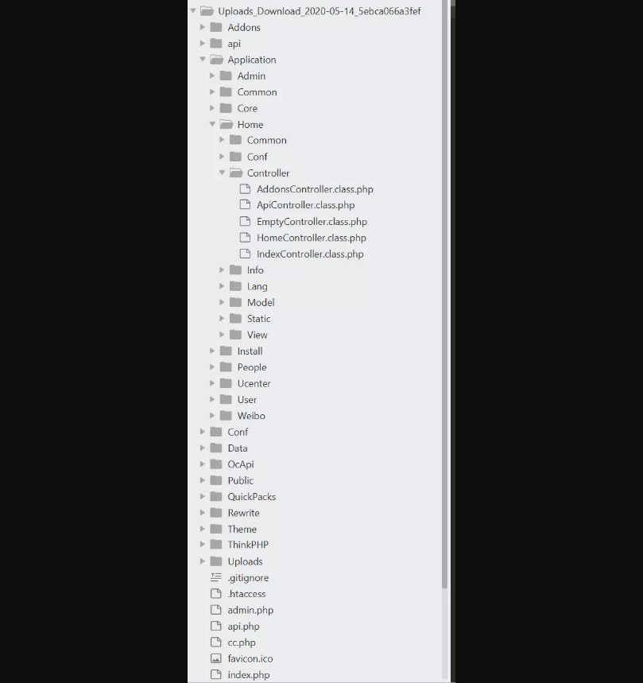

很典型的一个使用tp框架的cms，控制器都在application目录下
然后粗略的看了一下所有能直接访问的控制器，没发现有明显漏洞的地方，但是发现了个比较可疑的方法。

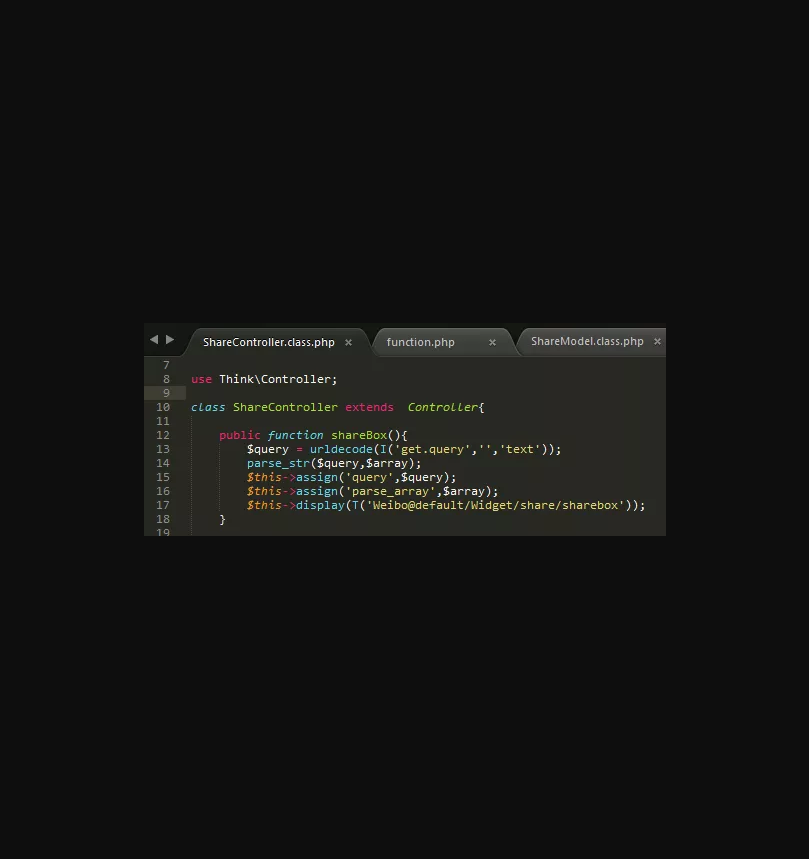

在Weibo/ShareController 控制器中有一个shareBox方法 其中获取了query参数 然后url解码 在parse_str 将$query解析成数组，然后assign成模板变量 最后display模板。这里并没有对获取的参数进行操作，那就可能在模板里面对参数进行操作了，去看下模板内容

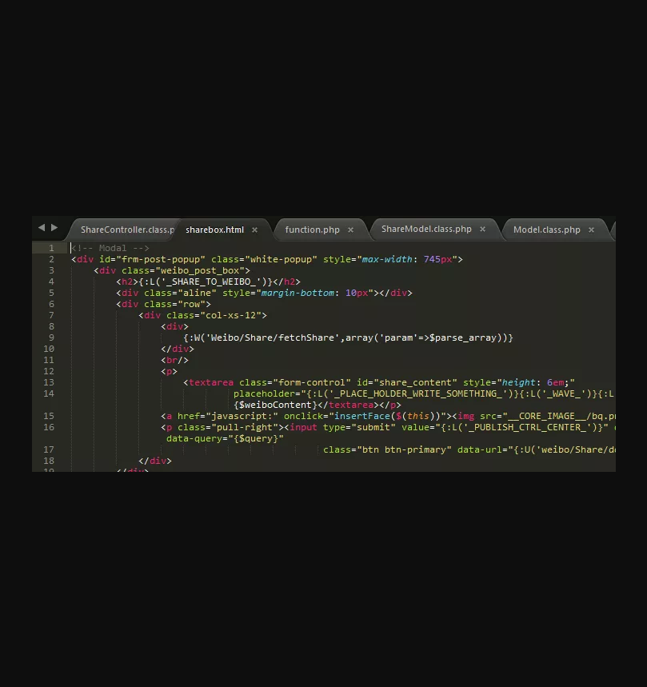

文件位于Weibo/View/default/Widget/share/sharebox.html
看到用了{:W()}这种写法
W方法位于Thinkphp/common/function.php

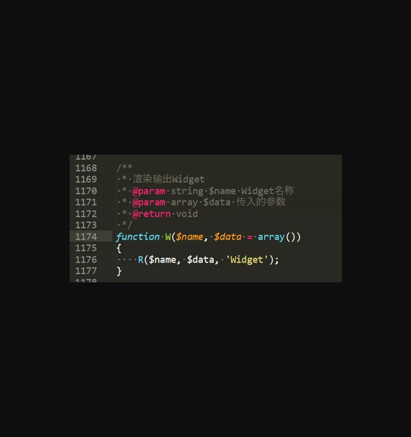

备注解释是渲染输出 调用了R方法 继续看一下

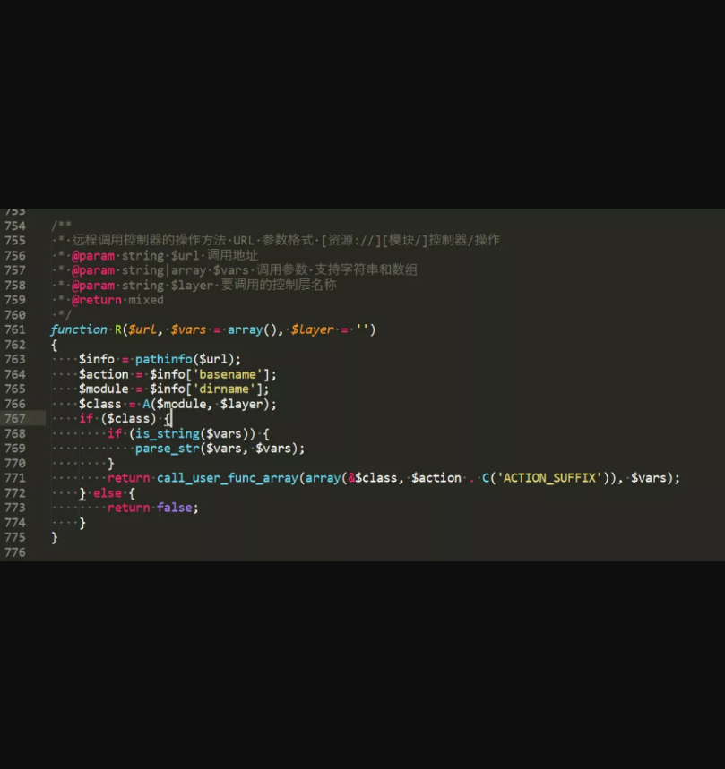

远程调用控制器的方法
{:W(‘Weibo/Share/fetchShare’,array(‘param’=>$parse_array))}
那这行代码就是调用fetchShare 方法，参数也就是之前获取的$query解析成得数组
那去看一下fetchShare方法,位于/Weibo/Widget/ShareWidget.class.php

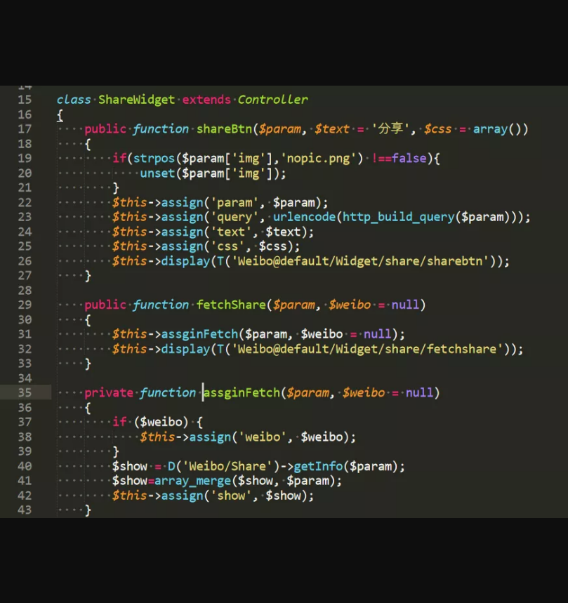

接着调用了assginFetch方法，我们看下D方法

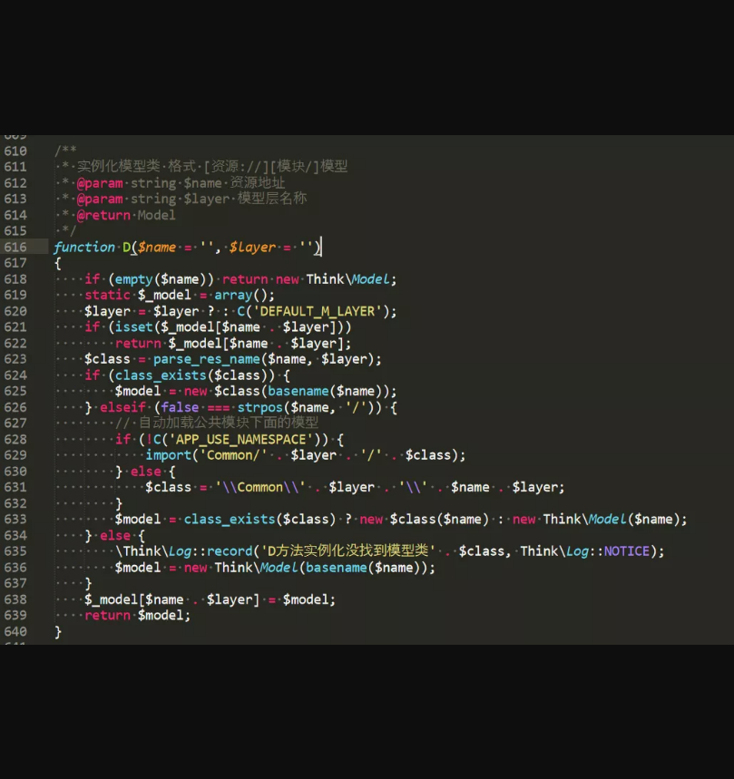

实例化模型类，那就是在Weibo/Model/ShareMode.class.php，然后又调用了getInfo方法

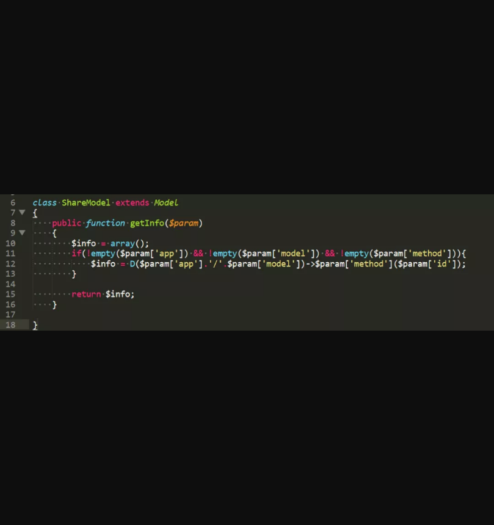

这里又调用了D方法，并且调用了有一个参数的方法。根据上面的了解，D方法可以实例化Model类，那可利用的范围就变大了，去找一下可以利用的方法，只要满足两个条件。
1.为Model类
2.方法只能有一个传入的参数

看下tp框架本身自带的Model类。/ThinkPHP/Library/Think/Model.class.php

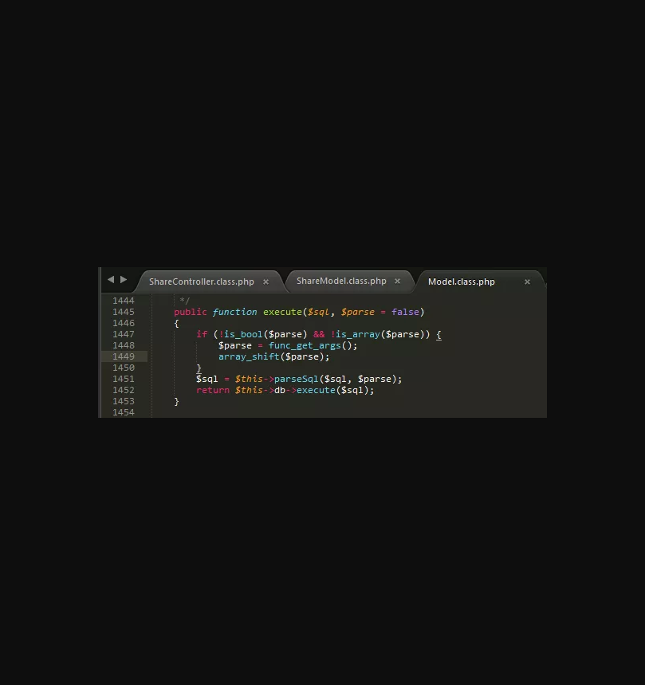

找到一个可以实现sql注入的一个方法。但是我们可以尝试去寻找能实现代码执行的方法。

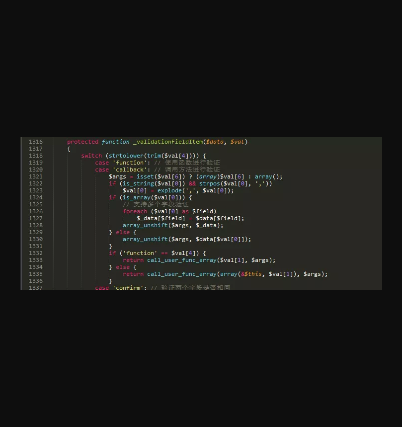

同文件下有个_validationFieldItem方法里面有call_user_func_array方法，如果能调用这个方法 并且两个参数都可控 那么就能实现代码执行。根据现在已知的条件，还不能利用 可以先记录一下。

找到一个可以利用的类，这是cms自己写的类。/Application/Common/Model/ScheduleModel.class.php

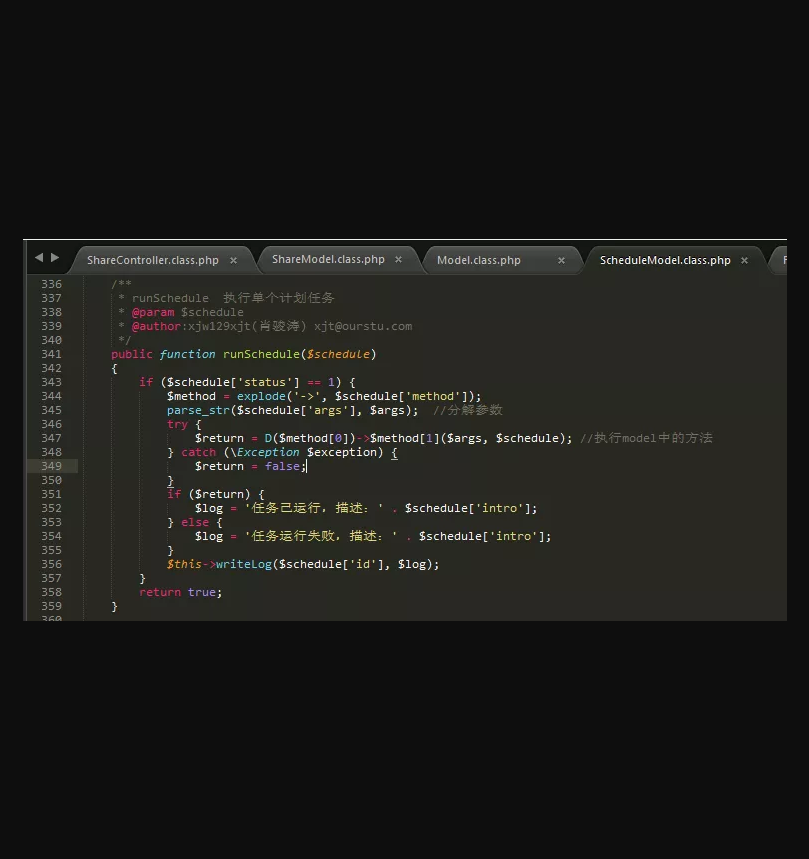

一个参数，为Model，满足这两个条件，然后看到又调用了D方法来实例化Model类，但是调用的方法为两个参数，结合上面找到的_validationFieldItem方法。按照流程构造poc，就能实现代码执行。

梳理一下漏洞触发流程：
1.ShareController.shareBox->
2.ShareWidget. fetchShare->
3.ShareWidget.assginFetch->
4.ShareModel.getInfo(这里控制D方法生成ScheduleModel类，并调用传入一个参数的方法)->
5.ScheduleModel.runSchedule(这里控制D方法生成Model类，并调用传入两个参数的方法)->
6.Model._validationFieldItem

# **0x3 漏洞验证**

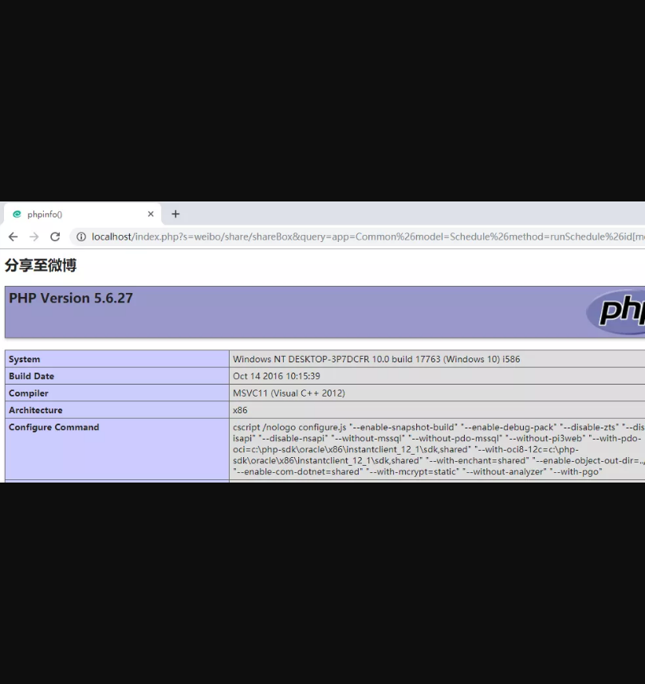