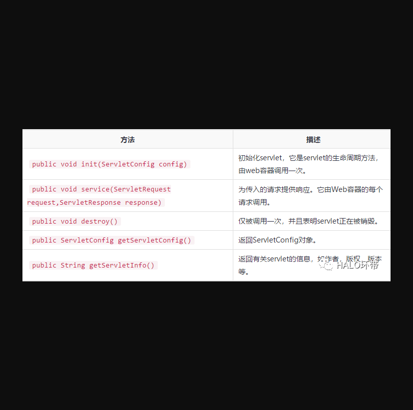
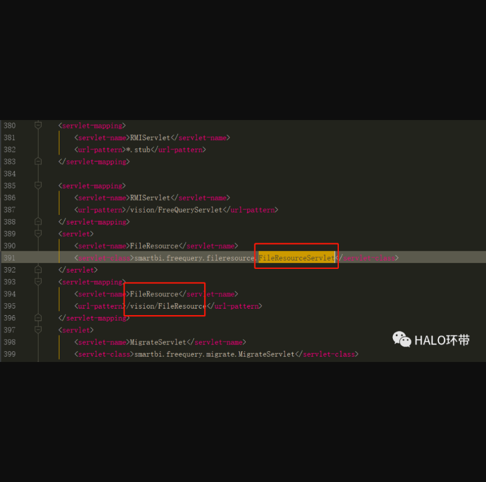
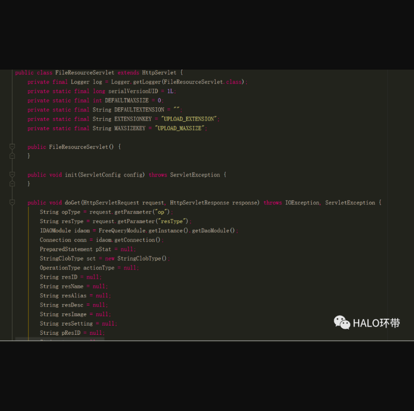
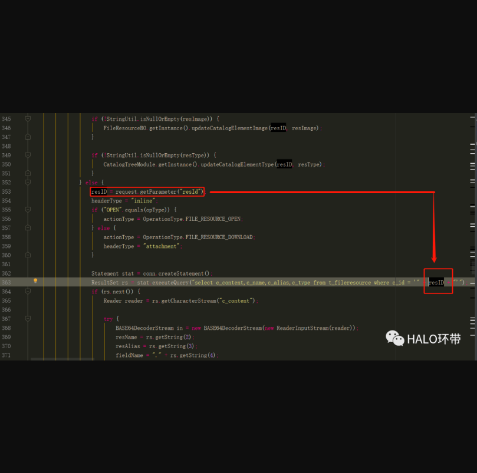
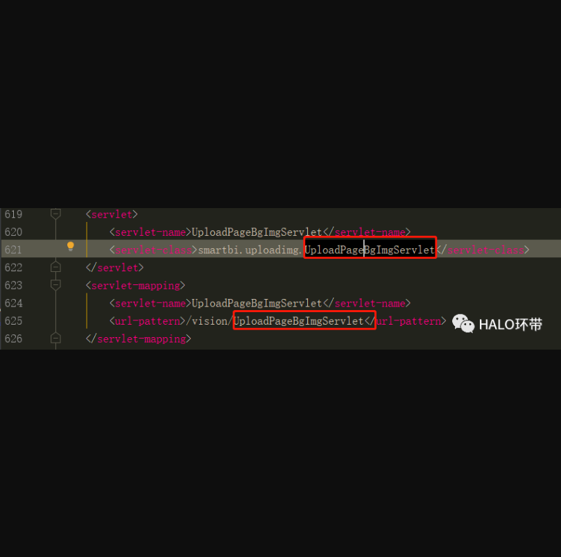
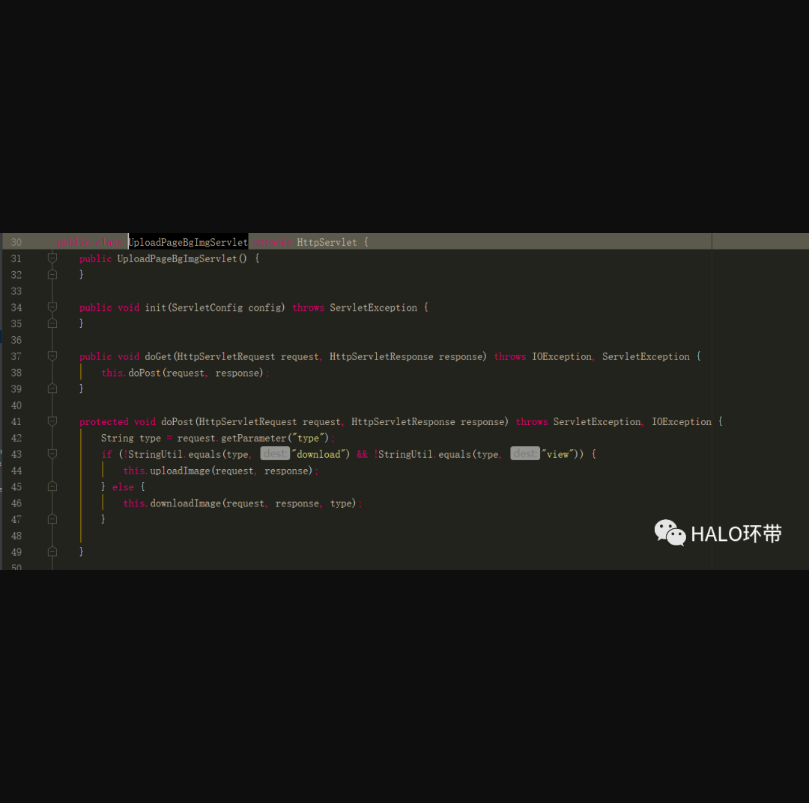
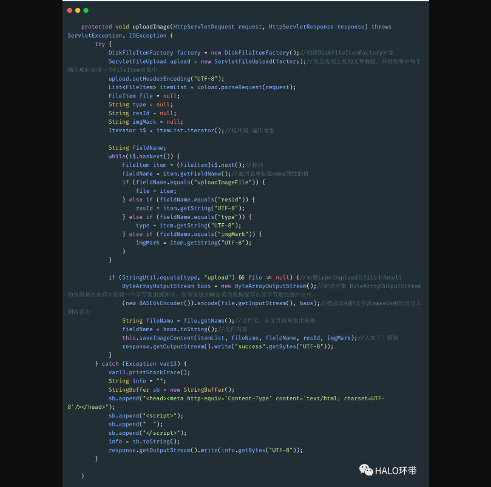
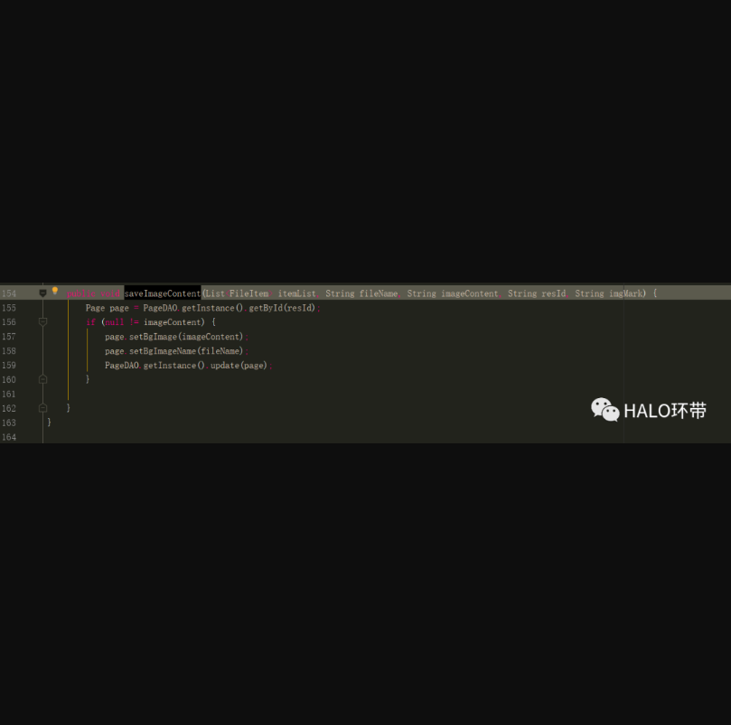
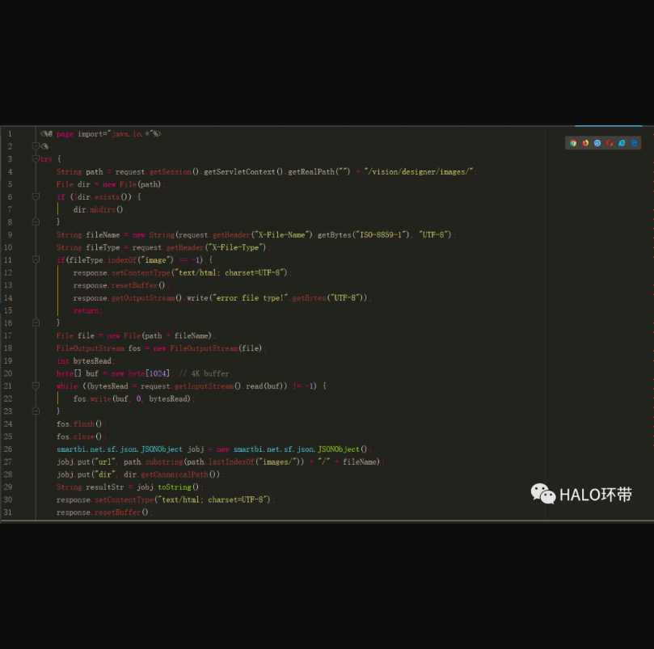

# SmartBi全版本 SQl注入 任意文件上传漏洞

## 前言
Smarbi是由思迈特软件开发的一款企业级商业智能和大数据分析平台，满足用户在企业级报表、数据可视化分析、自助分析平台、数据挖掘建模、AI智能分析等大数据分析需求。致力于打造产品销售、产品整合、产品应用的生态系统，与上下游厂商、专业实施伙伴和销售渠道伙伴共同为最终用户服务，通过Smartbi应用商店（BI+行业应用）为客户提供场景化、行业化数据分析应用。通过官网可知国内大部分银行，央企，部委都部署有该系统。在一次安全评估项目中遇到该平台，在网上找到相关源码后遂对该平台进行分析审计，挖掘出了一些问题。

## SQL注入
本来是想找个RCE的漏洞。但发现存在SQL注入。打开web.xml文件。发现一个FileResource类。感觉像是一个文件的读写类。我们追踪到class，然后看下类实现方法，通过浏览代码语法我们可以了解到该系统使用Servlet实现http的交互。这里简单的阐述一下Servlet的概念，方便后续理解。

大家都知道Servlet，但是不一定很清楚servlet框架，这个框架是由两个Java包组成:javax.servlet和javax.servlet.http，在javax.servlet包中定义了所有的Servlet类都必须实现或扩展的的通用接口和类，在javax.servlet.http包中定义了采用HTTP通信协议的HttpServlet类，Servlet的框架的核心是javax.servlet.Servlet接口,所有的Servlet都必须实现这一接口，在Servlet接口中定义了5个方法,如图琐事哦，其中前3个方法代表了Servlet的声明周期:



当Web容器接收到某个Servlet请求时,Servlet把请求封装成一个HttpServletRequest对象,然后把对象传给Servlet的对应的服务方法。HTTP的请求方式包括DELETE,GET,OPTIONS,POST,PUT和TRACE,在HttpServlet类中分别提供了相应的服务方法,它们是,doDelete(),doGet(),doOptions(),doPost(), doPut()和doTrace().。当我们了解了这些前置知识后。大大的方便了我们理解接下来的代码。



根据我们前面所了解到的一些前置知识。我们来看doGet方法的实现。



前面一堆巴拉巴拉我们先不讲。我们直接来看353-363行。resID通过getParameter获取。我们可控，然后直接在363行就将变量拼接到SQL语句里去了。而且直接就executeQuery了，前面都用了prepareStatement来预防SQL注入。为啥这里就直接拼接SQL语句了呢。我严重怀疑这是临时工写的代码。很明显这里存在SQL注入了。



我们直接构造payload注入即可：

`http://www.xxx.com//vision/FileResource?op=OPEN&resId=LOGIN_BG_IMG`

由于数据库存在差异。大家直接丢sqlmap跑就行了

## 任意文件上传
挖注入不是我的本来目的，任何以渗透测试为目的的代码审计最终的目标都是RCE或者任意文件上传。于是我继续寻找涉及文件操作的相关代码。PS:此处踩了很多坑。通过寻找web.xml里的配置信息。我快速定位到了一处上传接口UploadImageServlet。跟进看看



如果type不为download和view则进入uploadImage。跟进



看uploadImage前面的代码看的我很开心，仿佛好像没有过滤后缀之类的。仿佛任意文件上传就在眼前，代码的执行逻辑我写在注释里了。看到base64的操作我很疑惑。正常不应该直接写文件了么。直到我看到saveImageContent时，我的心一凉。根据函数名不难理解为保存图片内容。跟进看看。是否为我猜想的直接把文件内容入库了。



跟进saveImageContent，看到PageDAO后心彻底凉了。这里可以确定文件入库了，并没有落地到目录。就算没有过滤后缀。也没办法利用。



于是乎我就继续找呀找呀。发现这套系统百分之99的文件上传都是写到数据库里，着实恶心到我了。这时候我转战寻找jsp文件。我寻思独立写的jsp文件应该没有这么严谨。山重水复疑无路，柳暗花明又一村。经过耐心的寻找。终于定位到一个 上传文件。

`/vision/designer/imageimport.jsp`



纵观代码逻辑。先定义写入目录。然后判断目录是否存在，如果不存在则创建目录。然后读取header里的两个参数，用来作为文件名和文件类型，随后简单的判断一下type是否为image。然后就直接fos.write了。文件落地到/vision/designer/images/。一个比后门还要后门的文件上传写法。要不是我看到同目录其他的一些文件我差点以为这是一个后门了。构造上传也就很简单了。在header里面添加两个参数。X-File-Name为文件名。POST正文为你要上传的文件内容。请求即可

Payload:
```
POST /vision/designer/imageimport.jsp HTTP/1.1
Host: 127.0.0.1
User-Agent: Mozilla/5.0 (Windows NT 10.0; Win64; x64; rv:52.0) Gecko/20100101 Firefox/52.0
Accept: text/html,application/xhtml+xml,application/xml;q=0.9,*/*;q=0.8
Accept-Language: zh-CN,zh;q=0.8,en-US;q=0.5,en;q=0.3
Accept-Encoding: gzip, deflate
Cookie: UserLogging=false; FQConfigLogined=; FQPassword=; JSESSIONID=AAEDEBC8984E4F540DFAAF8C0F932035
X-File-Type: image
X-File-Name: 1.jsp
Connection: close
Upgrade-Insecure-Requests: 1
Content-Type: multipart/form-data; boundary=---------------------------2927288396864
Content-Length: 374

test

```


## 结语 
通过对smartBI的代码进行分析。不难看出开发设计人员还是很具备安全意识的，文件上传操作几乎都是直接入库了。大部分请求也通过RMIServlet进行处理。且接口请求数据和返回数据都加密处理了。但是百密终有一疏，出现拼接SQL注入这种写法着实不应该。这篇文章有很多不足，写的也很浅显。只做抛砖引玉。欢迎各位师傅多多指正。