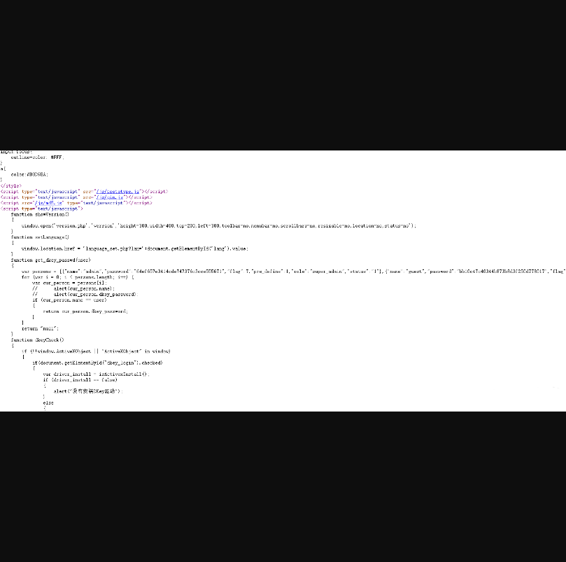
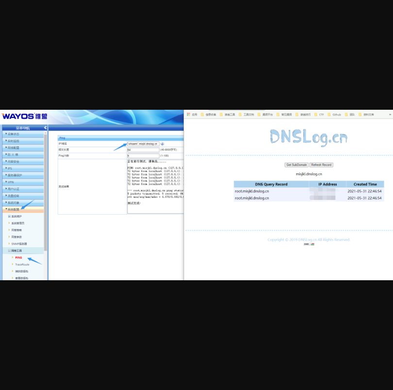

# Wayos 防火墙 密码泄露&&后台命令执行漏洞

## 漏洞描述

Wayos 防火墙 后台存在命令执行漏洞，通过命令注入可以执行远程命令

## 漏洞影响

> Wayos 防火墙

## FOFA

> body="Get_Verify_Info(hex_md5(user_string)."

## 漏洞复现

登录页面如下

可以通过F12查找到密码，密码为md5加密，可是尝试去解密

登录后台后 ping 模块命令执行

