## YouDiancms延时注入漏洞和登录绕过漏洞和getshell

## 漏洞描述

YouDiancms是一套企业建站系统，经过代码审计该系统存在多个漏洞

## 漏洞影响

> YouDiancms

## FOFA

> icon_hash="1728964041"

## 漏洞复现

## **0x01 未授权SQL注入**

首先拿到源码一看，发现该系统是基于THINKPHP3开发的。

在`App/Lib/Action/HomeBaseAction.class.php:16`

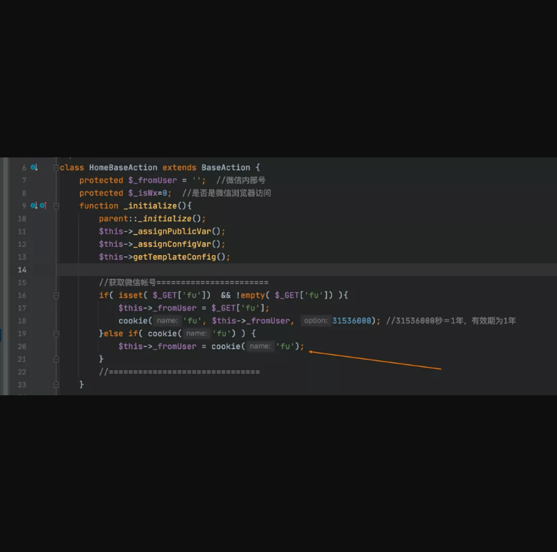

cookie可控，然后赋值给了`$this->_fromUser`

跟踪一下`$this->_fromUser`的引用。

在`App/Lib/Action/Home/ChannelAction.class.php:732`

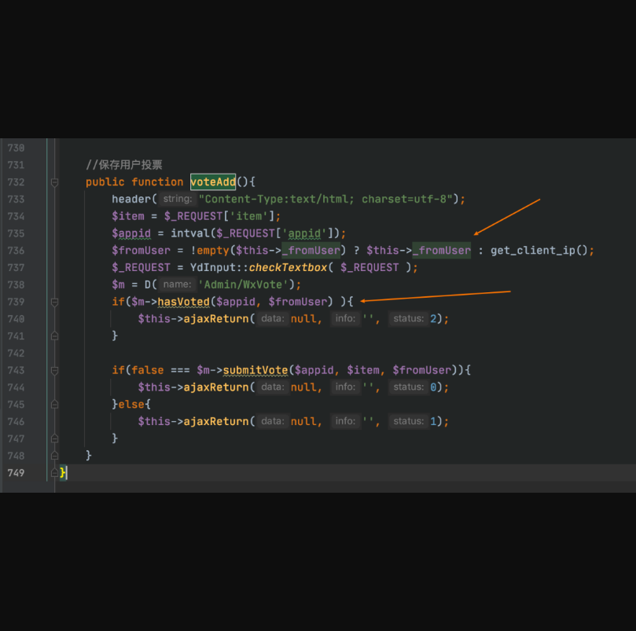

这里将`$this->_fromUser`带入到了`hasVoted`函数中，跟进该函数：

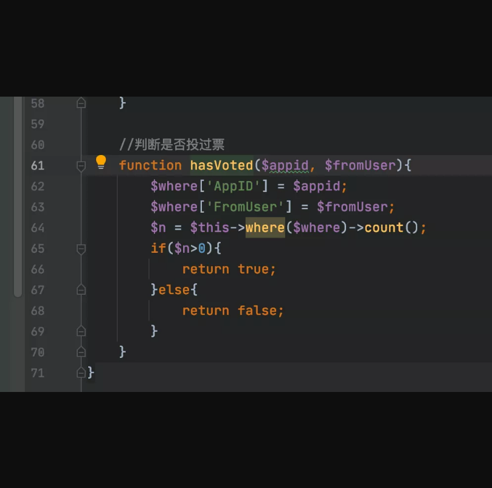

很明显，TP3的where注入。

延时注入payload如下:

```
GET /index.php/Channel/voteAdd HTTP/1.1
Host: localhostContent-Length: 2
Accept: application/json, text/javascript, */*; q=0.01
X-Requested-With: XMLHttpRequest
Accept-Encoding: gzip, deflate
Accept-Language: zh-CN,zh;q=0.9,en;q=0.8
Cookie: youdianfu[0]=exp;youdianfu[1]==(select 1 from(select sleep(3))a)
Connection: close
```

## **0x02 绕过登录到getshell过程**

### **0x0201 流程思路**

1. 验证码处可以设置任意session
2. 碰撞md5让AdminGroupID==1（超级管理员）
3. 后台修改模板插入phpcode实现代码执行

### **0x0x202 任意session设置**

在`App/Lib/Action/BaseAction.class.php:223`

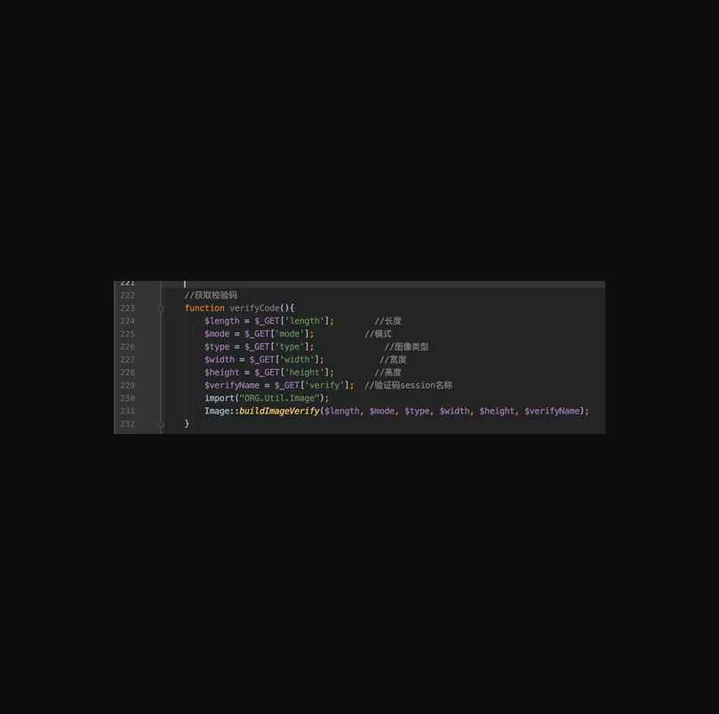

这个函数挺有意思的，本来是个生成验证码的操作，但是没想到所有的参数都是用户可以控制的，特别是这个`$verifyName`还可控。跟进`buildImageVerify`看看如何设置的`session`。

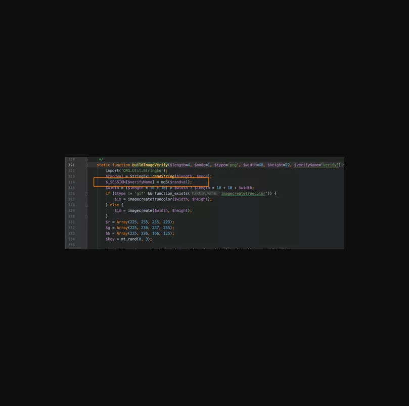

红框处设置了session，并且session的键名我们是可控的，但是值不可控，是个md5值。

然后我们去看看管理员的校验函数。在`App/Lib/Action/AdminBaseAction.class.php:7`

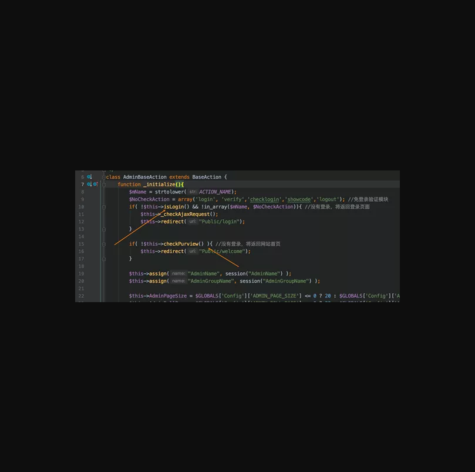

起作用的就两个函数，`isLogin`和`checkPurview`。跟进第一个看看：

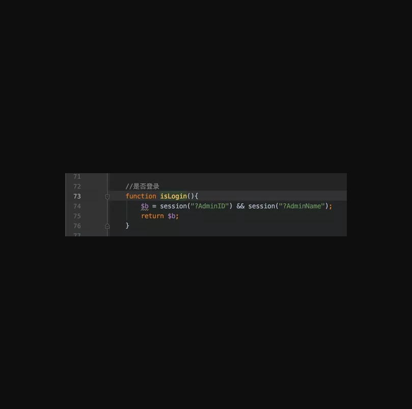

这个函数很简单，就简单的判断session是否存在，我们可以通过上文的验证码函数来设置。

然后就是checkPurview函数。

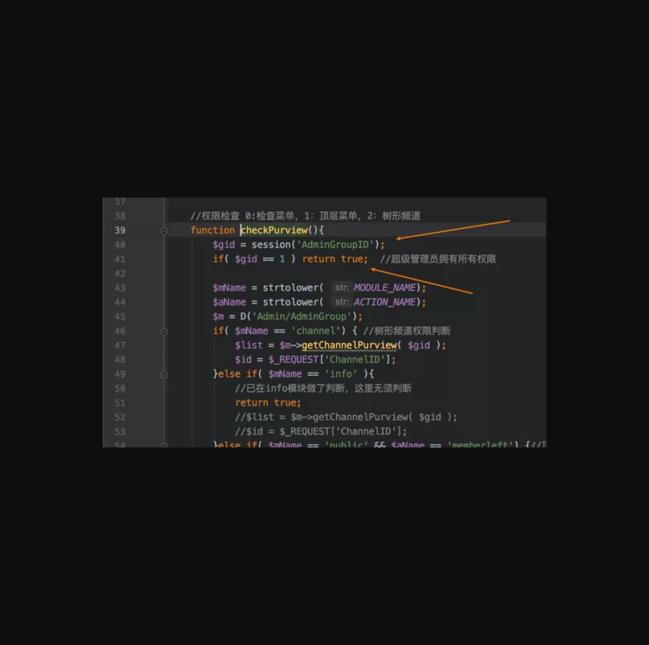

这里判断了`AdminGroupID`的值，当等于1的时候就是超级管理员，由于这里是个弱类型比较。所以上文设置session中的md5是可以碰撞的。

编写脚本得到超级管理员的session了，然后登录。

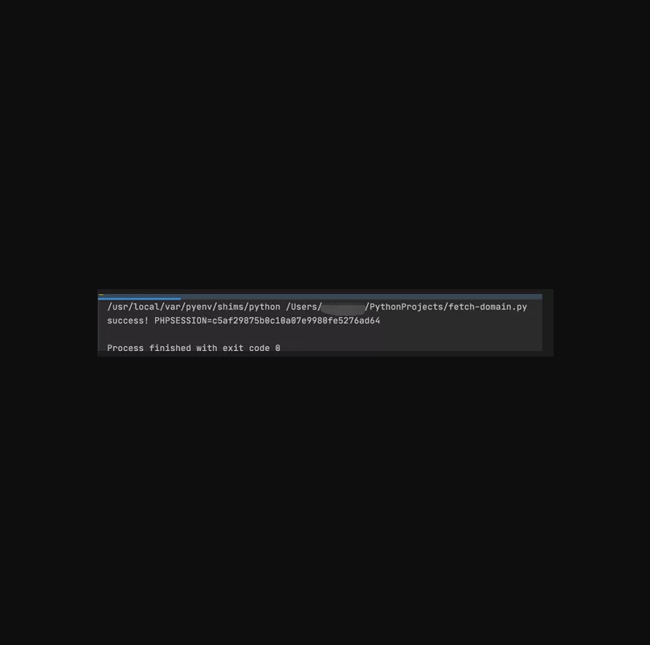

### **0x0203 后台getshell**

后台模板管理，可以修改模板，但是对<?php有检测，如图所示：

 

我们可以用`<?=?>`来绕过这个检测。

如图所示：

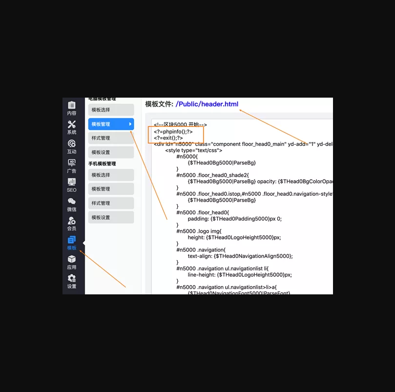

访问首页即可触发：

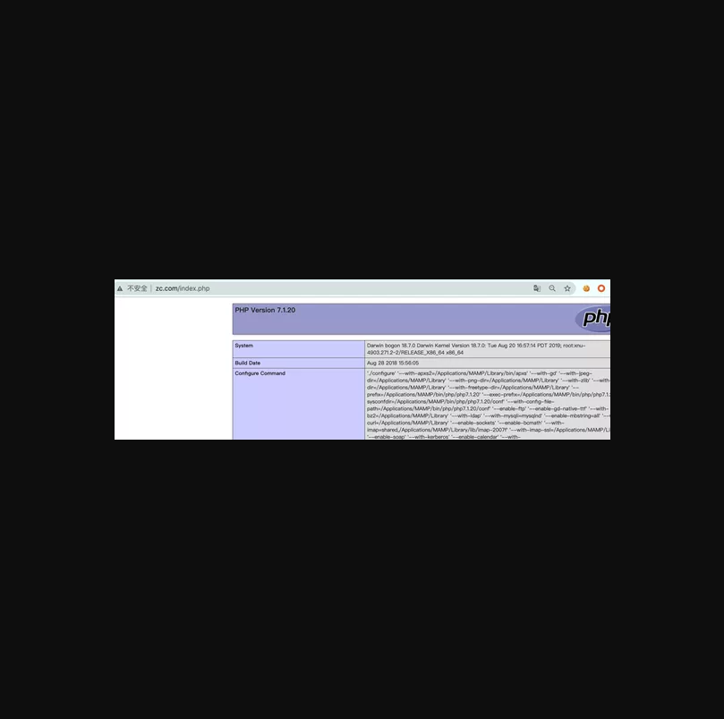