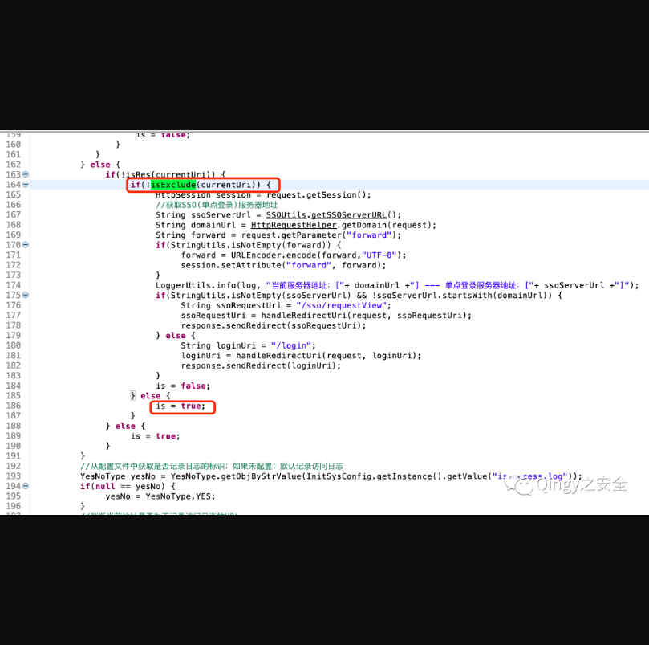
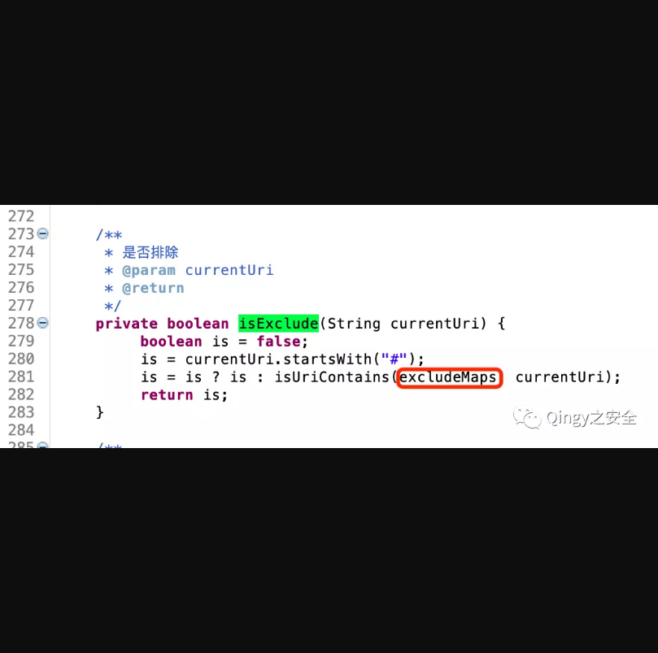
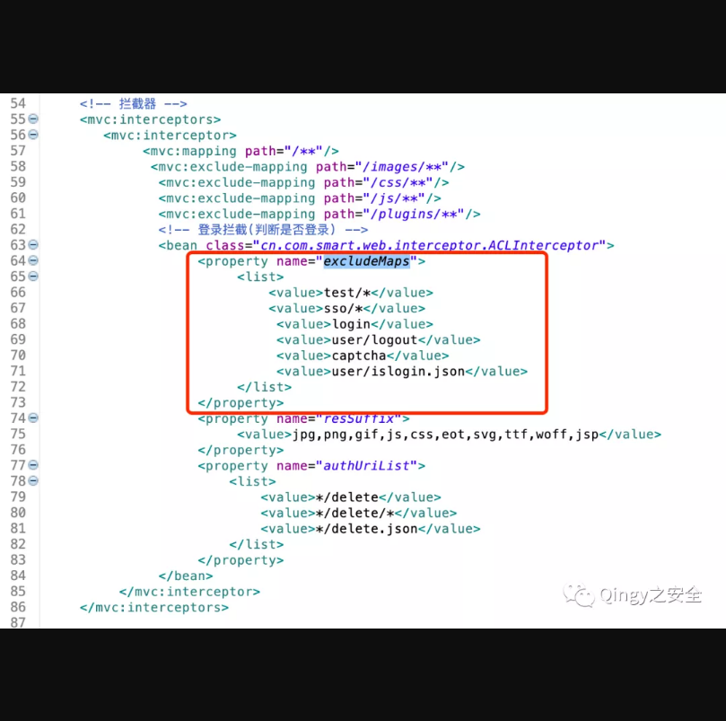
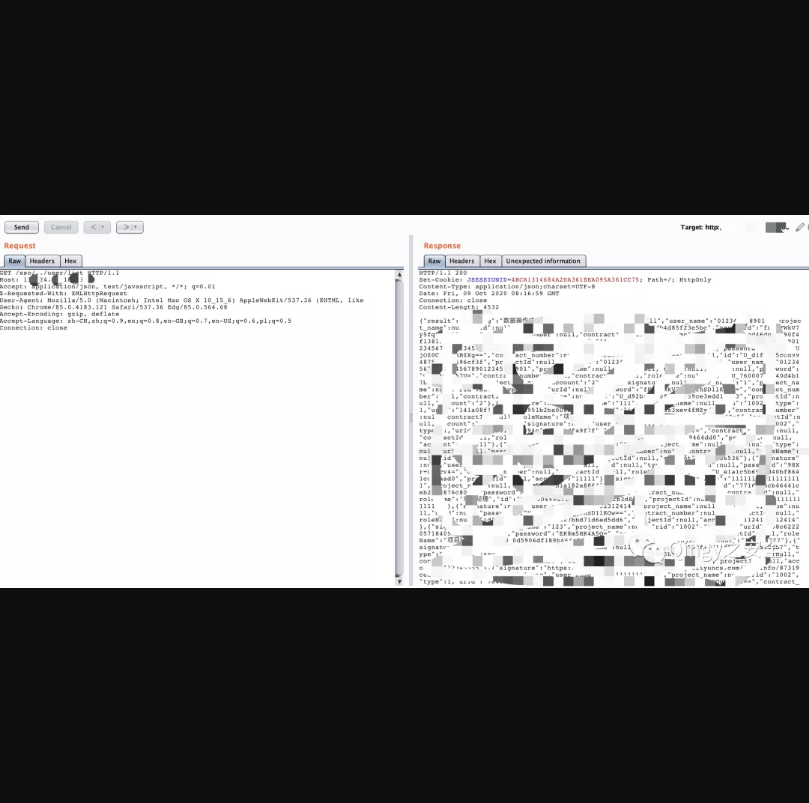

## smart-web2简单OA系统未授权漏洞

## 漏洞描述

smart-web2是一套相对简单的OA系统；包含了流程设计器，表单设计器，权限管理，简单报表管理等功能，经过代码审计发现其存在未授权漏洞。

## 漏洞影响

> smart-web2

## 漏洞分析

1、漏洞代码位置

```
cn.com.smart.web.interceptor.ACLInterceptor 
```



这是一个拦截器，在第164行对用户的uri进行了判断，如果isExclude返回为True，则会走到else，走到else则不需用户进行身份认证。

接下来我们追踪isExclude代码：



excludeMaps来源于：

```
smart-web2.src.main.resources.spring-web-config.xml
```

继续追踪，内容为：



我们可以确定如果uri开头为excludeMaps中的内容则不需要认证，例如

```
http://x.x.x.x:8080/sso/../user/list
```

