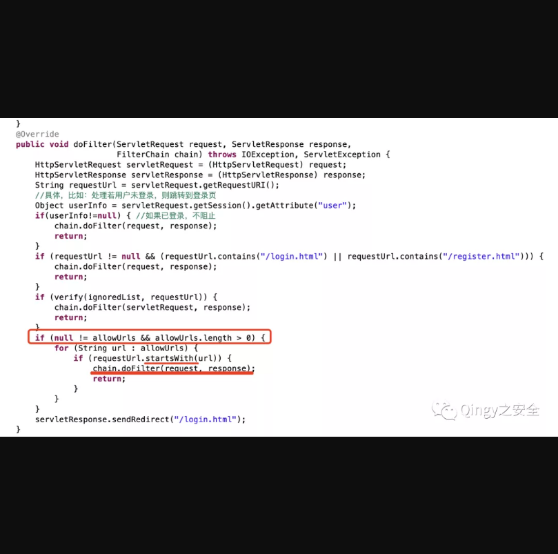
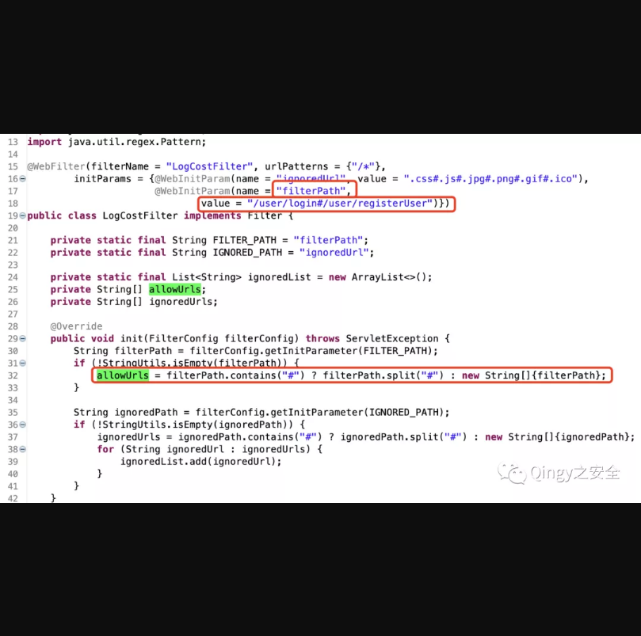
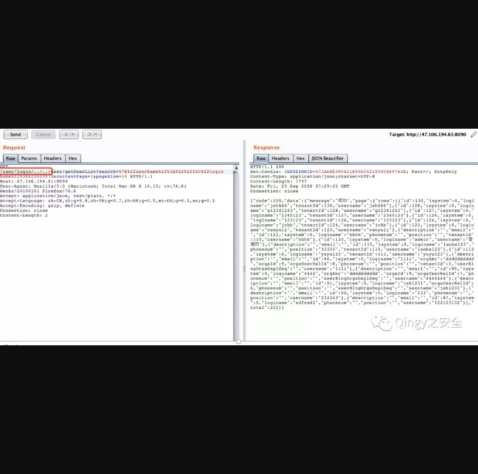
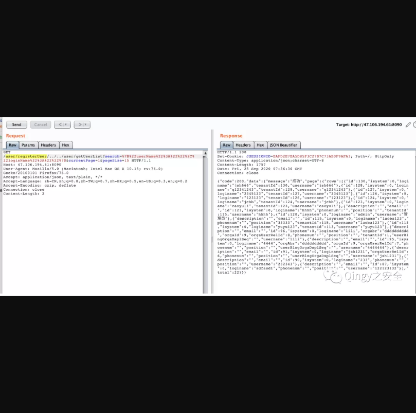

## 华夏ERP第二处授权绕过漏洞

## 漏洞描述

华夏ERP基于SpringBoot框架和SaaS模式，可以算作是国内人气较高的一款ERP项目，但经过源码审计发现其存在多个漏洞，本篇为授权绕过第二个漏洞点。

## 漏洞影响

> 华夏ERP

## FOFA

> title="华夏ERP"

## 漏洞复现

漏洞复现：

1、漏洞代码位置，利用filter做登录判断

```
com.jsh.erp.filter.LogCostFilter
```



如果URL开头匹配到了allowUrls中的内容则不跳转登录界面

追踪一下allowUrls的值：




allowUrls将/user/login#/user/registerUser以#分割成数组：

```
[“/user/login”,”/user/registerUser”]
```

下面我们需要将url开头设置为数组中的内容即可：

就比如/user/login/



或者设置为/user/registerUser/

