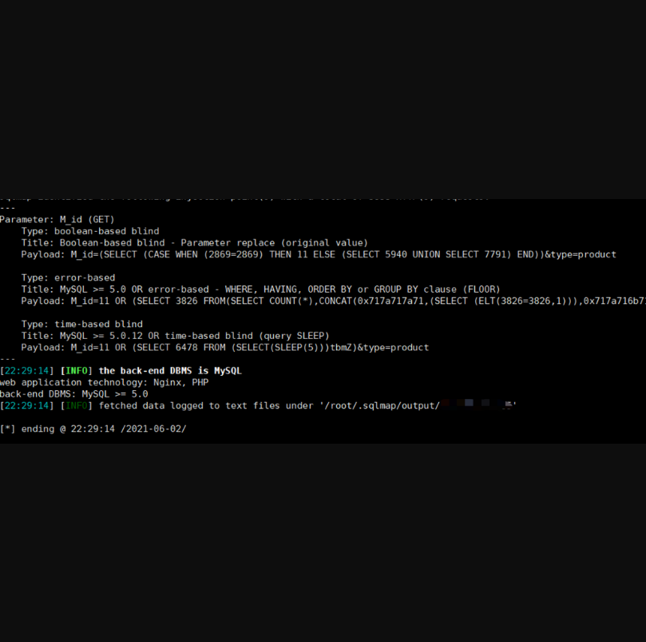

## 发货100虚拟商品自动发货系统存在SQL注入漏洞

## 漏洞描述

发货100虚拟商品自动发货系统是一套特色鲜明，专业实用的优秀虚拟商品自动发货系统/文章付费阅读系统，无需人工值守，客户在线购买即可自动完成交易。支持缺货提醒/自动发货/回收站/免签支付等多种功能。该系统存在SQL注入漏洞，可获取敏感信息及账号密码。

## 漏洞影响

> 1.1.20201211

## FOFA

> icon_hash="1420424513"

## 漏洞复现

界面如下：


漏洞URL为：

```
/?M_id=11&type=product   M_id参数存在注入漏洞
```

直接sqlmap一把梭

