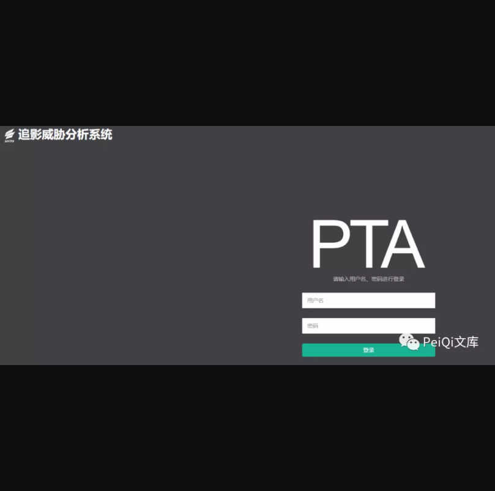
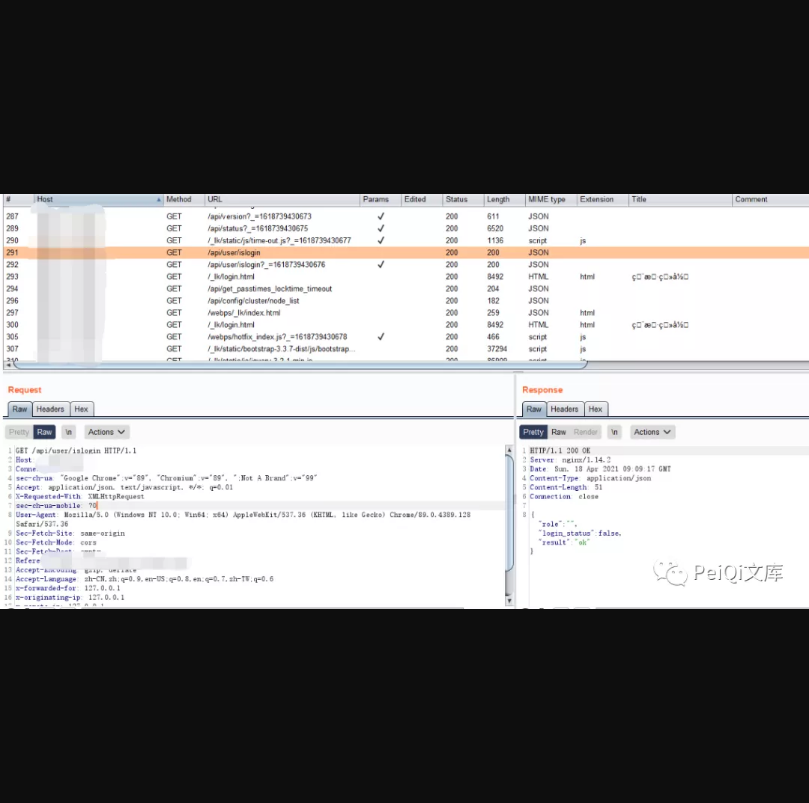
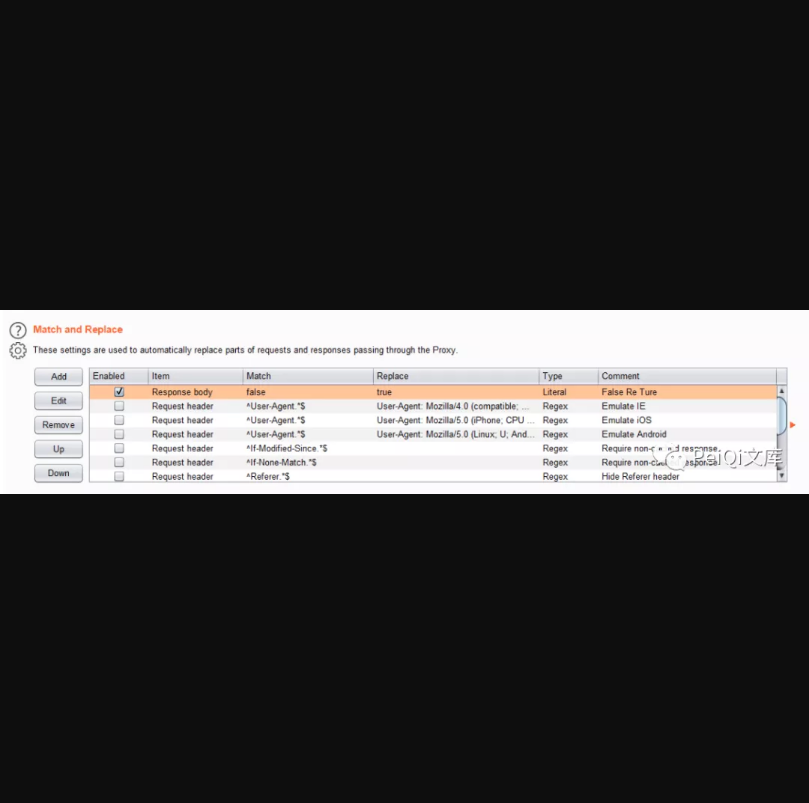
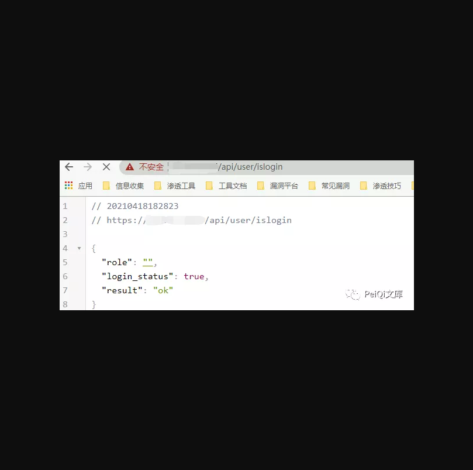

一：漏洞描述
安天 高级可持续威胁安全检测系统 存在越权访问漏洞，攻击者可以通过工具修改特定的返回包导致越权后台查看敏感信息

二:  漏洞影响

安天 高级可持续威胁安全检测系统

三:  漏洞复现
登录页面如下

其中抓包过程中发现请求的一个身份验证 Url

{"role": "", "login_status": false, "result": "ok"}
其中 login_status 为 false, 将参数使用 Burp 替换响应包为 true

请求 /api/user/islogin 时成功越过身份验证

再次访问首页验证越权漏洞

