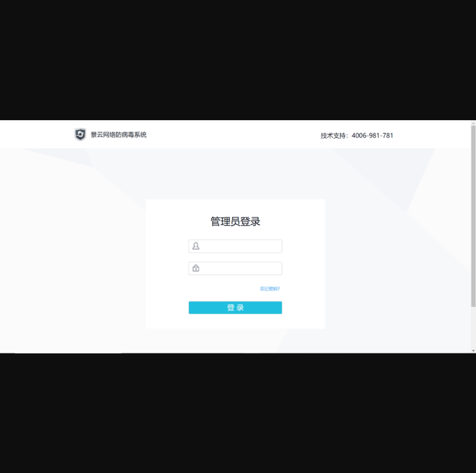
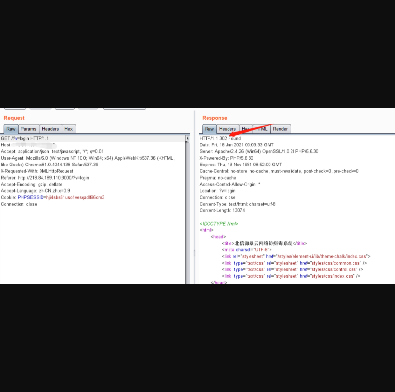
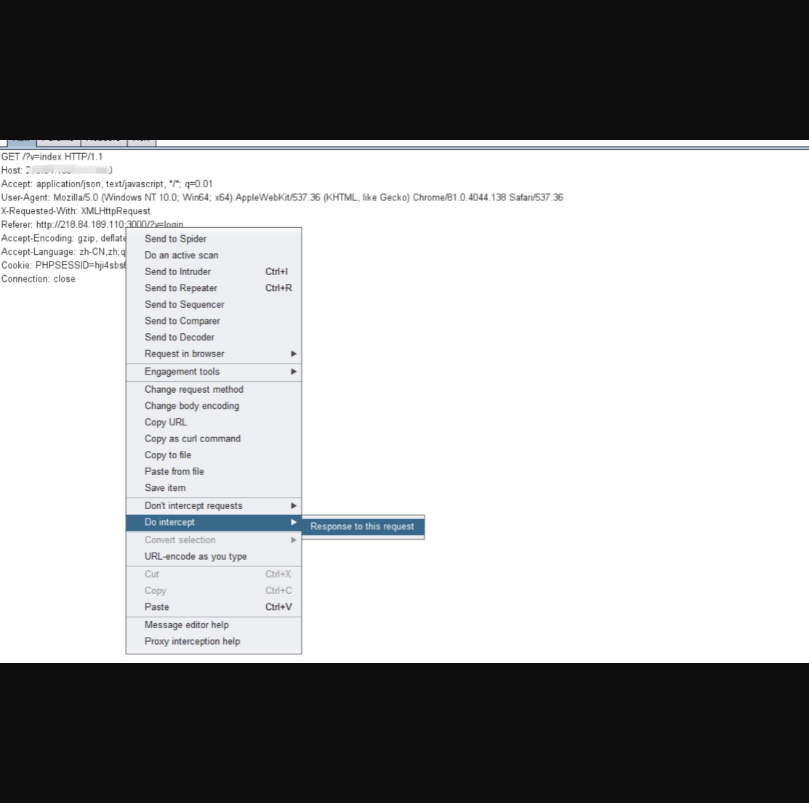
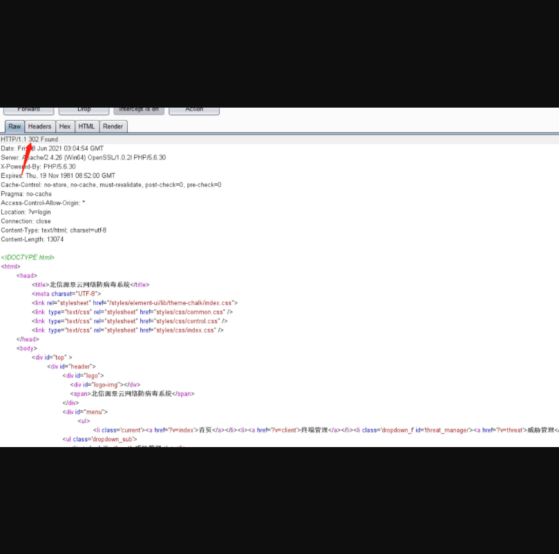
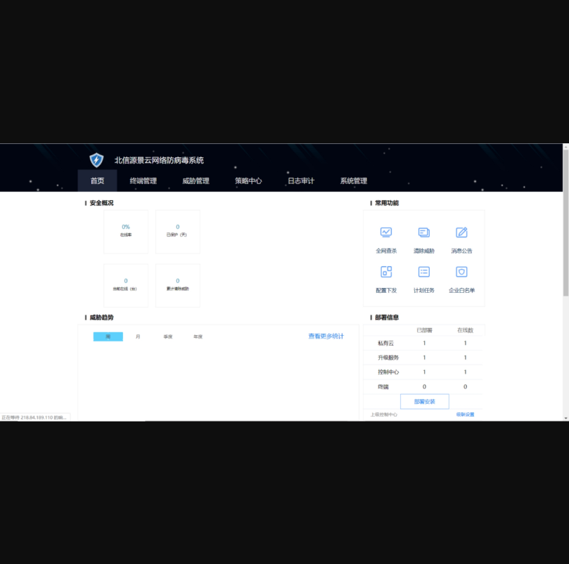

# 景云网络防病毒系统存在未授权访问

## 漏洞描述

北京辰信领创信息技术有限公司景云网络防病毒系统存在未授权访问，攻击者可以通过此漏洞未授权登录

## 漏洞影响

> 景云网络防病毒系统

## FOFA

> title="景云网络防病毒系统"

## 漏洞复现

登录界面如下(可以尝试默认口令super、super123)

访问url的时候发现会有一个跳转，然后是跳转到login这个页面 。应该此处是有重定向。直接上BP抓包，重放数据返回302，验证猜测，老规矩直接修改返回状态码尝试。

先右击拦截此包，然后放包

修改响应包的状态码 302为200 ，数据全放。

6）成功绕过~

