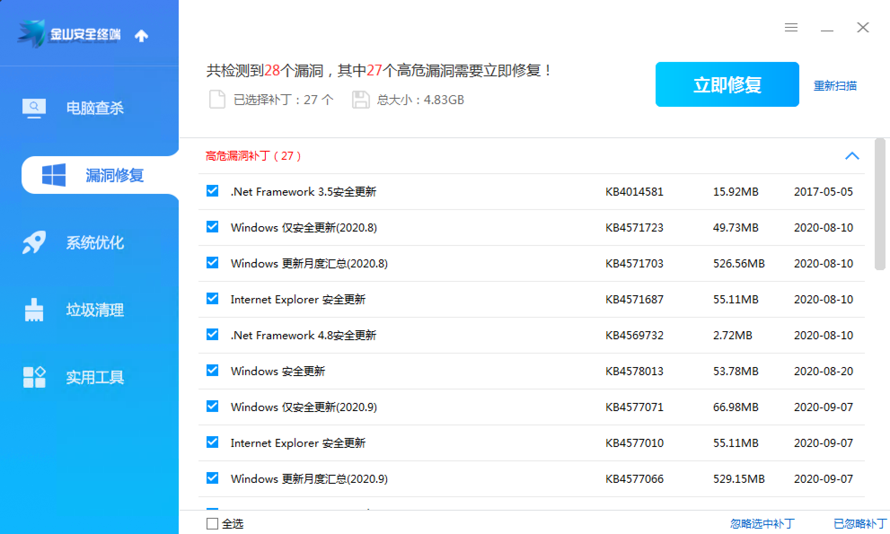
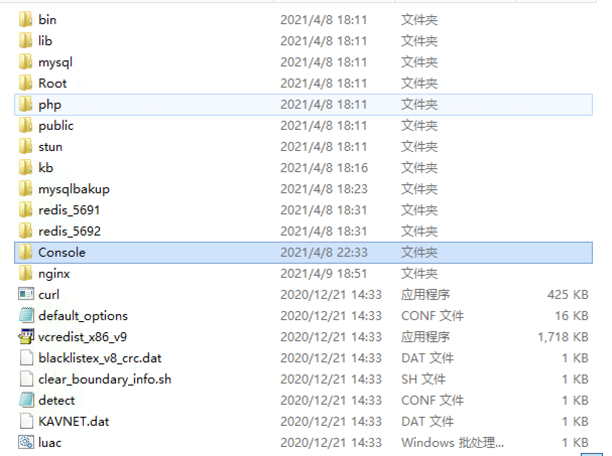
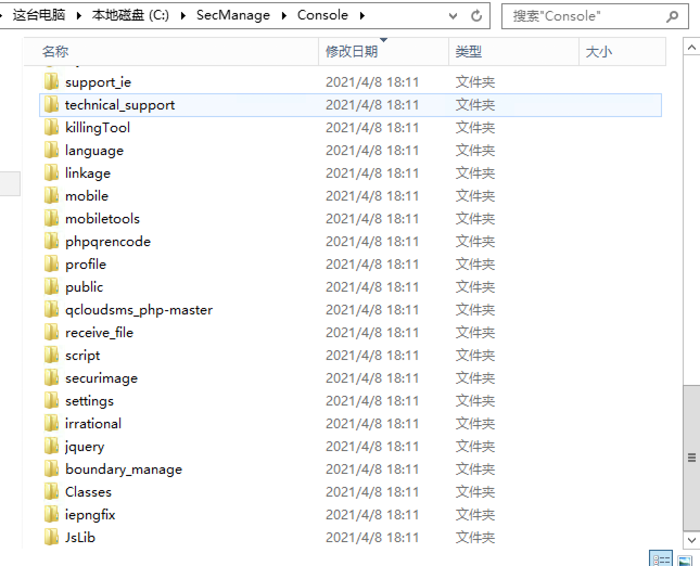
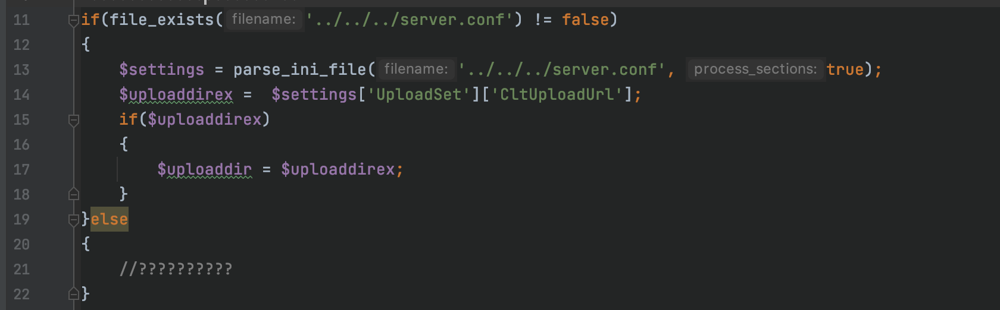
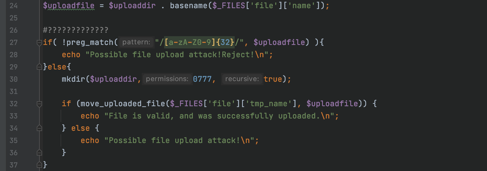
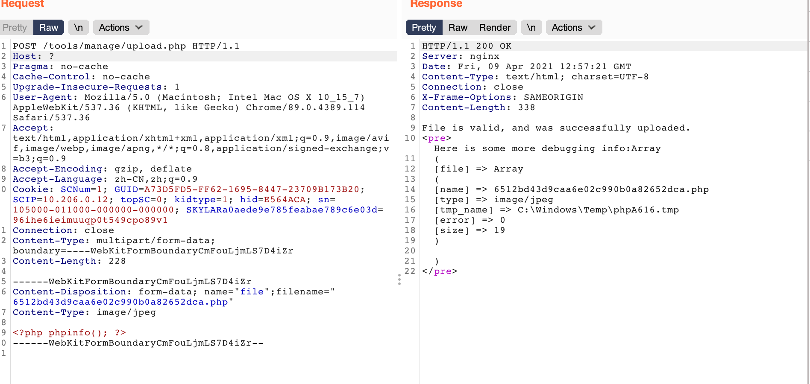
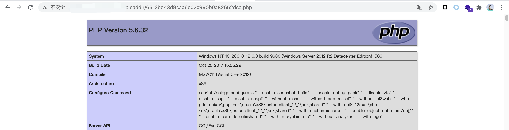

# 金山终端安全系统 V8 V9文件上传漏洞

程序下载链接：

V8：[v8下载](http://duba-011.duba.net/netversion/Package/KAVNETV8Plus.iso%20%22v8%E4%B8%8B%E8%BD%BD%22)

V9：[v9下载](http://duba-011.duba.net/netversion/Package/SecManage.iso%20%22v9%E4%B8%8B%E8%BD%BD%22)

系统环境:

Win2008 R2

内存:>=4G

改系统采用B/S架构，管理员可通过web应用对程序进行实时管控。

V9和V8文件结构大致相同，Web根目录为程序结构下的Console目录。

漏洞点:`/tools/manage/upload.php`

在tools目录下的mange下存在一个upload.php。
该文件可导致任意文件上传

漏洞分析:

在文件第八行中定义了一个变量为:$uploaddir.设置上传文件的默认存储路径为根目录下的/UploadDir/。

第11行至22行。

如果根目录下存在server.conf。则重写$uploaddir的值。

默认配置是不存在的。

24-35行中。进行了文件上传操作。

最终文件的存储路径为$uploaddir+上传文件名

在第27行中，使用preg_math进行一次正则匹配。要求上传的文件名必须已`/A-z/*32`位字符的格式。

也就是说上传的文件名必须是32位的长度。

这里随便给一个32位的md5就行。

满足条件后进入else。使用mkdir创建文件夹，并给予权限0777.

后调用move_uploaded_file导致任意文件上传:

POC如图

