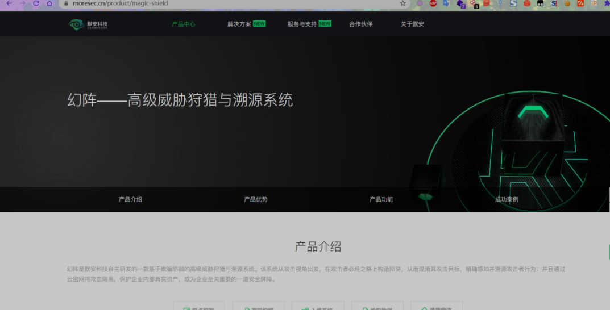
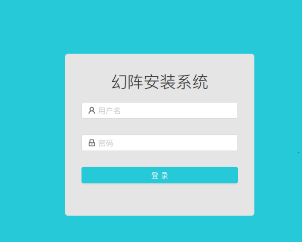
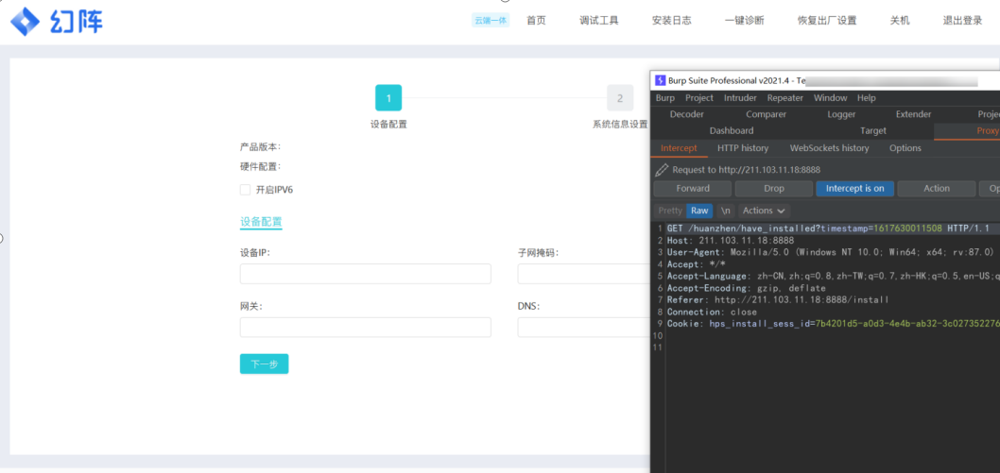
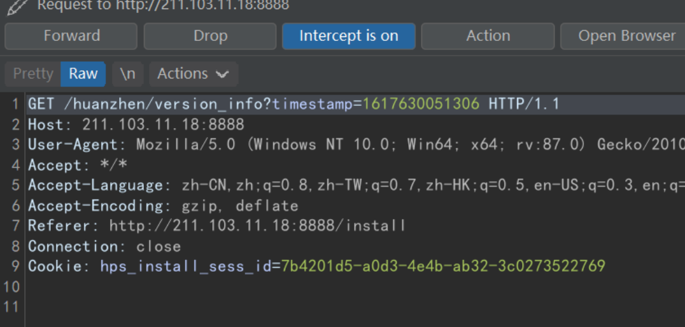
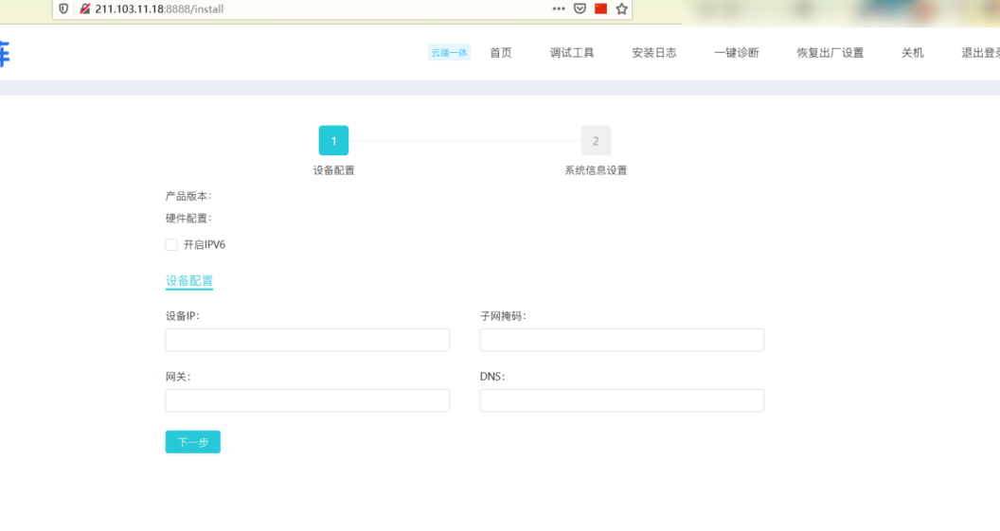
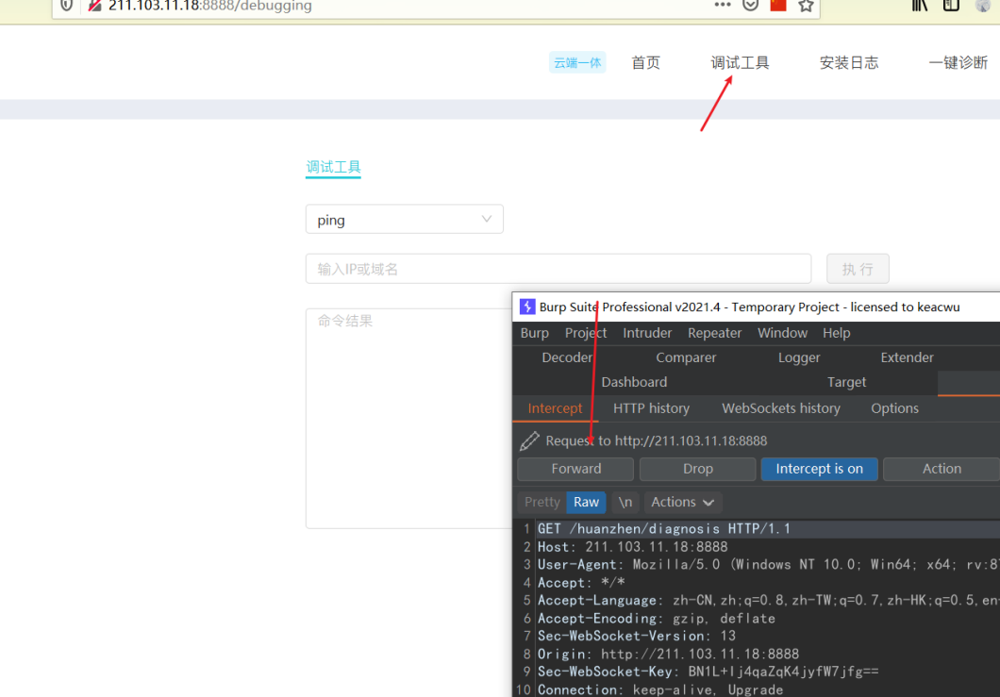
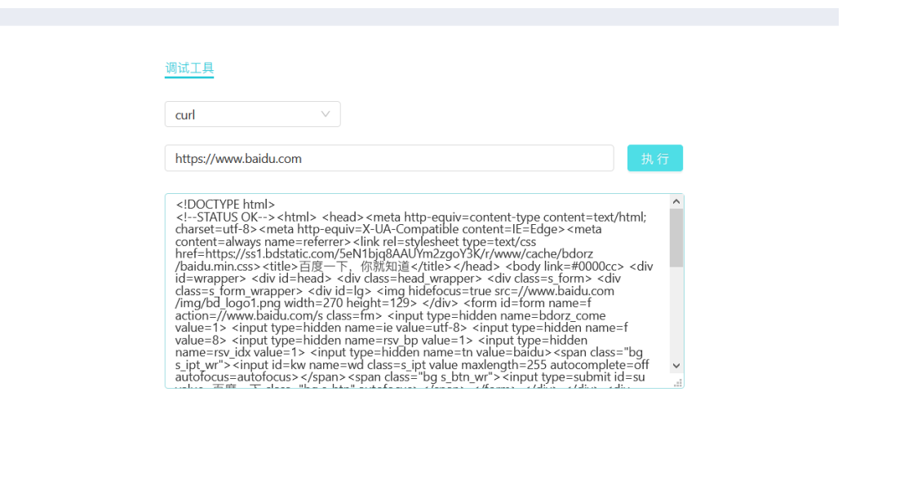
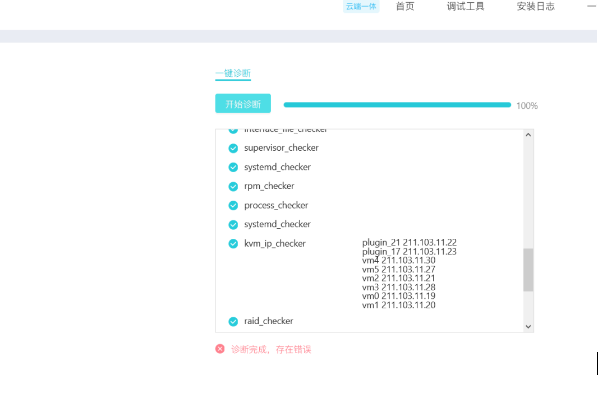

# 默安 幻阵蜜罐未授权访问 RCE

## 漏洞描述

默安 幻阵蜜罐存在部署页面未授权访问 ，可执行任意命令

## 漏洞影响

> [!NOTE]
>
> 默安 幻阵蜜罐

## 漏洞复现

产品页面

安装页面如下

默安 幻阵蜜罐

刷新并抓包

Drop掉 **/huanzhen/have_installed?**

进入页面

点击调试抓包

执行其他命令

点击一键诊断泄露 IP数据

